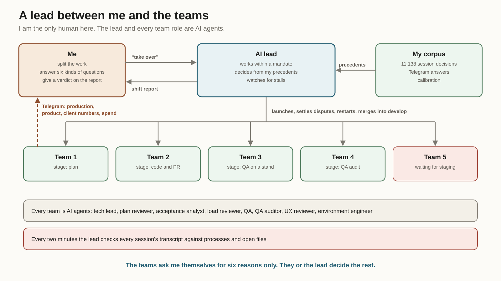
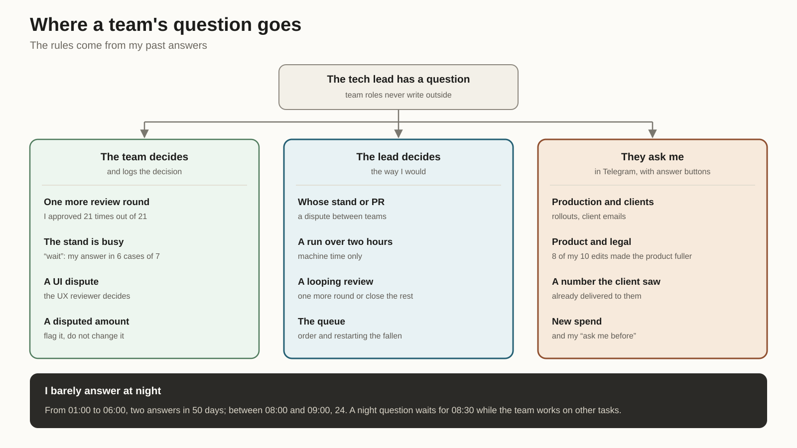
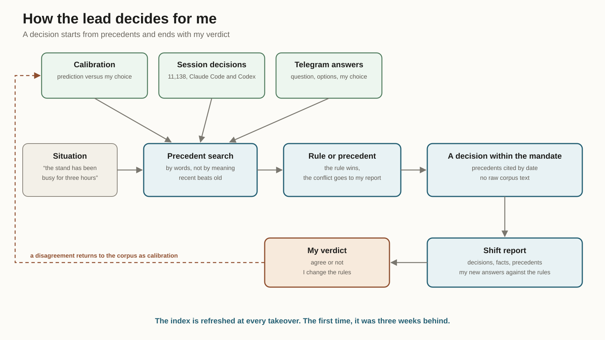
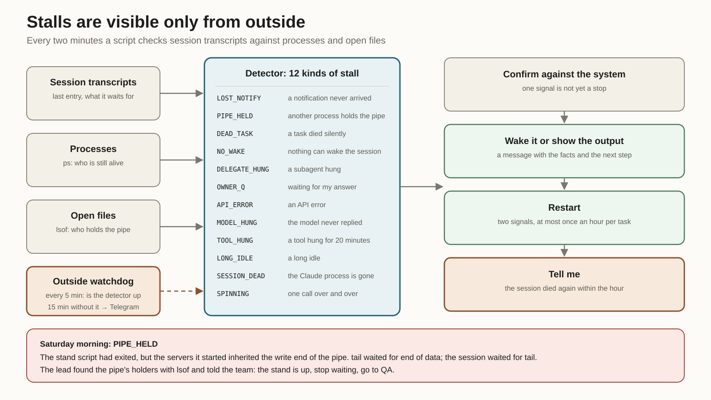

*What changed in the two and a half months after the article on autonomous AI tech teams: a lead now sits above them, and it decides from my past decisions.*

Over the last 30 days my Claude Code and Codex sessions processed 139.9 billion tokens. That is what the AgentKit counter shows. There were 396 sessions in that time, 13 a day on average.

All of them are visible in Agent Dashboard, an app I built for multi-agent development. From it I launch Claude Code and Codex sessions, see what each one is doing and steer them.

No one person can follow that flow by hand. Not even with nothing else to do.

In July I [described](/en/articles/ai-tech-teams-workflow/) how I set up autonomous AI tech teams: roles, evidence, a final gate, recovery after a crash. One team could go from task to closure without me. I call one such pass, a task or a batch of related tasks taken from plan to closure, a run. The trouble came with scale. With five teams running in parallel, I am the bottleneck again.

This article is about how I handed the teams to an AI lead. It decides the way I would, because it looks for the answer in my past decisions. And it takes nobody's word for anything, its own included.

I am the only human in this setup. The lead, the tech leads, QA, the auditors and the reviewers are AI agents, each with its own role.

## What broke at five teams

Every team wrote to me directly. Questions arrived in Telegram in no particular order. One team asked whether it could run another review round. Another reported that the stand had been busy for three hours. A third went quiet, and I did not know why.

Silence cost the most. A session can stop for good and still look alive. It waits for a background-task notification that will never come. Or it waits for a task whose process died long ago. Runs have timers, but a timer lives inside the same session that stopped. I learned about such stops only when I opened Agent Dashboard myself. Sometimes hours later.

Then conflicts. Five teams share one staging, common stands and sometimes common files. Someone has to decide who goes first. I did, whenever I got to Telegram.

And reports. A team writes "task closed". Rechecking every such claim by hand across five teams is a job of its own.

## The lead and its authority

Here is how the work runs now. In a separate session the AI lead and I go through the tasks and split them across teams. It launches the teams through Agent Dashboard and adds them to its roster. Then I say "take over". From that moment the lead works in my place.

Its authority is written down in a separate file. The file is built from my answers to direct questions. May it restart a dead session? May it merge green PRs? Where does urgent news go? I answered: yes, yes, Telegram.

The lead settles disputes between teams over a PR, a stand or the staging window. It allows a test run over two hours, as long as only machine time is at stake. It decides whether a review gets one more round or the remainder closes as separate tasks. It reorders the queue. It sends a team back to an earlier stage when its closure fails the gate. It restarts a dead session, at most once an hour per task. It merges a green PR into develop after reading the review and every failed job.

Production and everything a client sees stay with me. Product decisions, legal and safety. A number a client has already seen. New spend. Merging into master. Any change that makes a gate easier to pass. Overturning a decision a person made. A production database write happens only from my terminal, after a confirmation phrase I type myself.

Only I change the authority file. A hook lets a commit that touches it through only when the message records my approval and its date. The rules for when to call me and the cap on the protocol's size, both described below, are protected the same way.

The teams ask me these questions directly, in Telegram. The lead does not intercept them. It can only add facts to a team's context.

The teams know the lead exists. At first the teams did not understand who was writing to them, and said so. Now the autopilot protocol states it plainly: the lead is your supervisor, and here is how to recognize it.

When I come back, the lead hands the shift over with a report. The report lists each of its decisions, the facts behind it and the precedents it relied on. I give a verdict. A disagreement becomes calibration for next time.

## Statistics decide when to interrupt me

In July an agent weighed two things before asking me: whether the decision was reversible and how much a mistake would cost. The rule sounded sensible. In practice every team drew that line in its own place.

I pulled a month and a half of my answers to agents and looked at how I actually answer.

I approved an extra review round 21 times out of 21. So the question was unnecessary. The tech lead decides it now. The rule is simple: extend when the findings are real, belong to the task and keep shrinking.

To "the stand is busy, what now" I answered "wait" in six cases out of seven. The teams stopped asking.

Product decisions went the other way. I edit them often and in one direction: eight edits out of ten made the product fuller. Those questions stayed mine.

The night gave the simplest rule. Between one and six in the morning I answered twice in 50 days. Between eight and nine I answered 24 times. So a night question waits for 08:30, and the team takes other tasks meanwhile.

Six reasons to interrupt me are left. The team decides everything else and logs the decision.

## Deciding as me

An AI agent built the first version of the lead from a summary. The summary is a file of rules and counts like "21 out of 21". It is short and convenient. It holds none of the decisions themselves.

I noticed the same day. I have a decision corpus, and the lead has to read it.

The corpus is collected by my [Concierge](/en/articles/claude-codex-concierge/). It indexes my decisions from every local Claude Code and Codex session: what came before the decision, what I said, what the agent did next. In July the index held 4,246 records. Now it holds 11,138.

The lead searches two more sources. The first is my Telegram answers to the teams' questions: the question, the options, which button I pressed or what I wrote myself. The second is calibration: what the model predicted and what I actually chose.

Before each decision the lead looks for similar cases in all three. If the precedents agree, it follows them. If they split, it takes the most recent. If there is none, it says so. If a precedent contradicts a written rule, the rule wins, and the contradiction goes into my report.

In the report a decision cites its precedents by date. Raw corpus text never goes there. It is my correspondence, and only a paraphrase leaves it.

The Concierge rebuilds the index on request. The first time I checked, it was three weeks and 2,562 decisions behind. Now the lead refreshes the index when it takes over a shift.

The summary was not thrown away. It became a product of the corpus. At handback the lead collects my new answers and recounts the numbers in the rules. If I answered against a rule, a question appears in the report. I am the one who changes the rule.

## Stalls are visible only from outside

A timer inside a run is useless when the session itself has stopped. So the watching happens from outside. Every two minutes a script reads every session's transcript, the process list and the open files. No model runs in this loop, so it costs almost nothing, and the lead receives only its findings.

The detector tells 11 kinds of permanent stop apart. A background-task notification never reached the session. A task's process died without an exit code. The session is idle, and nothing is left to wake it. The model returned an API error. The Claude process is gone altogether.

The twelfth kind is the opposite case: the session is working, but idly. It repeats the same call and waits for the result to change. The worst such case in two weeks was 638 identical `wc -l` calls on one log in 24 minutes, about 490 million tokens per half hour. Normal work spends 50 to 90 million, mostly on cache reads, so tokens alone cannot tell such a session apart. The count of identical calls can. In 99% of 1,058 session and subagent transcripts over two weeks, it stays at 13 or fewer in 15 minutes. The detector's threshold is 20. All eight transcripts that reached it were polling something in a loop.

Each kind has an action: wake the session, show it the output, restart it. The lead acts only after confirming the finding against the system itself. One signal is not yet a stop.

The most telling case came on Saturday morning. A team restarted its stand with a script and piped the output into `tail` to avoid drowning in the log. The script exited. But it had started the stand's servers, and their parent processes inherited the write end of the pipe `tail` was reading. The pipe never closed. `tail` waited for end of data. The session waited for `tail`. The stand had been up the whole time.

A scheduled check does not save such a session. The session wakes up, sees the task as "running" and goes back to sleep. The lead used `lsof` to find who held the pipe and told the team: stop waiting, the stand is up, go to QA. That case produced a rule for the teams and a separate kind in the detector.

The watcher itself runs in the lead's session and dies with it. So a system process outside every session watches the watcher. Every five minutes it checks that the watching is running. If it has been gone for 15 minutes, a Telegram message reaches me with what the detector sees right now. At night the message waits until 08:30, like the teams' questions.

## The lead does not take its own word either

Once a team reported that its task was closed. The lead believed it and asked the team to release its lock. Then it ran the final gate itself. The gate answered: blocked. There was no QA verdict, no QA audit and no UX review. The team pointed to QA on an old branch, but no artifact stood behind the claim.

The lead corrected its request in the same message and sent the team back to QA. Since then it runs the final gate on every closure itself. For the lead, the word "closed" is only a reason to run it.

Then a hole turned up in the gate itself. The audit script always signed its file with the auditor's name, even when the QA agent ran it inside its own run. The final gate trusted the signature inside the file and took the newest one. For one task, the QA folder held such an "approved", while the real auditor said "rework". The gate picked the right verdict by luck: it happened to be newer.

Now every verdict is stamped with the run that produced it. The gate rejects an auditor's verdict from someone else's run. The new tests failed on the old script first, then passed on the fixed one.

A QA verdict names the commit it tested. The final gate requires that commit to contain what was merged: the PR's merge commit or its last commit. That is how it found a UI copy change merged after the QA verdict. No QA round had seen it, so it went into the release QA brief.

Teams fix the final gate themselves when they find a mistake in it. Each such change states in its commit what it now lets through or stops. The lead reads all of them in its cycle and reverts a change that lets through what the gate exists to stop. Only I can make the gate weaker.

## New roles and a budget for lessons

Two new AI roles joined the teams over the summer. The acceptance analyst writes the criteria and the "must not break" list separately from the tech lead. Otherwise the tech lead bends the criteria to fit its plan. The load reviewer checks server code for races, unbounded queries and the behavior of several replicas. It runs in parallel with CI and blocks only on critical findings.

Self-learning had to be capped. After every run the team writes a retrospective, and its lessons become protocol rules. In July there were 93 retrospectives; now there are 274. The protocol grew with them, and a model's context is finite. A rule that catches no mistakes takes the place of rules that do.

The autopilot protocol is now capped at 400 KB, and a script enforces it. A lesson that resurfaces a second time as a text rule has to become an automated check or go. The protocol weighs 399.9 KB today. A new rule competes for space with the old ones.

Retrospectives no longer come to me in Telegram. The lead collects them into the shift report. The QA fallback engine changed too: when Codex runs out of quota, QA switches to Devin.

## Numbers and weak spots

Since July the AI teams have made 111 more runs, each a task or a batch of tasks taken from plan to closure. 108 closed. Two stopped and asked for my decision. I closed one myself. One bug got through every check.

QA rounds per task went up: 2.7 against 1.4 in early July. By month, the rise happened once, from the second half of July into early August. August ran at 3.19 rounds per task and September at 3.04. No single protocol change lines up with a step.

Tasks did get bigger, but that explains 7 to 17% of the rise: within every size bucket, rounds roughly doubled. A round-by-round reading of the retrospectives splits the extra rounds this way. 46% are re-runs after a product defect or change, and they grow with task size. 30% are coverage and evidence rework with the product unchanged, nearly the same at every size. 13% went to the task brief and the environment, and the retrospectives do not explain 12%. The coverage rework coincides with the July process changes: separate acceptance criteria, a "must not break" list and gaps sent back to QA. Whether the auditor became stricter cannot be checked: its July files did not survive.

The precedent search is lexical. It finds cases with similar words and misses cases similar in meaning. For 52 of my 157 Telegram answers the question text was never saved, so the search cannot use them.

I do not work less. The work goes elsewhere. I shape the product and cut the tasks, answer the questions that stayed mine and accept every shift by its report.

The output shows in the history of the repository behind [findrates.ai](https://findrates.ai), the product I work on. In the last 30 days 425 pull requests were merged into it across 124 tasks, and production got 3 releases and 9 hotfixes. By [LinearB's 2026 benchmarks](https://linearb.io/resources/ai-engineering-productivity-gap), a developer on an elite team merges 2.6 pull requests a week. That is the pace of 35 to 40 such engineers. Since the July article, changes for 287 tasks have reached develop. The lead is there so that this pace does not stall on me.
