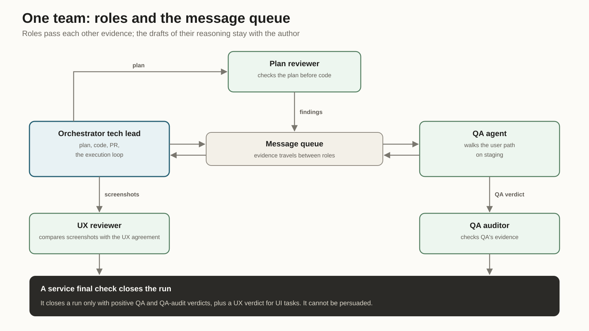
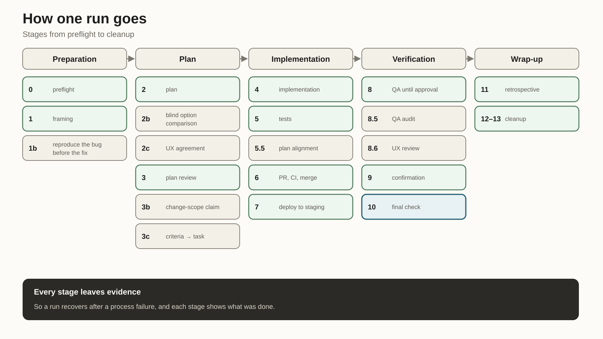
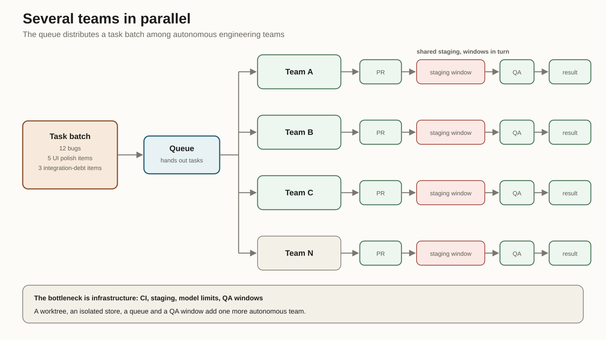
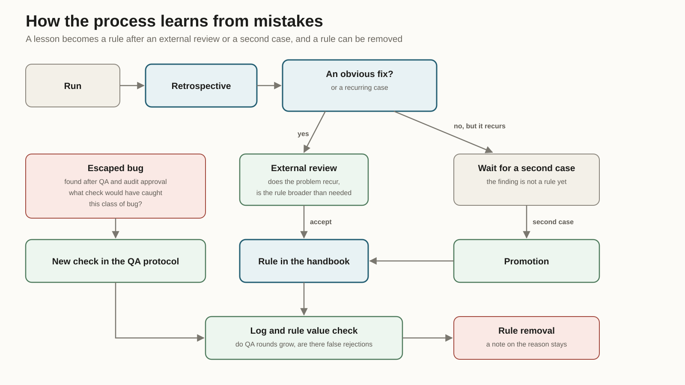

*How I separated roles, checks, and releases so that several AI teams can work in parallel without my constant supervision.*

## In Short

I stopped treating an AI agent as a lone contributor who just needs a good instruction and more context. That setup is fragile: the agent invents the solution, writes the tests, believes them, and reports "done", all by itself.

Instead I built a repeatable template for a small engineering team. One run takes a task or a coherent part of one, splits the work, separates responsibility, and goes through PR, CI, staging, QA and a QA audit. Only then does it report the outcome: done or blocked. Production release is automated too, but it lives outside the development cycle.

A run has six permanent roles, all of them AI agents: orchestrator tech lead, plan reviewer, QA agent, QA auditor, UX reviewer, environment engineer. Each role owns its stages. The product stays with me: product boundaries, contested decisions and starting the release pipeline. Along the way the roles pull in extra checks: security, accessibility, data, CI, browser scenarios, visual inspection.

No "done" is taken on faith. An author does not verify itself, a separate auditor verifies QA, and closure is decided by a service check that reads files. If a verdict is missing or of the wrong type, the run does not close.

The system writes its own run log. In the latest slice: 15 runs over six calendar days, one of which stopped and asked for my decision, and one bug that passed every check anyway and became material for a new rule. On average a task took 1.4 QA runs and 0.93 QA audits. The system has 93 retrospectives behind it. I do not compare these numbers with human teams. They show how much work the system does without me, where it stops on its own, and which mistakes still slip through.

## §1. Why I Got Into This at All

The code is usually fine. The problem starts later, when the agent reports "done".

An autonomous developer tends to verify itself. It wrote the code, wrote the tests, ran them, got green, and honestly concluded it had fixed the thing. But the tests could repeat the same mistake as the implementation.

I had exactly that case. The fix passed review, unit tests and CI. On staging it turned out that the fixed branch of code was never reached through the real user journey. Routing sent the scenario elsewhere and the repaired dialog never opened. The code was correct. The user never got to it.

So making an agent write code and run tests is not enough. You have to verify that the change is reachable by a user at all.

The second problem is duller and more painful. Long autonomous processes die. The laptop sleeps, a background task is cut off, a notification is lost, context runs out. From outside it looks like this: the agent stopped silently, and everything waits until you ask "so what's happening?". Autonomy like that needs watching, and watching is another job.

The third problem is the boundary of independence. The agent either asks about every trifle or makes a decision that should have come to me. Either way the automation loses its point.

That is where the engineering-team system came from: a repeatable team template with roles, evidence, recovery after a crash, and a formal line between "decide yourself" and "stop".

## §2. A Team Instead of One Agent

One agent with a large context is still a single point of failure. Smart, fast, careful, and the question stays the same: who verified its work?

So I stopped trying to build one perfect agent and assembled a small autonomous engineering team. It has roles, separate state, locks, reports, a message queue, and a clear rule about where the team decides for itself and where it stops and calls me.

Such a team brings a change to a verified state on staging and leaves a trail behind: plan, checks, verdicts, screenshots, decisions, mistakes. Writing the code is only part of that work.

Typing speed decides little here. What decides is how trust is arranged: who proposes the solution, who verifies it, where the evidence lives, what happens after a process dies, how several teams stay out of each other's way, and how a rule born from one incident does not turn into a mandatory useless ritual.

Four base rules came out of that.

1. **Author and verifier are separated.** The orchestrator wrote the plan, and another agent reviews it. The team wrote the code, and an external reviewer compares it against the plan. QA checks the product separately, and a QA auditor checks QA separately. Different models help here because they fail differently.

2. **Evidence beats phrasing.** A QA verdict is written to a structured file inside the run report; it does not stay in a conversation. Same for the QA audit and the UX verdict. The final check reads files, and the model's tone has no effect on it.

3. **Every rule has a reason.** The protocol grew out of retrospectives; nobody wrote it up front. Every rule carries an incident label: why it appeared and which class of failure it closes.

4. **Handing work to me does not depend on the agent's mood.** Before asking me anything, the agent checks three conditions: the decision is reversible, the consequences are small, the task stays within agreed scope. If all three hold, the team decides and logs it. If product meaning changes, the cost of error is high, or several attempts already failed, the run stops and asks for a decision.

Distrust extends to the task description too. A task gives a symptom and acceptance criteria. Named files, the suspected cause and the proposed fix are treated as hypotheses, especially when the text was written with a large language model: invented APIs and very confident wrong explanations show up there regularly.

Sometimes the team argues with me. If a task looks like polish for the sake of polish, the team sends it back with a question about value. A team that can push back on the merits is more useful than one that silently executes everything.

## §3. One Team: Permanent Roles and Temporary Checks

A single run is a small team with roles and separate channels. A batch of tasks is distributed across such teams; it is never stuffed into one endless conversation.

The table shows where responsibility ends: who plans, who reviews the plan, who looks at the product through a user's eyes, who verifies the verification, and who owns the environment.

| Role | Responsibility | Environment | What It Leaves Behind |
| --- | --- | --- | --- |
| Orchestrator | Plan, code, PR, execution loop, notifications | Claude | Plan, changes, PR, reports |
| Plan reviewer | Plan review and code-to-plan comparison | Codex | Findings on the plan and the changes |
| QA agent | Real user journey on the staging environment | Codex, fallback — Gemini | QA verdict, test plan, screenshots |
| QA auditor | Verification of QA quality | Codex | Audit verdict |
| UX reviewer | UX agreement before implementation, screenshot review after QA | Claude | UX agreement, UX verdict |
| Environment engineer | Worktrees, locks, resources, cleanup | Claude | Environment status report |

That is the top level. Below it sits a second layer: temporary checks inside supporting tools and methods. On one step the orchestrator works as a migration engineer, on another as an integrator. The reviewer can switch on a security check. QA becomes a browser operator. The UX reviewer turns into an accessibility auditor for a while.

Temporary checks have no channel of their own and never close a stage. They provide a specialised view where it is needed. So the six permanent roles pull in the checks they need as the work goes.

The QA agent does not stop at reading code. It follows the real user journey on staging, records observations, collects screenshots, attaches evidence.

There is a message queue between the roles. Put everyone in one shared instruction and independence becomes decorative: they all see the same reasoning and absorb the same assumptions. Through the queue the QA auditor receives QA's evidence; the draft of QA's reasoning never gets there. A verifier who has already read the author's explanation verifies worse.

At the end a service check closes the run. It requires a positive QA verdict, a positive QA audit and, for UI tasks, a positive UX verdict. It cannot be persuaded. That is what makes parallel work possible: I do not inspect every team before it closes. I look at the outcome and the evidence; I do not reread the whole journey by hand.

## §4. How One Run Works

There are many stages for two reasons. A run can recover after a process failure. And every stage leaves evidence in place of a verbal "I did it".

What follows is the logic of a single pass, without the full protocol.

### 4.1 Preflight

Stage 0 checks what is better discovered before work begins: deployment access, external CLI limits, forgotten background processes, availability of QA windows. It also creates a dedicated worktree and sets a lock for the run.

Stopping before the start is cheaper than stopping at stage seven, when there is already a PR, a queue and other people's expectations.

### 4.2 Framing and Splitting

One run takes a coherent piece of work: deployment to staging plus QA approval. If a task has several phases, the team splits it itself. That was a deliberate decision: if I decide where every task is cut, I am the manual coordinator again.

The split goes straight into a durable Markdown file: work parts, decisions made, resume protocol. A session's context may run out, background tasks may die, the file stays. A new session reads it and continues from the last point.

### 4.3 Reproduce the Bug First

For a bug fix the QA agent first reproduces the bug on the current staging environment. Before the code and, where possible, before the fix plan.

That closes three risks. The bug may be a phantom. After the fix the team may accidentally test a similar but different scenario. And the code may look wrong even though the user never reaches that branch. The last one is exactly what happened with the green but useless fix at the start of this article.

### 4.4 Planning and Comparing Options

If a task has several possible approaches, the orchestrator writes several architecture options first. They reach the plan reviewer in random order, with no hint at a favourite. Each has roughly the same level of detail. If one sketch is half as detailed as the rest, that is already a hint.

Once an approach is chosen, the plan goes through review. I capped it at three rounds. After the third we continue only for a serious or critical finding. In practice the fourth and fifth rounds mostly catch cosmetics that are cheaper to catch later.

A separate rule came from a silly incident: before putting helper-function names into a plan, check them in the code. Once a plan confidently cited four functions. Not one existed.

For UI tasks a UX agreement appears before implementation: interface states, reusable patterns, accessibility requirements, mobile first. The plan reviewer checks the plan against that agreement.

### 4.5 Code, Tests, and an Outside View

Implementation follows the plan. Tests are written from the specification, not from finished code. Internal modules are not mocked in BDD tests: only external SDKs may be. The local database is real and is reset predictably before each run.

Before the merge there is a separate comparison: the reviewer checks whether the code matches the plan. It catches quiet drift, where the implementation went sideways even though everything builds and the tests pass.

### 4.6 Deployment: A Green Status Proves Very Little

After deployment the team confirms that staging actually runs the intended build. A green infrastructure status proves little by itself: it may mean only that some deployment finished.

The rule appeared after two identical cases. One run reported a deployment, but staging had a different commit. Another updated only part of the system: infrastructure was green, the affected client service was still old. QA rejected it with a simple diagnosis: the change is not there.

So the report before QA uses careful language: "deployed for verification", not "fixed". The team earns the right to say "verified" only after every check.

### 4.7 The QA Loop

The orchestrator sends the QA agent a concise brief: the change, acceptance criteria, build version, affected parts of the code. A finding blocks the run if it is a regression from the current PR. Existing problems on affected screens are recorded separately. Without that boundary the first round drowns in unrelated old problems.

When QA rejects a run, the team first works out what actually happened, and only then touches the code:

| No. | Hypothesis | What the Team Does |
| --- | --- | --- |
| 0 | Broken environment | Checks the health of the staging environment |
| 1 | Real bug | Fixes it, opens a PR, runs CI, merges, redeploys, and reruns QA |
| 2 | False finding | Responds with a reference to the specification and requests another check |
| 3 | Overly strict test | Fixes the test, then gets confirmation from the QA auditor |

Item zero appeared after an investigation in the wrong place. Integration tests passed, staging was silent, and the team dug into business logic. Since then the environment is checked first.

There is protection against endless repair loops. If QA rejects twice for the same reason, a third attempt with the same class of solution is forbidden. The team moves up a level and makes the behaviour predictable in code in place of yet another instruction edit. If that does not help either, an architectural change is needed.

For UI work the orchestrator runs a quick self-check before QA: a service check measures specific numbers and states without opening a browser. Broken layout gets caught in 30 seconds, and no full QA round goes to it.

### 4.8 The QA Auditor

QA approval is always followed by a QA audit. It protects against a shared blind spot: a verifier can check the wrong thing too. An exception for "low-risk work that can skip this step" once let under-verified work through. That exception is gone.

The QA auditor derives the expected set of checks from the specification, compares it with actual coverage, reviews the evidence, and looks for a scenario QA may have missed. Sometimes it spot-checks staging. The verdict is one of two: approve or return for more work.

The auditor does not command the orchestrator directly. It sends a signal. A false critical finding is closed with an evidence-based response. A real gap is fixed and sent back for another audit. The system cannot close "with reservations".

For UI work the UX reviewer joins after the QA audit. It compares screenshots against the UX agreement. Critical and serious problems block closure. Medium and minor ones go into notes and the retrospective. A matter of taste comes to me after two rounds.

### 4.9 The Final Check

After QA, the audit and UX review, one question is left: can the run be considered closed. The final check answers it. It verifies the presence and contents of the evidence: a positive QA verdict, approval from the QA auditor, approval from the UX reviewer for UI runs. A nonzero exit code means there is no closure.

The check itself was checked too. An audit found two bugs where a rejection was treated as approval. In one case a negative verdict passed because of a matching substring. In the other a mixed verdict passed because it contained the word "success". After that the final check got its own regression tests.

For UI tasks the rule is stricter: a UX verdict is required by default. Unless the run is explicitly marked as work without an interface, the check demands one. Forget the flag and the check fails. That is by design: an earlier UI change shipped without either UX stage precisely because skipping was allowed by default.

After the final check QA publishes its comment, the tech lead closes the task, "not now" items become new tasks, and I get the outcome: done or blocked. Then cleanup: worktrees, locks, background processes, branches.

## §5. How a Run Continues After a Failure

Autonomy breaks most often on everyday failures: the machine sleeps, a process dies, a notification is lost. A separate part of the system owns resuming work after them.

Normally a run moves through events. A review, CI job, deployment or QA run finishes, a notification arrives, the orchestrator takes the next step.

But an event can be lost. A background task can be killed. The machine can sleep. So there is a safety net: every 15 minutes the system rereads the run state, finds the current stage, checks whether the background step is alive, and either resumes the work or repairs the failure.

I tried a four-minute interval. During a 30-minute QA run that produced around seven unnecessary returns to the run. Each return pulled the protocol and state back into context. Fifteen minutes turned out to be a reasonable compromise: idle time is bounded, context is not burned for nothing.

For "killed", "failed" and "timeout" statuses the rule is separate: that is an anomaly, and an empty turn is not an acceptable answer. The agent must read the output, check the signals of that specific step, and decide whether to repair it or hand it to me. The rule came from a run that stopped on a killed step and waited for me to look.

For that to work, critical state lives outside the model: run card, stage, next check time, table of parts, verdicts, task queue. A new session restores itself from files. A guard prevents finishing while unclosed tasks remain in the queue.

The timer also has to be removed on time. On "done" and "blocked" it is deleted, otherwise it keeps returning to a run that is already waiting for my decision. Same rule for locks, worktrees and processes: created a resource, remove the resource.

## §6. How Several Teams Work in Parallel

The next question is how to run several such teams. One enormous run that drags the whole queue behind it does not suit me. I hand in a batch, for example 12 bugs, 5 UI polish items and 3 integration-debt items, and the queue distributes them among autonomous engineering teams.

The number of teams runs into CI, staging, model limits, QA windows, storage and queues. Infrastructure becomes the bottleneck, and my attention stops being one. Add a worktree, isolated storage, a queue and a QA window, and you get another autonomous team.

Parallelism immediately creates a new problem: teams interfere with one another. With one team coordination is barely needed. With several you need to know in advance which parts of the project each will touch.

Each run holds a lock for its task and, after planning, records its change scope: the directories and product domains it will touch. A check looks for overlap with other active teams. Overlap does not always block the work, but it cannot be ignored. The team reads the other claim and chooses: change the plan, wait for the merge, or consciously accept the risk.

Teams now take staging in windows. The first version held it for 4–8 hours even though it was needed for part of that time. Now the team takes the environment before deployment, holds it through QA and the auditor's spot check, then releases it. If a fix is needed, the window is released during development. While one team writes code, another runs QA.

Environments are isolated without elaborate infrastructure. Each worktree gets its own storage, queue index and port. Parallel BDD runs stopped overwriting one another. A separate status screen shows queues, locks, declared change scopes, and when each team last updated its state.

Scaling came down to ordinary engineering work: preventing teams from overwriting one another's queues, preserving claims when locks are reacquired, recording session state separately. This layer now has its own test suite: 44 checks pass.

## §7. How the Process Learns from Mistakes

Every run ends with a stage that improves the process itself. Without it all that remains is a folder of instructions going stale.

The retrospective collects review logs, QA verdicts, the audit, friction notes, the orchestrator's memories and my corrections. The file has a required "honest mistakes" section: where the agent was wrong even though rules already existed.

Obvious fixes go into the process immediately. An outdated identifier, a missing instruction or a proven safeguard is corrected in the same pass. The agent has limited permission for such automatic commits: only team protocols, the process and personal configuration. Product code always goes through the full cycle.

Self-learning needs controls too. It quickly developed two failure modes.

The first was bloat. For five weeks every lesson became a new paragraph in the protocol. The core instruction grew from 790 to 1,732 lines and started eating too much context on every re-entry into a run, even when nothing had happened.

Now a lesson is recorded as a short 2–4-line rule with an incident label. It goes into the handbook for the stage where it is needed. The core changes only when a foundational rule changes. Before anything is added, the system looks for a similar rule, and if there is one, that rule is extended. Sizes are checked automatically: up to 300 lines for the core, 400 for a handbook. Exceeding a limit becomes a retrospective finding in its own right.

The second failure mode was self-blindness. An agent that completed a run tends to turn a one-off into eternal law. So not every finding becomes a rule immediately. Unless it needs an immediate fix, it waits for a second occurrence. After the second it becomes a rule.

New and generalised rules go through external review: recurring problem or one-off, is the rule written too broadly, does it conflict with an existing one, is the new QA check worth its cost on every run. With insufficient evidence the rule does not become active yet.

If a new check increases QA rounds, produces false rejections or conflicts with another finding, the rule goes back for review. When it is removed, the protocol keeps a short record of why, so the next run does not reopen the same debate from scratch.

Escaped bugs are tracked separately: those found after QA approval and the auditor's approval. Each gets a short analysis built around one question: what check would have caught this class? That check is added to the QA protocol. The bug fix and the process fix stay in separate files.

## §8. What Actually Limits Parallel Work

Several engineering teams consume context and compute, and I try not to spend either on waiting.

The bulk of context stays with the orchestrator. Heavy checks are pushed outward: QA runs, audit, review. By the final confirmation the orchestrator does not re-verify everything by hand. It reads the auditor's verdict and confirms the evidence is in place. Otherwise the auditor role exists and nobody uses its result.

The fallback route is described in advance. If the Codex limit is exhausted, the team switches to Gemini, with caveats. Narrow single-step tasks it handles fine. Complex repository edits it often loses or runs out of time on. That is written into the protocol as a limitation.

Context is saved in the protocol too. Hence the file size limits, the state check every 15 minutes instead of every 4, and the rule to read only the current stage's handbook. Re-entering a run does not reload the whole process description every time.

Speed comes from stages that run in parallel without losing checks. Code review runs alongside CI, but the merge waits for both. The QA brief is prepared while the deployment is polled. While one team goes through CI, deployment and QA, another is already taking the next piece of work to a PR.

Two places I do not cut: real CI and the QA → QA audit chain. First the check, then the check of that check.

The most expensive resource is my attention. So notifications are reduced to terminal signals: "done" with a report, or "blocked" with the specific decision required. The retrospective gets its own notification. Routine stays quiet: a restarted flaky CI run, a closed review finding, an intermediate stage.

If ten teams ask three questions each, autonomy is over. So before every question the team first has to work out whether it can decide by itself.

## §9. What You Can Take Away

If I were building a similar system from scratch, I would start with the boundaries of trust: where evidence is required, who verifies the verifier, and what happens when a run crashes. The choice of model and a detailed instruction can wait.

- **Evidence in files.** Every verdict is written to a file with a clear schema. "I checked" without a file does not count.
- **A final check.** A run is closed by a service check that inspects mandatory evidence. It needs tests of its own.
- **Dangerous skips are closed by default.** UX review is mandatory for UI tasks unless the run is explicitly marked as work without an interface.
- **Author separate, reviewer separate.** Preferably on a different model, or at least in a different context.
- **A QA audit.** A second verifier inspects the quality of verification: coverage, evidence, missed classes of scenario.
- **A reviewer sends a signal.** A false finding can be refuted with evidence. A real one gets fixed and sent back.
- **Reproduce the bug first.** For a bug fix, reproduce it on the live environment before repairing anything.
- **Blind option comparison.** Several architecture options in random order keep you from gluing yourself to the first idea.
- **Round caps.** Review, QA and audit each have a maximum. After a repeated failure of the same class, change the approach.
- **Periodic state checks.** A run normally moves through events; the scheduler insures against losing them. Pick an interval that does not return to the run without reason.
- **State outside context.** Stage, work parts, verdicts and queue are restored from files; the model's memory is not needed for that.
- **A lesson as a short rule.** 2–4 lines with an incident label, and the protocol has a size limit.
- **A rule is not born from one case.** Sometimes it needs a second similar incident or an external review.
- **Escaped bugs tracked separately.** A bug that passed every check must produce a new QA check.
- **Staging in windows.** A shared resource is held only for deployment and verification.
- **Careful wording.** Before QA the team writes "deployed for verification". "It works" appears only after the verdicts.

## §10. Where the Limits Are

The system does not replace a whole engineering team or a product owner's decisions.

Production release is automated but lives in a separate loop. The engineering team finishes at "verified on staging, queued for release". After that I start the release pipeline separately: it has its own protocol, its own checks and the right to stop. The team does not ship to production itself. It prepares a verified candidate, and the release loop takes it to production after a separate decision.

Taste is not automated either. The UX reviewer catches inaccessible controls, missing states, a broken mobile layout, a homemade component instead of a system one. But once the argument reaches "I do not like it", after two rounds it comes to me.

I treat the numbers carefully. 93 retrospectives are enough to see recurring mistakes and improve the process. But the latest metrics slice is 15 runs over six calendar days, and conclusions like "the system got twice as good" do not come out of that. I use these numbers to watch whether repeat QA rounds are growing, whether stops became more frequent, and whether new rules started getting in the way.

Bugs still slip through. Two bugs passed every check. Both were visual: functional checks did not cover them. After that came a visual sweep and a coverage matrix for bug classes. The system does not promise zero escapes. After every escape there must be a barrier for the whole class of similar failures.

The Gemini fallback is weaker than the main route: it saves narrow tasks when limits hit, and handles complex repository edits worse.

The system is personal. Roles, escalation rules, tracker rules, comment discipline, round caps: all of it is tuned to one person and one product. The general approach travels; the checks and thresholds you will have to grow from your own incidents.

The orchestrator itself produces the most mistakes. Most retrospectives are about how it made a lazy decision inside perfectly good rules: trusted a summary, did not reread the file, cut a check. The final check compensates partly. The process makes such mistakes visible, and they turn into new rules.

## Code Is the Middle of the Chain

When I describe this system, people often ask: "So the agent writes code instead of you?" Code is only the middle of the chain. The working unit looks like this: framing, plan, review, implementation, tests, PR, CI, staging, QA, QA audit, fixes, closure, retrospective. The gain comes from parallelism, independent roles, the final check, and not having to steer every step by hand.

The answer is built from an old engineering kit: separation of powers, witnesses, evidence, locks, loop caps, crash recovery, shared-resource management, retrospectives. A smarter model does not remove the need for process.

The agents do not become infallible. Their confidence becomes verifiable. That was enough for me to hand the system batches of tasks and look at the evidence.

Behind the system are a compact protocol, per-stage handbooks, service checks with tests, a run log, coordination of several teams, and 93 retrospectives. Every rule in the protocol was left by a real incident.
