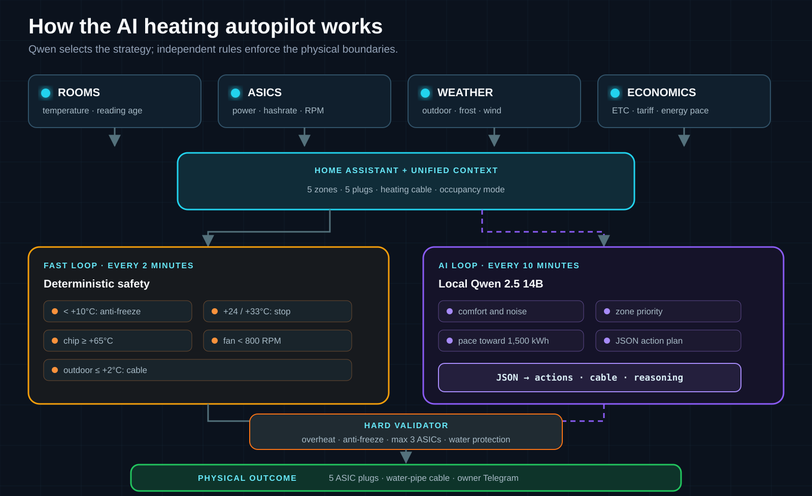
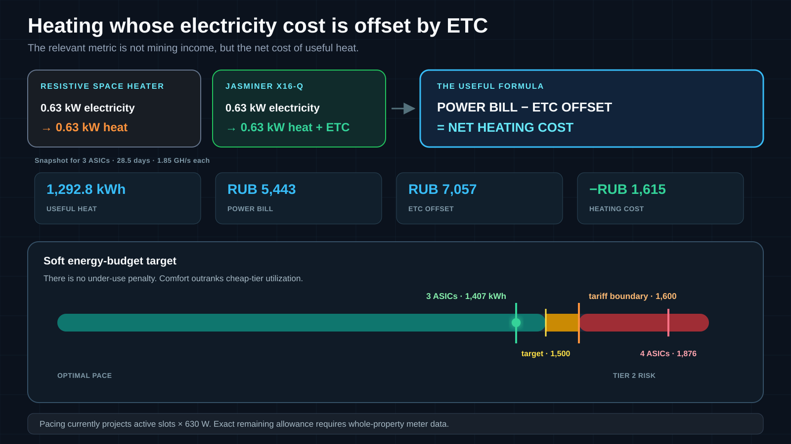

A country property contains five independent heating zones. Each has a quiet Jasminer X16-Q that converts its electrical input into heat while mining Ethereum Classic.

Climate is managed by a local AI autopilot with outdoor weather, water-pipe freeze protection, fan and hardware-switch monitoring, live heating-cost calculations, and a Telegram control panel. It runs on a local Linux server, distributes up to three “heat slots” across the zones, and does not depend on a cloud-hosted model.

The project’s main engineering principle is: **AI makes the high-level decision, but hard safety rules always have the final say**.

---

## What the system contains

| Layer | What it observes | Why it exists |
|---|---|---|
| Home Assistant | five Gosund smart plugs, Xiaomi/Aqara sensors, actual power draw | unified telemetry and power control |
| Climate | temperature, reading age, occupancy mode | freeze and overheat protection |
| ASIC fleet | power, hashrate, chip temperature, fan RPM | heating, mining, and hardware safety |
| Weather | local temperature, humidity, and wind | predictive water-pipe protection |
| Economics | ETC price, RUB exchange rate, network difficulty, tiered tariff | net useful-heat cost calculation |
| Local Qwen 2.5 14B | the collected operating context | zone selection and explainable decisions |
| Telegram | status, manual control, emergency stop, AI reports | remote owner control |

The physical mapping remains intentionally simple: **Unit N → Plug N → Zone N**. The operator, Home Assistant, and the model all use the same numbering scheme.

| Zone | ASIC | Zone type | Occupied limit | Away limit |
|---:|---:|---|---:|---:|
| Z1 | Unit #1 | residential | +24°C | +33°C |
| Z2 | Unit #2 | residential | +24°C | +33°C |
| Z3 | Unit #3 | non-residential | +33°C | +33°C |
| Z4 | Unit #4 | residential | +24°C | +33°C |
| Z5 | Unit #5 | residential | +24°C | +33°C |

A separate sixth plug controls the water pipe’s freeze-protection cable.

---

## Two autopilots instead of one

Control is deliberately split into two parallel loops:



### Fast loop: deterministic rules every two minutes

The rule-based supervisor does not reason or wait for the model. It checks critical conditions and can intervene immediately:

- below **+10°C**, it starts the ASIC in the cold room;
- at **+24°C** in an occupied residential zone, or **+33°C** in away mode, it stops heating;
- at a chip temperature of **+65°C** or above, it cuts power;
- if a powered ASIC draws more than 100 W while either primary fan falls below **800 RPM**, it cuts power;
- if a plug is on but the load is below **15 W**, it marks the ASIC as physically switched off and sends a rate-limited owner alert;
- at an outdoor temperature of **+2°C** or below, it starts the water-pipe heating cable and stops it again once outdoor temperature reaches **+5°C**.

If the weather API is unavailable, a conservative calendar fallback treats November 15 through March 15 as an active freeze-risk season.

### Slow loop: full AI autopilot

Every ten minutes, a local **Qwen 2.5 14B** receives occupancy mode, temperatures for all five zones, smart-plug states, physical-switch warnings, outdoor weather, heating-cable state, the current ETC price, the tariff policy, and the modeled pace of the monthly energy budget.

The model returns structured JSON:

```json
{
  "reasoning": "why these zones were selected",
  "actions": {"1": "OFF", "2": "OFF", "3": "ON", "4": "OFF", "5": "OFF"},
  "water_pipe_heating_cable": "OFF",
  "active_units": [3],
  "telegram_alert": "a short explanation for the owner"
}
```

The response is not executed blindly. The program checks four hard contracts again:

1. an overheated room always receives `OFF`;
2. a room below +10°C always receives `ON`;
3. normal operation allows no more than three ASICs at once;
4. freeze risk forces the water-pipe cable to `ON`.

Only validated actions are applied through Home Assistant. If the model times out or returns malformed JSON, ASICs fail safely to `OFF`, while deterministic anti-freeze and pipe protection remain active.

That is full autopilot, but not “an LLM wired directly to relays.” Qwen selects the strategy, software constraints validate the physics, and the independent fast loop protects the property between model cycles.

---

## Comfort, acoustics, and hysteresis

The system has two operating modes.

In **Occupied** mode, residential zones are limited to +24°C. When several zones are eligible, the AI prefers the non-residential zone, then rooms away from resting areas, leaving sleeping zones until last. Heating and mining continue while fan noise is kept away from people.

In **Away** mode, the ceiling rises to +33°C and priority shifts to the most productive units: Unit #5, #1, and #2.

A 1.2°C hysteresis band prevents relay chatter around a threshold. The fast deterministic loop gives a manual Telegram action a five-minute grace period, although critical overheating above +33°C overrides it. The AI still recalculates the overall strategy on its next ten-minute cycle.

Sensor values are not treated as unquestionable truth either. If a reading has not updated for more than 30 minutes, the interface clearly marks a calibrated fallback source. This keeps the loop alive when a battery dies without hiding where the value came from.

---

## Heating economics: the heat pays for itself

From a physics perspective, a resistive space heater and an ASIC are nearly identical: one consumed kWh ultimately becomes roughly one kWh of heat inside the room. The difference is that the space heater stops there, while the ASIC also produces ETC that can offset the electricity bill.

The useful formula is therefore not “how much did the miner earn?” but:

```text
Net heating cost = electricity bill − offset from mined ETC
```

The tariff model used by the system has no mandatory minimum consumption: unused kilowatt-hours do not expire, and there is no under-consumption penalty. A meter reading of 800 kWh produces a ₽3,368 bill, while 1,500 kWh costs ₽6,315. The autopilot’s goal is therefore not to burn through the allowance at any cost. It uses low-tier energy only where the additional heat is acceptable and the ETC offset genuinely lowers its net cost.



The economic model treats each Jasminer X16-Q as a nameplate **1.85 GH/s** and **630 W** unit. This matches the [manufacturer’s specification](https://www.jasminer.eu/blogs/news/introducing-the-future-of-crypto-mining-the-jasminer-x16-series) of 1.845 GH/s ±10% at 630 W ±10%. The five-unit modeled fleet is therefore **9.25 GH/s** at **3.15 kW**. Point-in-time dashboard readings above nameplate are excluded: real performance needs to be established from sustained average hashrate and pool-accepted shares.

The calculation below is a snapshot from **August 30, 2026 at 17:12 Moscow time**, with ETC at **$7.47**, USD/RUB at **85.60**, network difficulty near **1.97 PH**, and a 28.5-day modeled period.

| Heating mode | Thermal output | Useful heat | Power bill | ETC offset | Net heating cost |
|---|---:|---:|---:|---:|---:|
| One ASIC | 0.63 kW | 430.9 kWh | ₽1,814 | ₽2,352 | **−₽538** |
| Three ASICs | 1.89 kW | 1,292.8 kWh | ₽5,443 | ₽7,057 | **−₽1,615** |
| Four ASICs | 2.52 kW | 1,723.7 kWh | ₽7,487 | ₽9,410 | **−₽1,923** |
| All five ASICs | 3.15 kW | 2,154.6 kWh | ₽10,102 | ₽11,762 | **−₽1,660** |

A negative number in the final column does not mean the electricity itself is free: the utility bill still has to be paid. It means mined ETC covers that bill completely, with a remainder available for hardware depreciation and maintenance. For three units, the modeled cost of one kWh of useful heat in this snapshot is **−₽1.25**, compared with **+₽4.21** for an ordinary resistive heater.

### Energy pacing: a soft 1,500 kWh target

**Monthly Energy Pacing** sets a soft target of 1,500 kWh per month, leaving a 100 kWh buffer below the 1,600 kWh boundary of the first tariff tier. In August that corresponds to 48.4 kWh per day, or an average load of about 2.02 kW.

At the assumed 630 W per unit, the indicator reads as follows:

| Active ASICs | Daily pace | 31-day projection | Autopilot assessment |
|---:|---:|---:|---|
| 1 | 15.1 kWh | 468 kWh | substantial headroom |
| 2 | 30.2 kWh | 936 kWh | room for another useful zone |
| 3 | 45.4 kWh | 1,407 kWh | optimal first-tier pace |
| 4 | 60.5 kWh | 1,876 kWh | risk of entering Tier 2 |
| 5 | 75.6 kWh | 2,344 kWh | high pace |

This status is passed to Qwen and displayed in Telegram. When the pace is low, temperatures allow it, and a non-residential or another suitable zone can safely absorb the heat, the model receives an argument for adding load. When people are present, the +24°C and acoustic limits outrank the energy target. In `AWAY` mode, the three most productive units receive priority, but the hard cap still prevents the model from starting a fourth ASIC.

One accuracy boundary is important: the current `Pacing` implementation is a **run-rate indicator**, not a cumulative meter. It projects the number of active 630 W ASICs across the full month, but does not yet ingest month-to-date kWh, the property’s other electrical loads, or heating-cable consumption. It reliably shows that three slots fit the target operating range, but consuming the exact remainder up to 1,500 kWh will require whole-property meter integration.

### What it costs to enter the system

According to the supplied current Avito listing snapshot, Jasminer X16-Q asking prices are:

| Category | Asking price per unit | Meaning for a heating project |
|---|---:|---|
| New with warranty | ₽76,000–85,000 | five zones cost ₽380,000–425,000 before automation |
| Working used unit from a private seller | ₽20,000–31,000 | three units cost ₽60,000–93,000; five cost ₽100,000–155,000 |
| Used, selected for 3920+ memory banks and ETHW | ₽30,000–40,000 | extra validation raises the price, although this project mines ETC |
| Fast reseller buyout | ₽11,000–18,000 | a seller’s liquidation reference, not a normal acquisition price |

For Voronezh, payback is better expressed in calendar years. The current [SP 131.13330.2025 climatic standard](https://protect.gost.ru/sp/details/0634a74e-9f91-4571-82a8-b04c3a9b6c99) gives the city **186 days** with an average daily temperature no higher than +8°C.

The payback calculation below uses resistive electric heaters as the baseline. They would consume the same electricity to deliver the same heat, so the ASIC’s economic benefit is the entire ETC offset. Subtracting the electricity bill from that offset a second time would be incorrect.

| Operating scenario | Three active ASICs | Annual ETC offset | Three working used ASICs at ₽60,000–93,000 | Five-ASIC fleet at ₽100,000–155,000 |
|---|---:|---:|---:|---:|
| all 186 cold days without interruption | 8.44 MWh of heat | ₽46,100 | 1.3–2.0 years | 2.2–3.4 years |
| autopilot uses 60–80% of the cold period | 5.06–6.75 MWh | ₽27,600–36,800 | **1.6–3.4 years** | **2.7–5.6 years** |
| the property is occupied only in summer; `AWAY` runs September through May | 12.38 MWh | ₽67,600 | **0.9–1.4 years** | **1.5–2.3 years** |

The final row is an upper bound for 273 days: three units run continuously and the rooms can absorb their heat up to the `AWAY` limit throughout the period. A warm autumn or spring, a zone reaching its temperature ceiling, downtime, and repairs extend the payback period.

There is also an arithmetic constraint. Three 630 W ASICs consume only **1,361–1,406 kWh** in a full month. For the ASICs themselves to reach 1,600 kWh, average load must be 2.22 kW, or roughly 3.5 units; a fourth ASIC would need to run for 13–16 days each month. With the hard limit of three active units, the 1,600 kWh target has to apply to the whole-property meter: the ASICs contribute up to 1.36–1.41 MWh, and the remaining 0.19–0.24 MWh comes from the heating cable and other loads.

This is a scenario estimate, not a payback promise. ETC price and difficulty change, hardware has downtime and maintenance, and an asking price is not a completed-sale price.

### Comparison with natural gas in the Voronezh region

Under Russia’s completion-gasification program, the pipe is brought [to the property boundary free of charge](https://connectgas.ru/stages/dogasification) when a registered house is in a gasified settlement and the program’s conditions are met. The owner pays for all work inside the property, equipment, and heat distribution.

The [regulated 2026 rates from Gazprom Gas Distribution Voronezh](https://gazpromvrn.ru/upload/2025/prikazi/prikaz_68_11_25122025.pdf) provide an order of magnitude: ₽5,906 before VAT for the consumption-network design and ₽1,272,990 per kilometre before VAT for an underground polyethylene gas pipe up to 63 mm. At the [current 22% VAT rate](https://www.nalog.gov.ru/rn36/news/activities_fts/16596970/), that is about **₽7,200 for the design** and **₽1,550 per metre of pipe**. These are individual bill-of-quantities components; the boiler, meter, regulator, flue, ventilation, commissioning, and heating system cost extra.

A regional offer starting at [₽160,000 for house gasification](https://voronezh.profgazservis.ru/) is not the price of a functioning heating system. The same contractor lists boiler installation from ₽12,500 and a flue from ₽8,000, while the boiler itself is purchased separately. Current Voronezh retail prices put a 24 kW wall-mounted boiler at roughly **₽45,000–65,000**: for example, [₽45,390 for a Resanta GK-24](https://voronezh.resanta.ru/gazovyy-nastennyy-dvukhkonturnyy-kotel-gk-24-resanta/) and [₽64,990 for an Immergas Mythos Eolo](https://voronezh.lemanapro.ru/product/gazovyy-kotel-konvekcionnyy-24-kvt-immergas-mythos-eolo-3026937-dvuhkonturnyy-nastennyy-90330104/).

The boiler-room piping, pumps and manifolds, radiators, indoor pipework, heat-transfer fluid, and labour must then be added. A current Voronezh quote for [turnkey gas heating in a 100 m² house](https://voronezh.fl99.ru/otoplenie-pod-klyuch) starts at **₽390,000**; the listed scope includes design, boiler equipment, emitters, pipe distribution, flue, and commissioning. The boiler price must not be added to that package a second time, but the gas service line into the property and house still has to be added.

Five separate zones add another major item: a hydronic heat main between buildings. The [2026 Flexalen price list](https://thermaflex.ru/upload/iblock/379/wywi8sgktehzr3j97bo2z6j41qofns3b/Flexalen_2026_RUB_120126_1.pdf) prices pre-insulated twin heating pipe at roughly **₽5,600–9,200 per metre**, depending on diameter. A sample 40-metre route therefore costs **₽225,000–367,000 for the pipe alone**, before trenches, fittings, building entries, and installation. A seasonal property also needs freeze protection for any boiler shutdown or power failure.

[Residential heating gas](https://base.garant.ru/413331598/89300effb84a59912210b23abe10a68f/) costs ₽8.565 per cubic metre. At 9.3 kWh/m³ and 90% boiler efficiency, that is about **₽1.02 per kWh of useful heat**. For summer-only occupancy and three ASICs running from September through May, the comparison is:

| Option | Initial cost | Annual cost of 12.38 MWh of heat | Simple payback versus resistive heaters |
|---|---:|---:|---:|
| 3 used ASICs | ₽60,000–93,000 | ₽52,100 power bill − ₽67,600 ETC = **−₽15,500** | **0.9–1.4 years** |
| Gas, with an existing hydronic distribution system | roughly ₽230,000–360,000 for the service line, boiler, flue, and installation | about ₽12,700 for gas, excluding service | **5.8–9.1 years** |
| Gas, one house with a new heating system | **from ₽550,000**: gasification from ₽160,000 plus turnkey heating from ₽390,000 | about ₽12,700 for gas, excluding service | **from 14 years** |
| Gas, five separated zones | **from ₽0.8–1.0 million** in the 40 m heat-main example; trenches, fittings, and building entries increase the total | from ₽12,700 plus losses and service | **from 20–25 years**, longer after a complete quote |

The ASIC row assumes that electrical capacity, the server, sensors, and smart plugs already exist, as they do in this project. A greenfield installation must add their cost. The gas calculation is an order-of-magnitude comparison, not a quote: floor area, distances between buildings, boiler capacity, and distribution design determine the final figure. A gas system also supplies much higher peak output and can produce domestic hot water, so the options differ in capability as well as cost.

Under this snapshot’s assumptions, the ASICs have lower upfront cost and lower current net heating cost. Gas becomes cheaper to operate if the ETC offset falls below roughly **58%** of the level used here. The actual decision depends on route length, completion-gasification eligibility, the rooms’ ability to absorb heat, and sustained pool-side hashrate.

Why does the autopilot still cap normal operation at three units? In a 31-day month, three 630 W ASICs project to about 1,407 kWh, below both the soft 1,500 kWh target and the hard 1,600 kWh tariff boundary. In this particular economic snapshot, a fourth unit reduces net heating cost by only another ₽308, while continuous operation would project to about 1,876 kWh, add unwanted heat and noise, and risk Tier 2 pricing.

One limitation matters: the table models **ASIC and cable plugs only**, not the property’s entire utility meter. Baseline household consumption must be added before claiming that the whole property stays inside Tier 1. Pool fees, downtime, and the difference between instantaneous and sustained average hashrate are also excluded. This is an operating model for heating cost, not a profit promise.

## Telegram control

The bot accepts control commands only from the owner’s user ID. Its menu provides:

- live room, power, weather, and tariff status;
- fan RPM, chip temperatures, and acoustic estimates;
- Occupied and Away mode switching;
- manual control of five ASIC plugs and the heating cable;
- physical-switch auditing;
- an on-demand report with Qwen’s reasoning;
- an emergency “Turn everything off” command.

Server services restart automatically after a failure.

---

## Result

The five ASICs form a small autonomous energy system that controls five climate zones, protects the incoming water pipe, accounts for noise, monitors real hardware state, and continuously recalculates net heating cost.

The main value lies in verifiable autonomy boundaries. **The local AI is allowed to decide and act, while temperature, fans, physical power, tariff quota, and emergency shutdown remain deterministic.**

The system has only just entered continuous operation, so season-long reliability still needs to be earned over time. The complete path, however—from telemetry and Qwen’s decision to relay actuation and independent power verification—is already working on live hardware.
