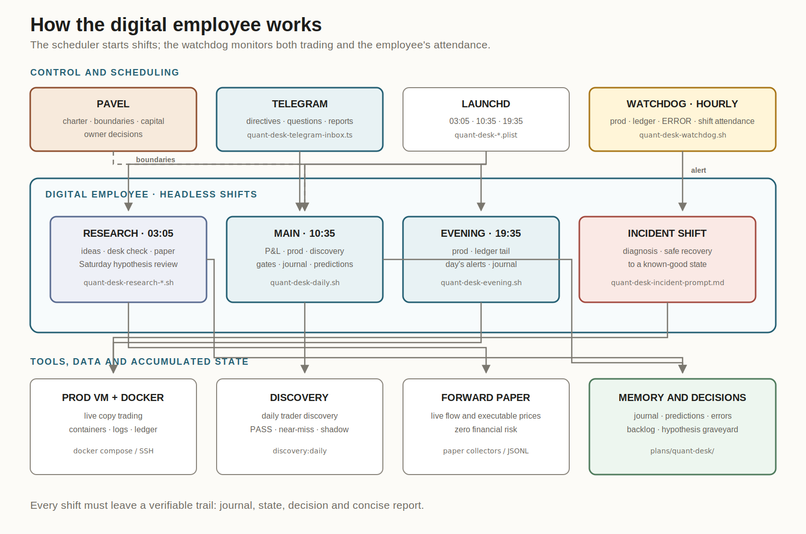

Many systems described as “digital employees” today start working only after a message from a person: someone still has to assign every next task.

I wanted an employee I would not have to wake up with a message every morning. One who starts a shift independently, finds work, acts within the limits of their authority, and comes to me only when an owner's decision is required.

It all started with my day job. I had been thinking a lot about an autonomous SRE engineer: someone who would monitor the infrastructure, spot failures, investigate their causes, safely restore a known working state, and bring a person either a diagnosis or a ready solution.

By then, I had already learned how to spin up entire technical teams automatically. The next step was an employee who did not need to be handed tasks one by one.

But the infrastructure at my main job was not a convenient place to test the idea: our load is modest, and serious incidents are rare.

At the beginning of the year, I became interested in Polymarket.

Polymarket is a prediction market. For me, it turned out to be a useful proving ground: real external systems, objective outcomes, a real cost of mistakes, and the ability to limit risk to small amounts. I already had a collection of trading bots running there.

At first, I was interested in copying the trades of successful traders. I built the trading infrastructure and daily scanners, learned how to test whether someone else's results could be replicated with my stake size, and launched several hypotheses with small amounts of money.

For several months, I monitored the experiments, reviewed reports, added and removed traders, checked trade execution, and shut down unsuccessful ideas.

Then I got bored.

The system still needed a manager: someone to notice silent failures, review candidates, analyze results, remember mistakes, and decide whether an experiment had already failed or simply needed more data.

I realized that I did not want to be that manager.

On July 18, I appointed a digital employee as the project's chief quantitative trader.

I consider it one employee, even though internally it is organized like a small team working in shifts. The trading bots are its hands. The employee itself combines the roles of manager, researcher, and on-call engineer.

Its work is founded on a charter.

The charter defines the role, objective, metrics, authority, and absolute boundaries. The employee may independently change configuration, add a newly discovered trader to shadow monitoring, restart a service, roll back an unsuccessful change, and deploy a paper-trading experiment.

But it may not place trades by hand, add money to the bankroll, or release a new strategy with real money before it has been tested sufficiently on paper. First comes the idea, then a cheap test, observation on new data without real money, and a success or kill criterion written down in advance. Only after that may it take the smallest step into live trading.

Money remains my responsibility. If the system proves a new source of income, it may request additional capital, but I make the decision. I also remain the owner of the “constitution”: only I can change the charter itself or lift a fundamental prohibition.

It does not need my permission for its day-to-day work.

And it does not need to be woken up.

In the morning, it checks the running system, profits and losses, trader activity, the results of the daily discovery process, and experiment deadlines. In the evening, a separate short shift makes sure no problem is left overnight. The research shift moves hypotheses forward. Every hour, a simple watchdog process checks the server, data freshness, and errors.

The watchdog also watches the employee itself: it is configured to notice a missed digital shift, try starting it again once, and raise an alert.

The operating procedure requires every shift to leave a log and a short Telegram report: what is happening with the money, whether the production trading system is healthy, what was done, what looked unusual, and whether a decision is required from me. I can give it a directive, but that directive will be carried out only within the charter's boundaries.

For example, in one of its recent runs, it independently found 85 new traders, reviewed every one of them, and reported that none qualified. Its job is to prevent a weak candidate from reaching real money. It does not have to find something useful every day.

It has memory.

Its working memory consists of a daily journal, decision and error records, forecasts for the next day, and a hypothesis graveyard. The graveyard prevents it from reopening ideas that have already been disproved.

On that foundation, I built an engineering equivalent of professional intuition.

Engineering intuition is made up of mathematics, memory, and mandatory investigation. First, the system finds deviations from historical behavior. Then the employee selects the three most important anomalies, retrieves similar episodes, and delivers a verdict: everything is explained, the baseline has changed, or an investigation is required.

This design has already produced real operational episodes.

On one occasion, the watchdog could not connect to the trading server and summoned an unscheduled SRE engineer. The engineer checked the server, service status, and data freshness. It turned out that the trading system had not failed: there had been a brief network outage between my home Mac and the remote machine.

The employee did not restart a healthy trading system just so it could produce an impressive “fixed it” report. It recorded the cause, confirmed that connectivity had been restored, and left a condition for deeper investigation if the problem began to recur. Sometimes the best work an engineer can do is avoid breaking anything through unnecessary intervention.

In another case, the employee found a bug in its own “intuition” mechanism. For two days, the system had compared forecasts with the wrong date and produced plausible results. It found the cause, fixed the check, and wrote a new rule into long-term memory: a green signal from an unverified control mechanism proves nothing by itself.

The new rule changed how subsequent shifts approached similar situations.

The first research shift, meanwhile, encountered a very attractive hypothesis: if several successful traders independently buy the same outcome, their combined signal should be stronger than any individual signal.

On the surface, the result looked nearly perfect: 37 groups of trades and a 100% win rate.

The employee broke down the sample and discovered that 27 of the 37 cases had been created by two traders using the same mechanics. One strategy spread across two wallets was creating the appearance of independent consensus. It killed the attractive branch. The remaining sample contained ten wins out of ten. It was too early to call that a discovery: ten observations were not enough. The idea could be revisited only after the predefined amount of data had accumulated.

To me, that matters more than generating yet another “brilliant strategy.” A digital employee must be able to generate ideas, act on them, and stop its own ideas.

This is still a young experiment. The trading infrastructure has been running for several months, while the employee itself started its first shift on July 18. It already launches without a message from me, fixes its own checks, changes permitted configuration, investigates incidents, reviews candidates, and runs the research pipeline. Its autonomy is already being tested in practice. Sustainable profitability has not yet been proven.

I am more interested in a different result.

A digital employee is created by an entire working system: a role, a schedule, authority, boundaries, memory, feedback, tools for taking action, and an obligation to report.

It does not need every next task to be assigned manually. It comes to work on its own.

And I am gradually stepping out of operational management and remaining in the role that motivated all of this in the first place: owner of the system, source of capital, and the person who makes only constitutional decisions.
