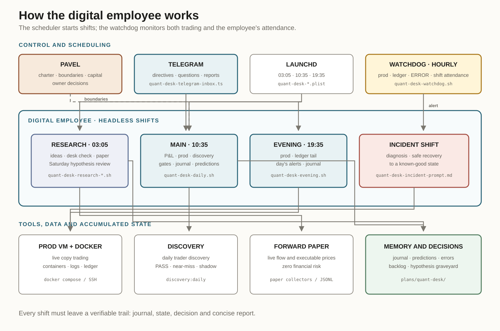

Almost everything called a digital employee today only works after a message from a person. Every next task is still assigned by you.

I wanted a different one. An employee nobody has to wake up in the morning: it starts its own shift, finds its own work, acts within its authority, and comes to me only when the decision is the owner's.

This started with my day job. I had spent a long time thinking about an autonomous SRE engineer — one that watches the infrastructure, spots failures, investigates causes, safely restores a known working state, and hands a person a finished diagnosis.

Spinning up entire technical teams was something I could already do by then. What came next was an employee nobody hands tasks to.

But my work infrastructure is a poor place to test that. The load is modest, serious incidents are rare. You can wait months for a proving ground.

At the beginning of the year I got interested in Polymarket.

Polymarket is a prediction market. As a proving ground it fit: real external systems, objective outcomes, a real price for mistakes, and risk you can keep inside small amounts. My trading bots were already running there.

At first I was interested in copying the trades of successful traders. I built the trading infrastructure and daily scanners, learned how to test whether someone else's results survive at my stake size, and launched a few hypotheses with small amounts of money.

For several months I watched the experiments. Reviewed reports, added and removed traders, checked execution, shut down ideas that failed.

Then I got bored.

The system still needed a manager: someone to notice silent failures, screen candidates, analyse results, remember mistakes, and decide whether an experiment had already lost or simply lacked data.

I did not want to be that manager.

On July 18 I appointed a digital employee as the project's chief quantitative trader.

I count it as one employee, though internally it is organised as a small team working shifts. The trading bots are its hands. The employee itself combines manager, researcher and on-call engineer.

Everything rests on a charter.

The charter defines the role, the objective, the metrics, the authority and the absolute boundaries. The employee may change configuration on its own, put a newly found trader under shadow observation, restart a service, roll back a bad change, and deploy a paper experiment.

It has no right to trade by hand. None to add money to the bankroll. None to release a strategy with real money before it has been tested on paper. First the idea, then a cheap check, then observation on new data without money, with success and kill criteria written down in advance. Only after that the smallest step into live trading.

Money stays with me. If it proves a new source of income, it may request capital, but the decision is mine. The charter is mine too: only I can lift a fundamental prohibition or rewrite the constitution itself.

For day-to-day work it does not need my permission.

And it does not need waking up.

In the morning it checks the running system, profit and loss, trader activity, the results of the daily search, and experiment deadlines. In the evening a short shift makes sure no problem is left overnight. The research shift moves hypotheses forward. Every hour a simple watchdog checks the server, data freshness and errors.

The watchdog also watches the employee. It notices a missed shift, starts it once more, and raises an alarm.

Every shift owes a journal and a short Telegram report: what is happening with the money, whether the trading system is alive, what was done, what looked strange, and whether a decision is needed from me. I can hand it a directive, but it will be carried out only inside the charter's boundaries.

In one recent run it found 85 new traders on its own, screened every one of them, and reported that none qualified. Its job is to keep a weak candidate away from the money. A useful find every day is not required.

It has memory.

Working memory is a daily journal, decision and error records, forecasts for the next day, and a hypothesis graveyard. The graveyard keeps closed ideas closed: nobody reopens them.

On that foundation I built it an engineering equivalent of professional intuition.

It comes from three parts: mathematics, memory and mandatory investigation. First the system finds deviations from history. Then the employee picks the three strangest things of the day, retrieves similar episodes, and delivers a verdict: explained, the baseline has changed, or investigate.

This design already has real operational episodes behind it.

One night the watchdog could not reach the trading server and summoned an unscheduled SRE engineer. It checked the server, service status and data freshness. The trading system had not failed: there was a brief network outage between my home Mac and the remote machine.

It did not restart a healthy trading system for the sake of an impressive "fixed it" report. It recorded the cause, confirmed connectivity was back, and left a condition for a deeper investigation if the problem started to repeat. Sometimes the best work an engineer can do is break nothing.

Another time it found a bug in its own intuition mechanism. For two days the system had compared forecasts against the wrong date and produced plausible results. It found the cause, fixed the check, and wrote a rule into long-term memory: a green signal from an unverified control mechanism proves nothing.

The rule changed how later shifts behaved in similar situations.

The first research shift, meanwhile, got a very attractive hypothesis: if several successful traders independently buy the same outcome, their combined signal should beat any single one.

On the surface the result looked nearly perfect — 37 groups of trades, a 100% win rate.

The employee broke the sample down. 27 of the 37 cases came from two traders running the same mechanics: one strategy across two wallets, impersonating independent consensus. It killed the attractive branch. The remainder held ten wins out of ten — too few to call it a find. The idea can be revisited only after a predefined amount of data.

That matters to me more than another "brilliant strategy". A digital employee has to generate ideas, act on them, and stop itself.

The experiment is young. The trading infrastructure has run for several months, the employee itself started its first shift on July 18. It already launches without a message from me, fixes its own checks, changes permitted configuration, investigates incidents, screens candidates and runs the research pipeline. Autonomy is being tested in practice. Sustainable profitability is unproven.

The other result interests me more.

A digital employee is not created by the model but by the working system around it: a role, a schedule, authority, boundaries, memory, feedback, tools to act with, and an obligation to report.

You do not assign it tasks. It comes to work on its own.

And I step out of operational management into the role this was all built for: owner of the system, source of capital, and the person who makes only constitutional decisions.
