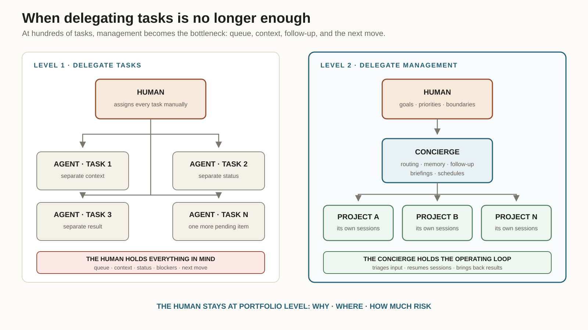
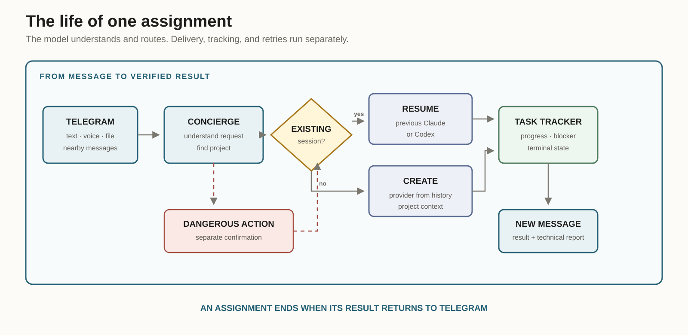

The more I use AI, the faster each individual task moves. Then the acceleration hits the most primitive part of the system: me.

Claude Code writes code, Codex reviews the changes, another session looks for the cause of a failure, and a fourth waits for review. They can work in parallel. My biological brain cannot do that nearly as well. Working memory holds only a few independent items at once; research often puts the number near four [meaningful chunks](https://pubmed.ncbi.nlm.nih.gov/11515286/). The exact limit depends on the task and on how well information is grouped, but it is nowhere near several dozen live sessions.

I started confusing which agent I had answered, what each one was waiting for, and where the finished result was hiding. The sessions did not forget their tasks. I did.

Once I asked a Telegram bot what was happening in one project. It looked at the timestamp of the last log entry and confidently reported that the session had been stuck for an hour and a half. At that exact moment, the screen on my Mac said `2 running tasks`. Another time I delegated work through the same bot. The agent finished, the result was already in the dashboard, and Telegram remained silent. Twenty minutes later I wrote: “Well?”

I needed an assistant that would remember the agents for me: know who was doing what, resume the right session, pass in new information, and come back with the result on its own.

I first built Agent Dashboard, a separate Electron application showing projects, sessions, and recent events. That was enough while I was at the computer. From a phone, I wanted to ask one question: “What is happening with Logicore?” Or forward a colleague's message and say, “Pass this to the project.”

That is how the Concierge appeared.

## When delegating tasks is no longer enough

The first stage of working with AI usually looks the same. A person takes a task, describes it to an agent, and receives the result. Better instructions and tools make it possible to delegate larger units of work.

With one project, this produces almost pure acceleration. I can still remember why each session is open, what it already knows, and which answer needs checking. Management stays invisible because it takes less time than the work itself.

Then there are ten projects and hundreds of tasks. Execution keeps getting cheaper, but a new cost appears: choosing the next task, finding the right context, avoiding duplicate work, noticing a blocker, waiting for the result, and remembering a decision made last week.

I had delegated execution while keeping all dispatch work for myself. AI sped up task production so much that I became the bottleneck in its throughput.

The next move is to step up one level. Agents can take over not only work inside a project but also a large part of its operational management: intake, routing, resuming previous sessions, tracking unfinished turns, running scheduled checks, and collecting summaries.

The human stays at the portfolio level. I decide why a project exists, where it is going, how much risk is acceptable, and which irreversible actions may be taken. The Concierge keeps work moving between those decisions.

This resembles the growth of an ordinary company. A founder first hires people to get more work done. Then the founder discovers that the entire day is spent assigning tasks and asking for status. At that point, another individual contributor is not the answer. What is missing is a management loop.



## Why I needed a separate agent

The Concierge lives in Telegram and accepts messages only from me. I can send text, a voice message, a screenshot, a document, or a fragment of a forwarded conversation.

Its work begins before any project agent is called. It has to understand which project the request belongs to, find the previous session, preserve its context, and decide whether anything should be changed at all. Sometimes I only want a summary. Sometimes I want the work to continue. Sometimes I forward a message with no verb, and proposing a few choices is safer than acting immediately.

The Concierge must not fix the project itself. I caught it trying to “help quickly” several times: connecting over SSH, opening a database, or reading a repository directly. That saved time only on the first step. Afterward, roles, permissions, and work history were mixed together.

The rule is now simple: the Concierge interprets and coordinates; work inside a project stays in that project's session.

This also changed how I choose the model. At first, we routed tasks by stereotype: code went to Codex, operational work to Claude. Continuity turned out to matter more. If a project already lives in Claude Code, that session has accumulated instructions, skills, an open branch, and memory of previous decisions. Opening Codex just because a new request contains the word “code” throws that advantage away.

The Concierge therefore looks for an existing session and resumes it. It creates a new session only when there is genuinely nothing useful to continue. The provider for a new session is inherited from the project's history as well.

## The path of one request

Suppose I forward a question from a course curator to Telegram. A second before forwarding it, I write a separate line: “This is our curator.”

An early version of the Concierge processed the first sentence immediately and replied that it did not know who I meant. Now adjacent messages enter a short collection window. The caption, forwarded message, and attachment reach the model as one ordered package.

Next, the Concierge compares the mentions with projects from the dashboard and its working memory. If the match is reliable, it proposes the relevant action immediately. If context is weak, Telegram shows two or three buttons: pass the request to the matched session, create a separate assignment, or just save the information. Nothing changes before I choose.

After the choice, the Concierge sends the task to the project agent and leaves one status message in the chat. Its text changes as work proceeds: the agent reads data, runs a command, edits files, and checks the result. This is a service message; it must not replace the substantive reply.

When the project session finishes its turn, a separate watcher notices the final state and wakes the Concierge. The Concierge sends the result as a new message. Long logs and engineering details remain behind a “Technical report” button.

Using a new message matters. If the old status is edited, Telegram may not display a notification. Formally, the answer was delivered; in practice, the person never saw it.



## What runs without a model

A pinned Claude Code session on Sonnet handles request understanding. It does not close after every answer. The process waits for the next message on standard input, so idle time consumes no tokens and a new request does not pay the startup cost of another session.

I gradually moved everything related to reliability out of the language model.

A local outbox keeps a finished reply until Telegram confirms delivery. A network failure retries the send, not Sonnet's reasoning. The scheduler computes the next run itself. The watcher tracks assignments without continuous AI polling. A watchdog restarts the service after a failure with the same session ID.

The system now consists of a few simple parts:

| Component | Responsibility |
|---|---|
| Telegram bot | Mobile input and reply delivery |
| Pinned Sonnet session | Intent understanding and conversational context |
| Agent Dashboard | Projects, Claude/Codex sessions, and events |
| Task watcher | Progress, stalled starts, and final results |
| Project Brain | Facts, decisions, and open questions for each project |
| Scheduler | Recurring assignments and run history |
| Decision corpus | Search for similar choices in old sessions |

Sonnet has Full Access: Chrome, skills, plugins, and connected MCP servers. A dedicated interceptor still blocks shell commands and direct project-file access from the Concierge session. A textual promise to “stay out of projects” did not prove strong enough.

## The failures that shaped the architecture

The first version started a new Claude session for every request. The bot replied, exited, and forgot the conversation. “Check again” naturally prompted a question: check what? Moving to one pinned session preserved the context and reduced response time.

Then I learned that dispatching a task was not enough. Claude Code has no event that can make a language model, after it has already replied, speak again when another session finishes. That is why the independent watcher exists. I no longer have to write “Well?” to discover a result that is already ready.

The next failure looked mysterious: some replies “did not render.” Telegram's API log said that everything was successful. The initial reply and the progress tracker were editing the same `message_id`; whichever wrote last remained on screen. We reserved the old message for progress and started sending substantive replies separately. We also added a technical delivery log: API method, result ID, attempt number, fallback, and text hash. The text itself is not logged.

Another bug exposed an internal exception to the user:

```text
Claude returned an invalid intake proposal
```

The cause was mundane. The model understood the request but invented a button label longer than 48 characters. Those fields are now normalized locally first. If the structure is still invalid, the service asks the model to repair it once. The final fallback offers safe read-only actions instead of an exception trace.

Write permissions needed their own investigation. The Concierge had two separate restrictions: normal authorization to mutate data and an additional confirmation for dangerous operations. Both produced a similar refusal, so even the agent could not explain why adjacent requests behaved differently.

Authorization is now issued for a specific Telegram message, expires quickly, and carries a risk scope: read-only, reversible mutation, or dangerous action. A refusal includes a reason code and the risky fragment that was detected. Repeating the same forbidden call cannot accidentally push it through.

## What it remembers about me

A long chat history is poor memory. It makes words easy to find and decisions hard to find.

The Concierge separately indexes my decisions from local Claude and Codex sessions. Each record keeps the preceding conversation, my formulation, the agent's next reply, and the names of tools that were used. Command arguments and tool results do not enter this index.

For example, I once said firmly: “ai-panel is a different project. Do not touch it.” A later request for a new interface found that precedent and produced a useful recommendation: create a separate repository instead of attaching the feature to a project with a similar name.

This search does not turn the model into a copy of me. It lets the model make a prediction and expose its basis: which past decisions look similar, how close they are, and what information is missing now. After I make the actual choice, the prediction can be calibrated.

Project Brain sits next to the general index. It is a short memory for each project: confirmed facts, recent decisions, the usual provider, and open questions. Daily summaries no longer depend only on the last ten lines of the newest session.

## Assignments that return on their own

I do not use slash commands in ordinary conversation. A recurring assignment is created with a sentence:

> Send me a Logicore summary at ten on weekdays until September 1.

Or:

> Check the migration every three hours, eight times in total.

Before saving it, the Concierge shows how it understood the interval, repeat limit, and next runs. The same conversational interface can change the schedule, pause it, run it now, or delete it.

The schedule database lives on the Mac and survives service restarts. A missed day does not produce a queue of obsolete runs. A task cannot run in parallel with itself. After three persistent failures, it stops and reports the reason.

For publishing, payments, deletion, or a production deployment, a permanent schedule is not permanent consent. Every such run requires confirmation again.

## Where the system stands now

On July 31, 2026, a local installation check shows one live pinned Sonnet session. The dashboard sees 12 projects and 38 Claude and Codex sessions. The index contains 4,246 decision records from three source types. The current suite of 171 tests passes.

Those numbers will become outdated quickly. The limits will remain.

The Mac and Agent Dashboard have to be running, or the Concierge cannot reach project sessions. Another session may stop because of the network, authorization, or a missing tool. A forwarded screenshot without explanation can genuinely be ambiguous. The decision model finds analogues, but it does not read minds.

I tested local models as well. Some sounded convincing in normal conversation, but their quality dropped on routing, strict tool schemas, and dangerous scenarios. Sonnet remains the central dispatcher for now. Speech recognition, storage, search, scheduling, and observation run locally.

I can now leave home without the laptop, forward a task to the Concierge, and receive an answer from the same project session I worked with that morning. If the agent gets stuck, I see it in Telegram. If it finishes, the result arrives on its own.

That was the point.
