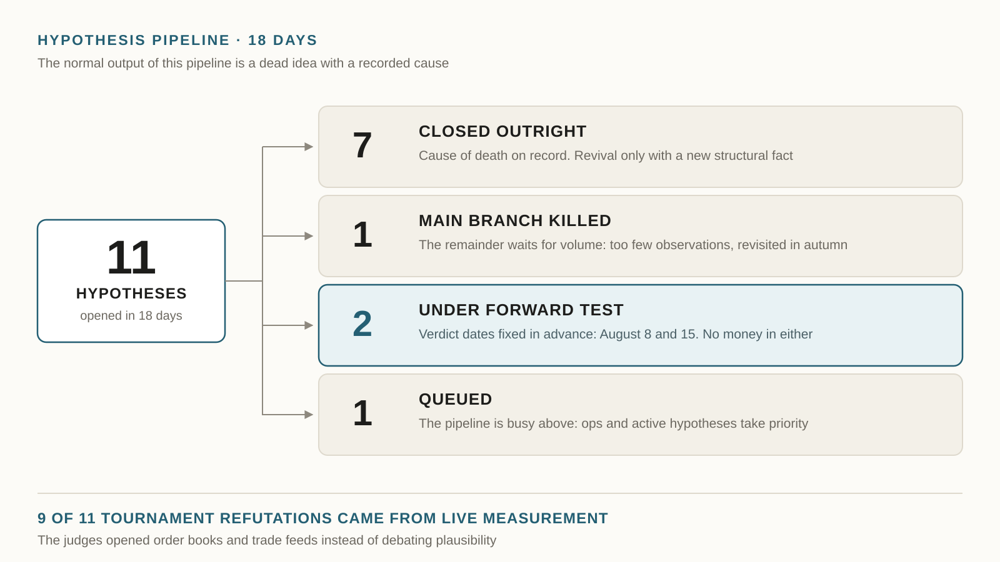

On July 18 I put a digital employee in charge of my prediction-market project as head quant. Today is day 18. Here is what worked and what did not.

Fifty shift runs in 18 days. Morning, evening, night research, the long Saturday one. Nineteen journals, one per day, no gaps.

I started none of them. He shows up on his own.

Plus ten unscheduled call-outs. The watchdog saw something in the system that should not have been there and woke the on-call engineer.

I expected him to hunt for new ways to make money. Mostly he rejects things.

Eleven hypotheses in 18 days. Seven closed outright, an eighth had its main branch killed and the remainder sent back to wait for data. Two are in work, one is queued. One of the dead did not survive until the evening of the day it was born.

His pipeline:

1. Idea.
2. Cheap check against data already collected — one day.
3. Forward test on paper, weeks, no real money.
4. Success and kill criteria, written down before collection starts.
5. Only then real money, $5–15.

The criteria are written in advance. That is the only thing stopping anyone from bending results to fit a good-looking idea.

Once a month he runs an idea tournament. Ten generators independently propose hypotheses from different angles, then a historian, a practitioner and a statistician judge each one. August: thirty ideas, seventy-four agents.

Five were killed. Nineteen stayed as candidates with no right to proceed. Two made it to actual work.

Nine of eleven refutations rested on live measurement, not reasoning. The judges went into order books and trade feeds and checked whether the idea was telling the truth.

One hypothesis died when they measured the minimum price step. It came out ten times smaller than the idea required. There was no edge at all.

Three separate investigations converged on one conclusion: where the exchange subsidises market making, there is no easy money for us.

People rarely finish three investigations in a row when each one ends in "no". It is dull and it stings. He finished them.

About money.

July closed positive: about seventy dollars on seventy trades. First profitable month of the project.

The profit came from defence, not from a discovered edge. The system started filtering out almost everything it used to let through, and turnover dropped six times.

August is running close to zero.

Right now the live circuit has almost no traders worth copying. Signals are down to single digits per day. Three days running the count fell.

He worked out why: seasonal quiet plus new candidates still under observation. Not a failure. A regime.

He did not fake activity. He declared the quiet the August norm, rewrote the expectations and set a date after which quiet turns into an alarm.

The search runs every day regardless. On Wednesday he screened ninety-two new candidates and approved none. One went into shadow observation: the trader is tracked and what-if trades are recorded, but no money is placed. The shadow list grew from five to ten.

He catches himself regularly.

The watchdog raised an alarm: the trade journal is silent. He checked and worked out that a silent journal on an empty market is normal, not a failure. He rewrote the rule: alarm only when both journals go quiet at once, live and shadow.

Second case. He mixed up the day of the week and ran the Sunday procedure on Monday. On an automated launch he could not see what day it was. He injected the weekday straight into the task.

Third. He raised a small alarm — "the shadows are silent" — checked, and found no silence. He had misread his own file, looking for a field under the wrong name. He wrote that into the journal in plain words, admission included.

That matters to me more than a winning trade. A system that does not look for its own mistakes will sooner or later deliver a beautiful report about a success that never happened.

Then there are two things he does not decide without me. The charter was written for exactly these.

First — access.

His best hypothesis right now is servicing the combo-bet channel. Retail wants to bundle several outcomes into one bet, and almost nobody is willing to take the other side. He measured the demand: over a million unanswered requests per day. Channel turnover runs forty to seventy times above the threshold below which the idea had to be killed.

Then he hit the wall. Profitability cannot be computed from the outside at all. He tested three pre-registered ways around the limitation and refuted all three with live measurement.

To compute the margin you have to become a participant in that channel with working keys. That means real money. That means me.

He did not push through. He walked up to the edge of his authority, stopped, wrote the question down and put it on my desk.

Second — his own capacity.

Three times in these weeks a shift hit the model limit, one collapsed entirely. He handled it himself: learned to wait for the reset time and retry once. The symptom is gone, the cause is not.

What to do next — spread the shifts out or extend the plan — he logged as a question for me. It has been open since August 1.

He does not decide for me.

Eighteen days is not long enough to judge profitability. Today's wording is boring: autonomy confirmed, profitability unproven.

Profitability is not what I was testing.

I was testing whether you can assemble an employee who shows up on his own, finds his own work, kills his own good-looking ideas, admits mistakes in writing, and brings me only the decisions that are mine to make.

In 18 days he closed seven of his own hypotheses and cut the branch off an eighth, rejected hundreds of candidates, fixed his own checks twice, never broke a working trading system for the sake of a clean report, and asked me one question. About capacity.

The dates are set. August 8 — verdict on the combo-bet hypothesis. August 15 — verdict on the paper experiment. The rule was fixed in advance: two profitable months in a row and I increase the capital.

The first one is in. He is working on the second right now, with no reminders from me.
