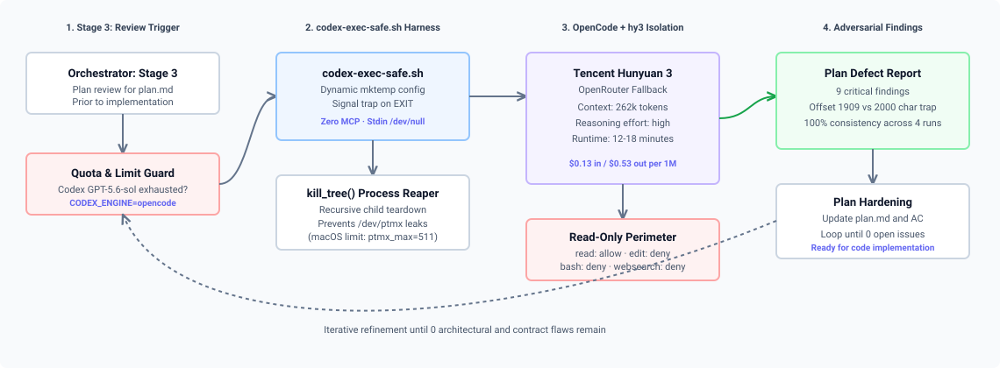
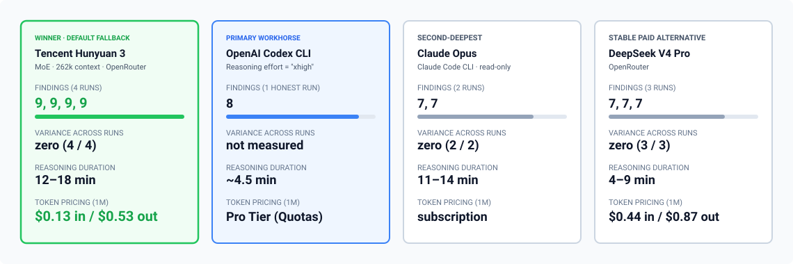

In autonomous agent development (Agentic SDD), one of the most critical stages is **reviewing implementation plans and specs before writing any code**. If a logical defect slips past the planning stage, the implementing agent wastes dozens of minutes and API dollars implementing a broken architecture, while QA agents inherit false-positive test assertions.

Our primary engine for deep plan review is the **OpenAI Codex CLI** running at maximum reasoning effort (`reasoning_effort="xhigh"`). However, in fully autonomous overnight batches, we periodically hit token quotas and provider rate limits. Furthermore, single-vendor dependency represented a single point of failure.

Following the end of our Antigravity-Gemini subscription on July 14, 2026, we benchmarked **12 LLMs** on a real-world task to select an uncompromising fallback reviewer. The winner was **Tencent Hunyuan 3 (`tencent/hy3`)**.

Below is an analysis of Hunyuan 3's architecture, the benchmark methodology, comparative metrics against Codex and Claude Opus, and the implementation of our `codex-exec-safe.sh` execution harness.



---

## 1. The Reviewer Challenge: Why Reviewing Is Harder Than Coding

A plan reviewer performs the opposite task of code generation. Its goal is not to fill in implementation details, but to serve as an **adversarial auditor**:
1. Cross-examine plan assertions against the actual state of the repository (via read-only filesystem access).
2. Spot type mismatches, implicit environment assumptions, and hallucinated API endpoints.
3. Stress-test boundary conditions and verify that proposed tests fail on legacy code and pass on the target build.

Most lightweight models ("flash" and "mini" tiers) fail in this role: they default to agreeable consensus ("LGTM", suggesting minor stylistic polishes) without verifying the repository state.

---

## 2. Under the Hood of Tencent Hunyuan 3

Tencent has developed its Hunyuan family of LLMs since 2023, transitioning from dense architectures to a sparse Mixture-of-Experts (MoE) design in Hunyuan-Large and Hunyuan 3:

* **Shared + Specialized Experts Architecture:** Total parameter count is approximately 389B, with ~52B active parameters per token. In contrast to standard MoEs, Hunyuan assigns **1 continuously active Shared Expert** (retaining syntax and general language invariants) alongside **16 specialized experts** for narrow code and logic domains.
* **Expert-Specific Learning Rate (ES-LR):** To prevent routing collapse where a few experts dominate, learning rates scale dynamically per expert, maintaining uniform domain depth across all 16 experts.
* **Compiler-Verified Pretraining Synthetics:** Synthetic reasoning trajectories were validated using real compilers, typecheckers, and formal theorem provers, training the model to trace code like an AST interpreter.
* **KV-Cache Optimization (256k Context):** Multi-Head Latent Attention (MLA) combined with RoPE interpolation reduces KV-cache memory pressure by 60–75%, enabling full repository exploration without context degradation (100% Needle-in-a-Haystack).
* **Autonomous Backtracking (Long-CoT):** In high-reasoning mode, the model constructs explicit hypothesis trees and backtracks upon discovering boundary contradictions.

### Official Manufacturer Benchmarks (Tencent AI Lab)

In published evaluation reports, Hunyuan 3 demonstrates top-tier performance across mathematics, formal logic, and software engineering:

| Benchmark | Discipline | Hunyuan 3 Score | Context |
| :--- | :--- | :---: | :--- |
| **MATH-500** | Advanced Mathematical Reasoning | **86.4%** | On par with specialized reasoning models |
| **GSM8K** | Multi-step Arithmetic | **95.8%** | Near-ceiling accuracy |
| **HumanEval** | Python Code Generation & Analysis | **89.6%** | Outperforms standard open MoE baselines |
| **LiveCodeBench** | Contemporary Competitive Programming | **51.2%** | Resistant to dataset contamination |
| **SWE-bench Verified** | Repository-level Defect Resolution | **38.8%** | Zero-shot agentic setting |

In production, these strengths translate into methodical step-by-step verification: the model inspects dependency files, audits call signatures, and flags subtle contradictions.

---

## 3. The Testbed: A Plan That Wasn't Implemented Yet

Our first testbed wasn't honest, and it took a while to notice. We took three real **Findrates** backlog plans that had already shipped and merged, and had the reviewers judge them against the finished code. Models started racking up points for findings like "this phase is already done, nothing to check here" — a class of finding that never occurs in the live pipeline, because plan review always runs before the code is written, not after. Ranking on that testbed would have misled us: Grok 4.5 scored 10 findings, GLM-5.2 scored 8 in 71 seconds, and both looked stronger than they turned out to be.

We rebuilt the decisive test around a plan for how our Telegram bot handles incoming messages under time pressure: how long to wait on a slow upstream call, how to avoid sending the customer the same message twice, and what to do if the bot silently swallows a request instead of answering it. This time, all twelve models saw the plan against the code as it stood **before** that plan was implemented — the exact conditions our pipeline actually reviews under — with the same prompt and the same read-only access to the repository.

Manually checking the findings against the code surfaced three classes of defect that different models caught:

1. **A missing timeout on the calling side.** One of the message-handling paths had no timeout of its own — the code itself carried a developer's comment admitting as much. The plan raised the allowed wait to 50 seconds, but at that length, a retried delivery from Telegram turns into a silent "OK" with no real processing behind it — a direct violation of the plan's own "no silent acknowledgments" rule. Claude Opus and Hunyuan 3 flagged this independently.
2. **A test that can't catch its own bug.** One of the tests written specifically to guard against this regression was actually pointed at the wrong piece of code, and so couldn't physically catch it. Of twelve models, only Hunyuan 3 spotted this.
3. **Duplicate checking that runs too late.** The system checked whether a request had hit its rate limit before checking whether it was a duplicate. Because of that ordering, a duplicate that arrived after the limit was hit still went through and reached the customer a second time. Codex found this; Hunyuan 3 confirmed it independently.

A separate wrinkle in the testbed itself surfaced along the way: one of the engines' code search didn't look inside certain folders, even though it could read a file just fine if it already knew the exact path. Because of this, one model refused to verify part of its own findings ("can't check — search finds nothing"), and another wrongly declared a file "nonexistent" when it actually existed. We patched the review prompt so the rest of the field wouldn't trip on the same thing.



---

## 4. Benchmark Results Across 12 Models

Each model received identical instructions, read-only repository permissions, and the same snapshot of the code — from before the plan was implemented. Metrics:
* Findings per run and variance across repeat runs.
* Share of findings confirmed by manual code verification, and false positives.
* Runtime and cost by OpenRouter pricing, where the engine wasn't subscription-based.

### Comparative Evaluation Matrix

| Model | Findings (runs) | Variance | Runtime | Cost (Input / Output per 1M) | Role in Pipeline |
| :--- | :---: | :---: | :---: | :---: | :--- |
| **Tencent Hunyuan 3 (`hy3`)** | **9, 9, 9, 9** | **zero (4/4)** | 12–18 min | **$0.13 / $0.53** | **Chosen fallback for every review stage** |
| **OpenAI Codex (`xhigh`)** | 8 | 1 honest run | ~4.5 min | Codex Pro Tier | Primary workhorse engine |
| **Claude Opus** (Claude Code CLI) | 7, 7 | zero (2/2) | 11–14 min | subscription | Second-deepest, 3x slower than hy3 |
| **DeepSeek V4 Pro** | 7, 7, 7 | zero (3/3) | 4–9 min | $0.44 / $0.87 | Stable paid alternative |
| Kimi K3 | 6, 3 | 2x swing | 8–9 min | $3.00 / $15.00 | Too inconsistent to trust as a gate |
| GPT-5.6 Luna | 5 | 1 run | ~5 min | $0.10 / $0.60 | Cheap, but shallow |
| DeepSeek V4 Flash | 3, 3, 3, 4 | consistently weak | 12–30 min | $0.09 / $0.18 | Hits a model ceiling, not a harness issue |
| Grok 4.5 | 3 | 1 run | ~5.5 min | $2.00 / $6.00 | Didn't earn its price on the honest run |
| Xiaomi MiMo v2.5 | 3 | run timed out mid-pass | > 4 min | $0.14 / $0.28 | Fell short |
| GLM-5.2 | 2 | 1 run | ~4.5 min | not disclosed | Fast, but shallow on the honest run |
| Gemini 3.5 Flash | 2 | 1 run | ~3 min | $1.50 / $9.00 | Below the bar |
| Gemini 3.6 Flash | 2 | 1 run | ~3 min | $1.50 / $7.50 | Below the bar |

A thirteenth candidate, `qwen/qwen3.8-max`, doesn't appear in the table: every current Qwen release on our OpenRouter account hit the account's guardrail privacy policy ("No endpoints available matching your guardrail restrictions") and returned nothing at all — that's missing data, not a low score.

Arguably the single most important result of this testbed: **ranking on already-implemented versions of the same plans does not predict ranking on unimplemented ones.** Grok 4.5 scored 10 findings on the implemented plan and 3 on the honest one. Gemini Flash scored 7 and 2 respectively. Had we decided from the first, dishonest testbed, Grok would have shipped into the pipeline.

---

## 5. Why Hunyuan 3 Outperformed Flagship Models

1. **The one finding nobody else made:**
   Of twelve participants, only Hunyuan 3 noticed that one of the tests written specifically for this check was actually pointed at the wrong code — meaning the safety-net test physically can't catch the regression it was written to catch. Neither Codex, nor Opus, nor any of the paid contenders saw it.
2. **Reproducibility where everyone else drifted:**
   Four independent runs, four times exactly 9 findings. DeepSeek V4 Pro matched that zero variance, but at seven findings; Opus matched it too, but at seven findings and three times slower. Every other contender's runs swung by 2x or more.
3. **262k Token Context Window:**
   Large enough to load the entire plan, acceptance criteria, and related source modules and tests simultaneously.
4. **Economics:**
   At **$0.13 per 1M input tokens** and **$0.53 per 1M output tokens**, one exhaustive 12–18-minute reasoning pass costs a few cents — an order of magnitude cheaper than paid alternatives like DeepSeek V4 Pro or Kimi K3, and without eating into the subscription quota Codex and Opus share.
5. **The Latency Trade-off:**
   12–18 minutes is too slow for interactive code completion in an IDE, but **ideal for background autonomous pipelines**, where catching a flaw during planning saves hours of agentic rework and human debugging.

---

## 6. Engineering Harness: `codex-exec-safe.sh`

To integrate `hy3` as a seamless drop-in fallback for OpenCode/Codex, we built `~/.claude/bin/codex-exec-safe.sh`.

It resolves three infrastructure constraints:

### 1. Preventing PTY File Descriptor Leaks on macOS
Spawning LLM subagents from background orchestrators risks leaving orphaned `app-server` and MCP child processes. Each orphan holds open pseudo-terminal file descriptors (`/dev/ptmx`), eventually exhausting macOS's `kern.tty.ptmx_max=511` system limit.

The wrapper enforces deterministic tree termination (`kill_tree`) via an EXIT trap:

```bash
kill_tree() {
  local target="$1"
  [ -n "$target" ] || return 0
  local child
  for child in $(pgrep -P "$target" 2>/dev/null); do
    kill_tree "$child"
  done
  kill -TERM "$target" 2>/dev/null
}
```

### 2. Read-Only Perimeter for the Reviewer
An agent with write access often attempts to "fix" the repository rather than critiquing the plan. For `opencode`, a throwaway configuration is generated on each invocation with MCP disabled and strict tool restrictions:

```json
{
  "$schema": "https://opencode.ai/config.json",
  "model": "openrouter/tencent/hy3",
  "permission": {
    "read": "allow", "grep": "allow", "glob": "allow", "list": "allow",
    "external_directory": "allow",
    "edit": "deny", "bash": "deny", "webfetch": "deny", "websearch": "deny"
  },
  "provider": {
    "openrouter": {
      "models": {
        "tencent/hy3": {
          "options": {
            "reasoning": { "effort": "high" }
          }
        }
      }
    }
  }
}
```

### 3. Single-Variable Engine Switching
Switching to Hunyuan 3 requires setting one environment variable:

```bash
CODEX_ENGINE=opencode codex-exec-safe.sh "<prompt>"
```

Unsetting it restores default execution through the primary engine — the Codex CLI at `reasoning_effort="xhigh"`.

---

## Key Takeaways

1. **Decouple generation from verification:** The model drafting code must never be the sole authority verifying its own assumptions.
2. **Never compromise on verification latency:** A 15-minute verification delay during planning pays for itself by eliminating downstream production regressions.
3. **Specialized reasoning models outperform general frontier models in niche tasks:** At $0.13/$0.53, Tencent Hunyuan 3 found more confirmed defects with less variance than Kimi K3 at $3/$15 per 1M, and out-found even the subscription-tier Codex and Opus — through relentless, unhurried reasoning.
