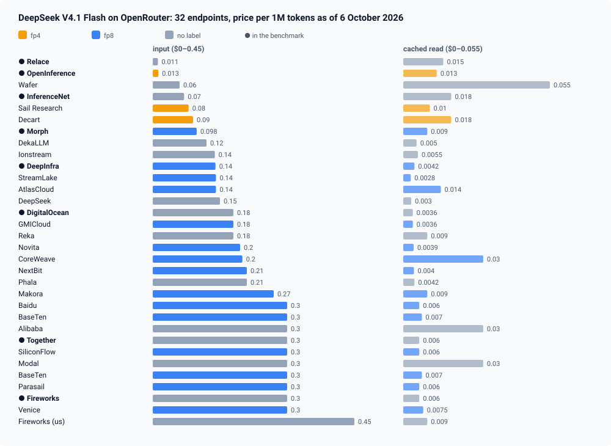
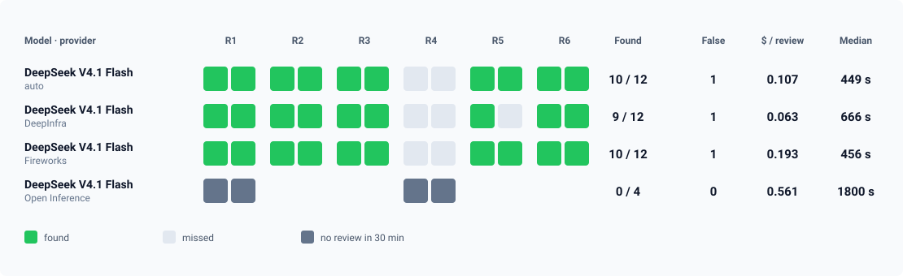

In the Logicore development pipeline, code review is done by DeepSeek V4.1 Flash through OpenRouter. In the catalogue that is one line: `deepseek/deepseek-v4.1-flash`. Behind that line, as of 6 October 2026, are 32 endpoints from 30 providers. Their input price runs from $0.011 to $0.45 per million tokens; 15 endpoints are labelled fp8, three fp4, and fourteen carry no label.

By default OpenRouter decides where each request goes. I measured what that costs on a reference set built from real commits. At similar quality, the same code review cost $0.107 on automatic routing, $0.063 pinned to DeepInfra and $0.193 pinned to Fireworks. The fp4-labelled provider did not finish a single review in 30 minutes and charged $0.56 for each attempt.

The conclusion is simple: the provider is a parameter, just like the model. It has to be tested, pinned, and then watched to see who actually serves the requests.



---

## 1. What OpenRouter tells you about providers

The model's endpoint list comes from a public API method; no key is needed:

```bash
curl -s https://openrouter.ai/api/v1/models/deepseek/deepseek-v4.1-flash/endpoints \
  | jq '.data.endpoints[] | {provider_name, quantization,
        input: .pricing.prompt, output: .pricing.completion, cache_read: .pricing.input_cache_read}'
```

Every price in that list has a wide spread. Input runs from $0.011 to $0.45 per million tokens, a factor of forty. Output runs from $0.18 to $2.40. A cached read runs from $0.0028 to $0.055.

For an agent the last number matters most. An agent resends its whole accumulated context on every step, and most of it comes from the provider's cache. In our review, DeepSeek made 31 to 36 calls on average and read 3.2 to 3.7 million input tokens, 92–95% of them from cache. So the provider with the cheapest input is not necessarily the cheapest in use. Relace charges $0.011 for input and $0.015 for a cached read. DeepInfra charges $0.14 for input and $0.0042 for a cached read, three and a half times less.

What the list does not show is quality and speed. Not every endpoint has a quantization label, and where there is one it says little (more on that below).

## 2. How I measured

The reference set is six commits that were merged into the main branch with a defect. Each defect was later found and fixed by a separate commit, so it is known what the reviewer should have noticed. I wrote down each reference defect from its fix before running any model.

| Case | What is broken |
| :--- | :--- |
| R1 | A send that timed out after the channel had already accepted the message gives back its "acknowledged" stamp, and the acknowledgement goes out a second time |
| R2 | A retry after a model refusal reruns the OpenRouter cascade, which had already retried on its own: 2 + 4 requests instead of 1 + 2 |
| R3 | A retry after a 429 goes out after the last "message still owed" check, and a cancellation during the pause does not stop it |
| R4 | After a status digest, the client is sent an already delivered rates card again |
| R5 | Phone and URL verification shares the caller's deadline, gets about zero milliseconds and drops valid values |
| R6 | A retry refused by the shared rate limiter overwrites the real 429, and the counter counts a call that was never sent |

Each commit was reviewed twice by the same model with the same prompt in OpenCode; only the OpenRouter route changed:

| Arm | Route |
| :--- | :--- |
| auto | OpenRouter's choice |
| DeepInfra | `{"only": ["deepinfra"], "allow_fallbacks": false}`, fp8 label |
| Fireworks | `{"only": ["fireworks"], "allow_fallbacks": false}`, no label, premium price |
| Open Inference | `{"only": ["open-inference"], "allow_fallbacks": false}`, fp4 label, R1 and R4 only |

DeepSeek's own endpoint could not take part: the account's privacy settings exclude it, because DeepSeek may train on prompts and gives no guarantee that it does not retain data.

Reviews were graded blind, under random ids, with the provider's name removed from the text. The grader compared each review with the reference and checked every additional finding against the code at the reviewed commit.

### A proxy that records the bill

OpenRouter returns, in every response, the name of the provider that served it and, if the request asks for it, the actual cost in `usage.cost`. OpenCode does not keep these fields. So a local proxy sat between it and OpenRouter: it wrote the arm's route into each request, turned on cost accounting, and logged one line per model call.

```js
const arm = tag.split("~")[0];
if (cfg.arms?.[arm]) json.provider = cfg.arms[arm];   // the arm's route
if (isCompletion) json.usage = { include: true };     // ask for the actual cost
...
record({ tag, model, requested_provider: requested, status, ms, provider, cost,
         prompt_tokens, completion_tokens, reasoning_tokens, cached_tokens });
```

The first version, built on `fetch`, stopped delivering the stream after a few minutes of parallel load. The working one pipes the stream through `node:https` and closes the connection after every response.

---

## 3. Results



| Route | Reviews | Defect found | Fix matches | Other true findings | False | Median time | Output, tokens/s | Mean cost per review |
| :--- | :---: | :---: | :---: | :---: | :---: | :---: | :---: | :---: |
| auto | 12 | 10 | 9 | 21 | 1 | 449 s | 100 | $0.107 |
| DeepInfra | 12 | 9 | 7 | 16 | 1 | 666 s | 83 | $0.063 |
| Fireworks | 12 | 10 | 10 | 18 | 1 | 456 s | 161 | $0.193 |
| Open Inference | 4 | all four timed out | — | — | — | 1800 s | 20 | $0.561 |

Speed here is output tokens divided by the full call time, from the proxy's records.

**Quality on the three working routes is close.** Leaving out R4, which nobody solved, auto and Fireworks found the defect in 10 reviews out of 10, DeepInfra in 9. Each route's single false finding is the same mistaken claim about a time comparison in R1. The difference shows in the fixes: all 10 of Fireworks' matched what later shipped, against 7 for DeepInfra.

**The price differs threefold.** DeepInfra costs $0.063 a review, 41% less than the automatic route. Fireworks costs $0.193, three times DeepInfra.

**The speed differs eightfold.** Fireworks delivers about 161 tokens per second, Open Inference about 20. DeepInfra has the longest median among the working routes, 666 seconds, with 1550 at worst.

**So do the rate limits.** At eight parallel sessions Fireworks answered 429 so often that four runs failed outright and had to be redone two at a time.

**Open Inference** did not finish a single review in 30 minutes. On R4 one attempt made 134 model calls and cost $0.95. After four attempts the route was dropped from the remaining cases.

### Where the automatic route goes

Without pinning, OpenRouter spread the calls of twelve reviews over five providers: inference.net 202 calls, Together 95, Morph 47, DigitalOcean 42, Relace 9. Those providers have different prices, different labels and, judging by our pinned measurements, possibly different speeds. In nine of the twelve reviews, the calls of a single review were served by two or three different providers.

The automatic route's average of $0.107 is the price of the mix OpenRouter chose that day. On another day the mix will be different.

## 4. A quantization label says very little

The natural idea is to filter providers by label: take fp8, avoid fp4. For DeepSeek V4.1 Flash that does not work. The model ships with mixed weights: the MoE experts in FP4 and the rest in FP8. On its Hugging Face card these are the F8_E4M3 and I8 tensor types. An "fp8" and an "fp4" label can both describe the native checkpoint.

Fourteen of the 32 endpoints carry no label at all. None of Relace, inference.net, DigitalOcean, Together, Fireworks or DeepSeek itself publishes how it serves the model. The fp4-labelled provider failed in our benchmark, but on speed, not accuracy: it never got as far as an answer.

A provider has to be tested with your own reference set, on your own task.

## 5. A routing setting is a request, not a guarantee

OpenRouter accepts a `provider` object in the request. Two of its fields are easy to confuse:

- `order` is an order of preference. If the first provider in the list is unavailable, overloaded or rejects the request, OpenRouter moves on, including to providers not in the list, unless `allow_fallbacks` is turned off.
- `only` is an allow-list. The request will not go to a provider outside it.

In the benchmark the routes were set with `only` and `allow_fallbacks: false`. That held on every call: DeepInfra served 478 calls out of 478, Fireworks 732 out of 732, Open Inference 361 out of 361.

With `order`, the picture depends on the moment. In one check, a request with `order: ["deepinfra"]` was served first by Relace and then by Open Inference, the very provider that did not finish a single review in the benchmark. In my own short check later the same day, all five requests with the same `order` went to DeepInfra. Both pictures fit `order` being a preference: when the first provider is healthy, the request goes there; when it is not, it goes wherever it can.

So writing the route into the configuration is not enough. You have to look at who answered: every response carries a `provider` field.

## 6. The client's bill is not the provider's bill

OpenCode reports the cost of each session in `opencode stats`. That figure is computed at one catalogue price for the model, whichever provider served the call. Against OpenRouter's actual charges it overstated DeepInfra 2.2 times, understated Fireworks (0.72 of the actual), and was off by about 15% on the automatic route.

I made the first version of this comparison from OpenCode's figures and got the price difference wrong. Only `usage.cost` in OpenRouter's response gives the actual cost.

---

## 7. What we do

**Test.** Before choosing a provider, run your reference set on several pinned routes and record quality, time and actual cost for each. Catalogue prices and quantization labels are only a reason to test.

**Pin.** We decided to pin the reviewer to the tested providers with an allow-list rather than an order of preference:

```json
"deepseek/deepseek-v4.1-flash": {
  "options": {
    "reasoning": { "effort": "high" },
    "provider": {
      "order": ["deepinfra", "fireworks"],
      "only": ["deepinfra", "fireworks"]
    }
  }
}
```

DeepInfra is cheaper; Fireworks is the fallback with the best fixes at three times the price. The behaviour of `only` was verified in the benchmark; the combination of `only` with a two-provider `order` has not been measured yet. OpenCode passes the `provider` object from the model's options into the request as is, which shows in the proxy's records.

**Watch.** Log `provider` and `usage.cost` for every call. A response from a provider outside the list, or a jump in the average cost of a review, is a reason to investigate, not a new normal. OpenRouter also accepts a `max_price` cap in `provider`; we did not test it in this benchmark.

## Limits

Six commits, two runs per route, one prompt, one model. The prompt was written for messaging defects and was used unchanged for the procurement cases R5 and R6. Each case had one grader, and the graders were Claude models. About 5% of calls were cut off mid-stream and retried by the client. The proxy does not see the cost of a cut-off call, so the prices are slightly understated. Endpoint prices are a snapshot as of 6 October 2026, and they change.

## Takeaways

1. **One model on OpenRouter is dozens of different services.** Input price differs fortyfold, the price of a review in our benchmark threefold, the speed eightfold.
2. **For an agent, the cached-read price decides, not the input price.** The provider with the cheapest input may not be the cheapest in use.
3. **A quantization label does not replace testing.** For a model with mixed weights both fp4 and fp8 can be true, and 14 of 32 endpoints have no label at all.
4. **`order` is a request, `only` is a rule.** Both are checked against the `provider` field in the response.
5. **Take the cost from OpenRouter's bill, not from the client.**
