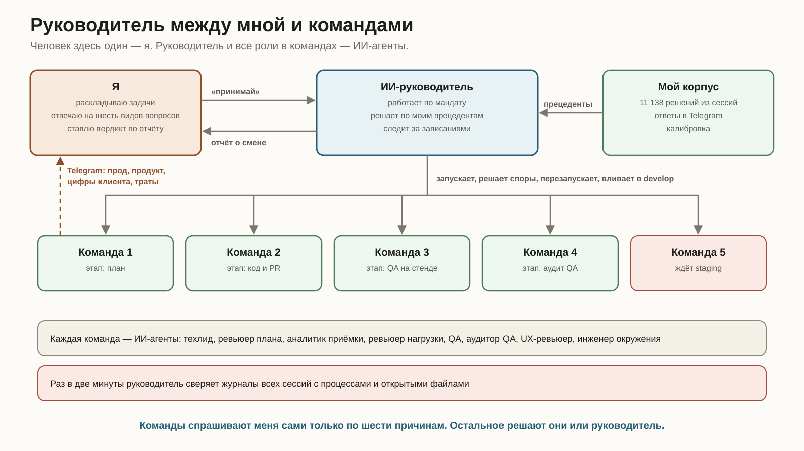
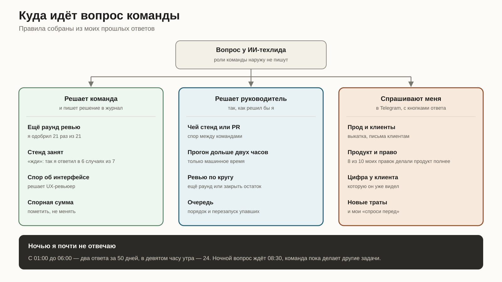
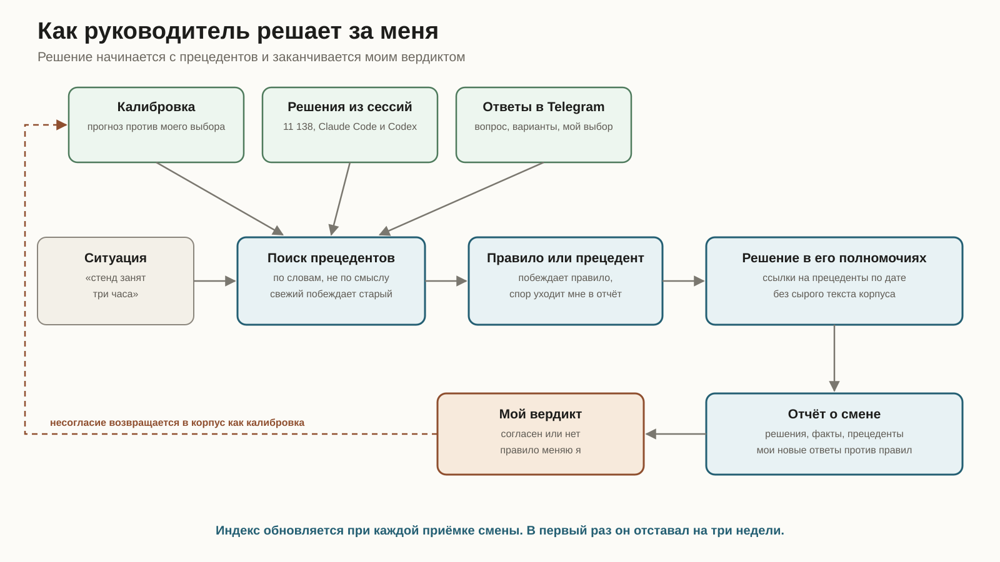
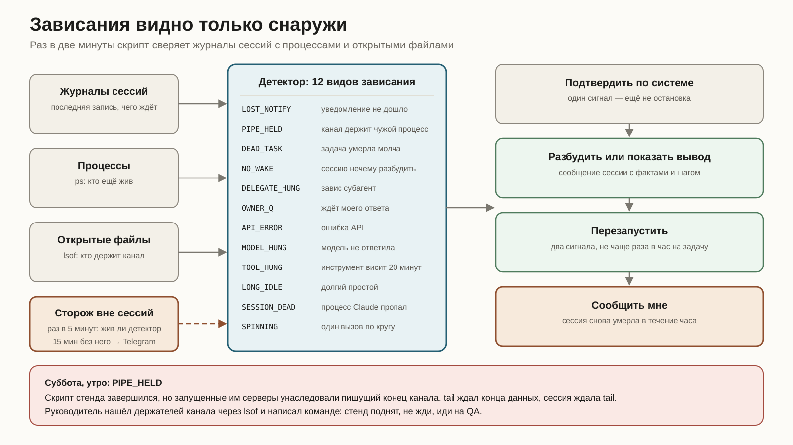

*Что изменилось за два с половиной месяца после статьи об автономных ИИ-техкомандах: над ними появился руководитель, и решает он по моим прошлым решениям.*

За последние 30 дней мои сессии Claude Code и Codex обработали 139,9 миллиарда токенов. Так показывает счётчик AgentKit. Сессий за это время было 396, в среднем 13 в день.

Все они видны в Agent Dashboard. Это приложение я сделал сам для мультиагентной разработки: из него я запускаю сессии Claude Code и Codex, вижу, чем занята каждая, и управляю ими.

Уследить за таким потоком вручную один человек не может. Даже если больше ничем не занят.

В июле я [описывал](/articles/ai-tech-teams-workflow/), как устроил автономные ИИ-техкоманды: роли, доказательства, финальная проверка, восстановление после сбоя. Одна команда проходила путь от задачи до закрытия без меня. Такой проход — одна задача или пачка связанных задач от плана до закрытия — я называю запуском. Проблема пришла с масштабом. Когда параллельно идут пять команд, узким местом снова становлюсь я.

Эта статья о том, как я передал управление командами ИИ-руководителю. Он решает так, как решил бы я, потому что ищет ответ в моих прошлых решениях. И никому не верит на слово, себе тоже.

Человек в этой схеме один — я. Руководитель, техлиды, QA, аудиторы и ревьюеры — ИИ-агенты, у каждого своя роль.

## Что сломалось на пяти командах

Каждая команда писала мне сама. Вопросы приходили в Telegram вразнобой. Одна команда спрашивала, можно ли ещё раунд ревью. Другая сообщала, что стенд занят третий час. Третья молчала, и я не знал почему.

Молчание обходилось дороже всего. Сессия может остановиться навсегда и при этом выглядеть работающей. Она ждёт уведомление о фоновой задаче, которое уже не придёт. Или ждёт задачу, процесс которой давно умер. Таймеры внутри запуска есть, но таймер живёт в той же сессии, которая встала. О таких остановках я узнавал, только когда сам открывал Agent Dashboard. Иногда через несколько часов.

Потом конфликты. Пять команд делят один staging, общие стенды и иногда общие файлы. Кто-то должен решать, кто идёт первым. Решал я, когда доходил до Telegram.

И отчёты. Команда пишет «задача закрыта». Перепроверять каждое такое заявление вручную при пяти командах — отдельная работа.

## Руководитель и его полномочия

Теперь работа устроена так. В отдельной сессии мы с ИИ-руководителем разбираем задачи и раскладываем их по командам. Он запускает команды через Agent Dashboard и заносит в свой список. Потом я говорю «принимай». С этого момента руководитель работает за меня.

Его полномочия записаны в отдельном файле. Файл собран из моих ответов на прямые вопросы. Может ли он перезапустить упавшую сессию? Может ли вливать зелёные PR? Куда писать срочное? Я ответил: да, да, в Telegram.

Руководитель решает споры команд за PR, стенд и окно на staging. Разрешает прогон тестов дольше двух часов, пока речь о машинном времени. Решает, нужен ли ещё раунд ревью или пора закрывать остаток отдельными задачами. Меняет порядок очереди. Возвращает команду на ранний этап, если её закрытие не прошло проверку. Перезапускает упавшую сессию, но не чаще раза в час на задачу. Вливает зелёный PR в develop, прочитав ревью и каждый упавший джоб.

За мной остаются прод и всё, что видит клиент. Продуктовые решения, право и безопасность. Цифра, которую клиент уже видел. Новые траты. Вливание в master. Любое ослабление проверок. Отмена решения, которое принял человек. Запись в продовую базу идёт только из моего терминала, после фразы подтверждения, которую я набираю сам.

Файл полномочий меняю только я. Коммит, который его трогает, хук пропускает, только если в сообщении записано моё согласие и его дата. Так же защищены правила, когда меня дёргать, и лимит объёма протокола, о которых ниже.

Эти вопросы команды задают мне напрямую, через Telegram. Руководитель их не перехватывает. Он может только добавить команде фактов.

Команды знают, что руководитель есть. Сначала команды не понимали, кто им пишет, и сами об этом сказали. Теперь в протоколе автопилота прямо написано: руководитель — твой начальник, и вот как его узнать.

Когда я возвращаюсь, руководитель сдаёт смену отчётом. В отчёте каждое его решение, факты под ним и прецеденты, на которые он опирался. Я ставлю вердикт. Несогласие становится калибровкой для следующего раза.

## Когда меня дёргать, решает статистика

В июле агент перед вопросом мне прикидывал две вещи: обратимо ли решение и велика ли цена ошибки. Правило звучало разумно. На практике каждая команда проводила эту границу по-своему.

Я выгрузил свои ответы агентам за полтора месяца и посмотрел, как отвечаю на самом деле.

Лишний раунд ревью я одобрил 21 раз из 21. Значит, вопрос был лишним. Теперь его решает техлид. Правило простое: продлевать, если находки настоящие, относятся к задаче и их становится меньше.

На вопрос «стенд занят, что делать» я в шести случаях из семи ответил «жди». Спрашивать об этом перестали.

С продуктовыми решениями вышло наоборот. Их я правлю часто и в одну сторону: из десяти правок восемь делали продукт полнее. Такие вопросы остались моими.

Ночь дала самое простое правило. С часу до шести утра я ответил два раза за 50 дней. В девятом часу утра ответил 24 раза. Поэтому ночной вопрос ждёт 08:30, а команда пока берётся за другие задачи.

Осталось шесть причин меня дёрнуть. Всё остальное команда решает сама и пишет решение в журнал.

## Решать как я

Первую версию руководителя ИИ-агент собрал по выжимке. Выжимка — это файл с правилами и счётчиками вроде «21 из 21». Она короткая и удобная. Самих решений в ней нет.

Я заметил это в тот же день. У меня есть корпус решений, и руководитель должен читать его.

Корпус собирает мой [Консьерж](/articles/claude-codex-concierge/). Он индексирует мои решения из всех локальных сессий Claude Code и Codex: что было перед решением, что я сказал, что агент сделал после. В июле в индексе было 4 246 записей. Сейчас 11 138.

Руководитель ищет ещё в двух источниках. Первый — мои ответы в Telegram на вопросы команд: вопрос, варианты, какую кнопку я нажал или что написал сам. Второй — калибровка: что предсказала модель и что я выбрал на самом деле.

Перед каждым решением руководитель ищет похожие случаи во всех трёх. Сходятся прецеденты — он следует им. Расходятся — берёт самый свежий. Прецедента нет — так и пишет. Если прецедент спорит с записанным правилом, побеждает правило, а противоречие уходит мне в отчёт.

В отчёте решение ссылается на прецеденты по дате. Сырой текст корпуса туда не попадает. Это моя переписка, и наружу идёт только пересказ.

Индекс Консьерж перестраивает по запросу. Когда я проверил его впервые, он отставал на три недели и 2 562 решения. Теперь руководитель обновляет индекс, когда принимает смену.

Выжимку при этом не выбросили. Она стала производной от корпуса. При сдаче смены руководитель собирает мои новые ответы и пересчитывает счётчики в правилах. Если я ответил против правила, в отчёте появляется вопрос. Правило меняю я.

## Зависания видно только снаружи

Таймер внутри запуска бесполезен, когда встала сама сессия. Поэтому наблюдение идёт снаружи. Раз в две минуты скрипт читает журналы всех сессий, список процессов и открытые файлы. Модели в этом цикле нет, он почти ничего не стоит, а руководитель получает от него только находки.

Детектор различает 11 видов вечной остановки. Уведомление о фоновой задаче не дошло до сессии. Процесс задачи умер, не оставив кода выхода. Сессия простаивает, и разбудить её нечему. Модель вернула ошибку API. Процесс Claude пропал совсем.

Двенадцатый вид — обратный случай: сессия работает, но вхолостую. Она повторяет один и тот же вызов и ждёт, что результат изменится. Худший такой случай за две недели — 638 одинаковых вызовов `wc -l` на один лог за 24 минуты, около 490 миллионов токенов за полчаса. Обычная работа тратит 50–90 миллионов, в основном на чтение кэша, поэтому по токенам такую сессию не отличить. Отличает её число одинаковых вызовов. В 99% из 1 058 журналов сессий и субагентов за две недели их не больше 13 за 15 минут. Порог детектора — 20. Все восемь журналов, дошедших до него, опрашивали что-то в цикле.

На каждый вид есть действие: разбудить сессию, показать ей вывод, перезапустить. Действует руководитель только после того, как подтвердил находку по самой системе. Один сигнал — ещё не остановка.

Самый показательный случай был в субботу утром. Команда перезапускала стенд скриптом и направила его вывод в `tail`, чтобы не тонуть в логе. Скрипт завершился. Но он успел запустить серверы стенда, и их родительские процессы унаследовали пишущий конец канала, из которого читал `tail`. Канал так и не закрылся. `tail` ждал конца данных. Сессия ждала `tail`. Стенд при этом давно работал.

Проверка по расписанию такую сессию не спасает. Сессия просыпается, видит задачу в статусе «выполняется» и засыпает снова. Руководитель нашёл через `lsof`, кто держит канал, и написал команде: не жди, стенд поднят, иди на QA. Из этого случая выросли правило для команд и отдельный вид в детекторе.

Сам наблюдатель работает в сессии руководителя и умирает вместе с ней. Поэтому за ним следит системный процесс вне всех сессий. Раз в пять минут он проверяет, идёт ли наблюдение. Если его нет 15 минут, мне в Telegram приходит сообщение с тем, что сейчас видит детектор. Ночью сообщение ждёт 08:30, как и вопросы команд.

## Руководитель тоже не верит на слово

Однажды команда доложила, что задача закрыта. Руководитель поверил и попросил её освободить блокировку. Потом прогнал финальную проверку сам. Проверка ответила: заблокировано. Не было ни вердикта QA, ни аудита QA, ни UX-ревью. Команда ссылалась на QA старой ветки, но ни одного артефакта за этим не стояло.

Руководитель исправил свою просьбу тем же сообщением и вернул команду на этап QA. С тех пор он гоняет финальную проверку по каждому закрытию сам. Слово «закрыто» для него только повод её запустить.

Потом нашлась дыра в самой проверке. Скрипт аудита всегда подписывал файл именем аудитора, даже когда его запускал QA-агент в своём прогоне. Финальная проверка доверяла подписи внутри файла и брала самый свежий. По одной задаче в папке QA лежало такое «одобрено», а настоящий аудитор сказал «на доработку». Проверка выбрала правильный вердикт случайно: он оказался новее.

Теперь каждый вердикт помечен прогоном, который его выдал. Вердикт аудитора из чужого прогона проверка отклоняет. Новые тесты сначала упали на старом скрипте, потом прошли на исправленном.

Вердикт QA называет коммит, который проверяли. Финальная проверка требует, чтобы этот коммит содержал то, что влито: коммит слияния PR или его последний коммит. Так нашлась правка текста в интерфейсе, которую влили уже после вердикта QA. Ни один раунд QA её не видел, и её добавили в задание на QA релиза.

Финальную проверку команды правят сами, когда находят в ней ошибку. Каждая такая правка объясняет в коммите, что она теперь пропускает или останавливает. Руководитель читает их все в своём цикле и откатывает правку, которая пропускает то, что проверка должна останавливать. Ослабить проверку могу только я.

## Новые роли и бюджет на уроки

За лето в командах появились две новые ИИ-роли. Аналитик приёмки пишет критерии и список «что нельзя сломать» отдельно от техлида. Иначе техлид подгоняет критерии под свой план. Ревьюер нагрузки смотрит серверный код на гонки, неограниченные запросы и работу нескольких реплик. Он идёт параллельно с CI и блокирует только критичное.

Самообучение пришлось ограничить. После каждого запуска команда пишет ретроспективу, уроки из неё становятся правилами протокола. В июле ретроспектив было 93, сейчас 274. Протокол рос вместе с ними, а контекст модели ограничен. Правило, которое не ловит ошибок, занимает место тех, что ловят.

Теперь протокол автопилота ограничен 400 КБ, и это проверяет скрипт. Урок, который второй раз всплыл как текстовое правило, надо превратить в автоматическую проверку или удалить. Сейчас протокол весит 399,9 КБ. Новое правило конкурирует за место со старыми.

Ретроспективы больше не приходят мне в Telegram. Их собирает руководитель и кладёт в отчёт о смене. Запасной движок QA тоже сменился: если у Codex кончился лимит, QA переключается на Devin.

## Цифры и слабые места

С июля ИИ-команды провели ещё 111 запусков: каждый — задача или пачка задач от плана до закрытия. 108 закрыты. Два остановились и попросили моего решения. Один я закрыл сам. Через все проверки прошёл один баг.

QA-раундов на задачу стало больше: 2,7 против 1,4 в начале июля. По месяцам видно, что рост был один, со второй половины июля до начала августа. В августе вышло 3,19 раунда на задачу, в сентябре 3,04. Ступеньки на дату какой-то одной правки протокола нет.

Задачи стали крупнее, но это объясняет от 7 до 17% роста: внутри каждой группы задач по размеру раундов стало примерно вдвое больше. Разбор ретроспектив по раундам делит лишние раунды так. 46% — повторные прогоны после дефекта или изменения продукта, и их тем больше, чем крупнее задача. 30% — доработка покрытия и доказательств, когда продукт не менялся, почти одинаковая при любом размере. 13% съели постановка задачи и окружение, 12% ретроспективы не объясняют. Доработка покрытия совпала по времени с июльскими изменениями процесса: отдельными критериями приёмки, списком «что нельзя сломать» и возвратом пробелов на QA. Строже ли стал аудитор, проверить нельзя: его июльские файлы не сохранились.

Поиск прецедентов лексический. Он находит случаи с похожими словами и пропускает похожие по смыслу. У 52 из 157 моих ответов в Telegram не сохранился текст вопроса, и для поиска они потеряны.

Работы у меня меньше не стало. Изменилось, на что она уходит. Я разбираю продукт и нарезаю задачи, отвечаю на вопросы, которые остались моими, и принимаю каждую смену по отчёту.

Результат виден в истории репозитория [findrates.ai](https://findrates.ai) — продукта, над которым я работаю. За последние 30 дней в него влиты 425 PR по 124 задачам, в прод ушли 3 релиза и 9 хотфиксов. По [бенчмаркам LinearB](https://linearb.io/resources/ai-engineering-productivity-gap) за 2026 год разработчик из лучших команд вливает 2,6 PR в неделю. Это темп 35–40 таких инженеров. С июльской статьи в develop ушли изменения по 287 задачам. Руководитель нужен, чтобы этот темп не упирался в меня.
