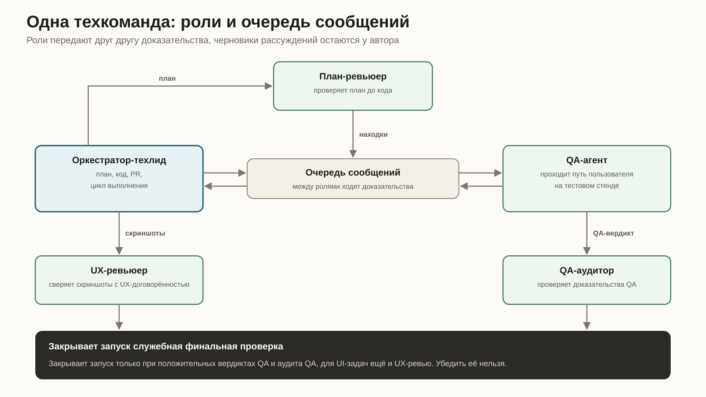
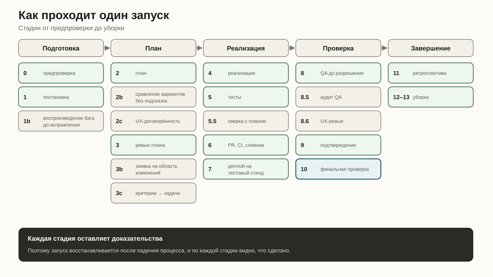
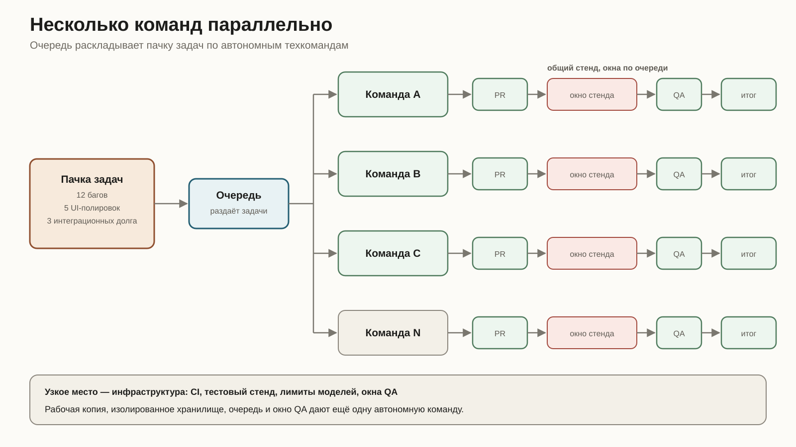
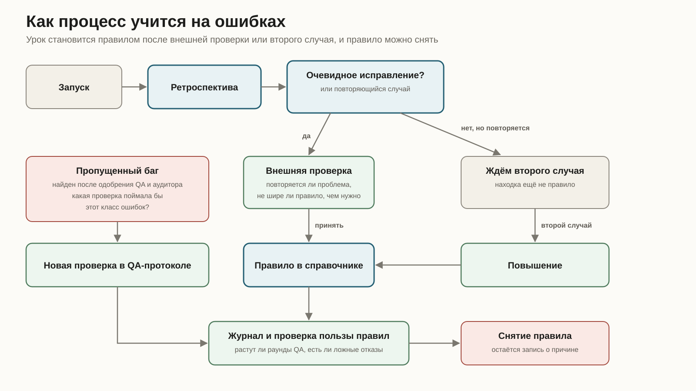

*Как я развёл роли, проверки и релиз так, чтобы несколько ИИ-команд могли работать параллельно без моего постоянного контроля.*

## Коротко

Я перестал смотреть на ИИ-агента как на одинокого исполнителя, которому надо дать хорошую инструкцию и побольше контекста. Такая схема хрупкая: агент сам придумывает решение, сам пишет тесты, сам им верит и сам сообщает «готово».

Вместо этого я собрал повторяемый шаблон маленькой технической команды. Один запуск берёт задачу или связную часть задачи, разбивает работу, разделяет ответственность, проходит PR, CI, тестовый стенд, QA и аудит QA. Только после этого он отдаёт итог: готово или заблокировано. Боевой релиз тоже автоматизирован, но живёт отдельно от цикла разработки.

Внутри запуска шесть постоянных ролей, и все они — ИИ-агенты: оркестратор-техлид, ревьюер плана, QA-агент, QA-аудитор, UX-ревьюер, инженер окружений. Каждая роль отвечает за свои стадии. Продукт остаётся за мной: продуктовые рамки, спорные решения и запуск релизного конвейера. По ходу работы роли подключают дополнительные проверки: безопасность, доступность, данные, CI, браузерный сценарий, визуальный контроль.

Ни одно «готово» не принимается на слово. Автор не проверяет сам себя, проверку QA проверяет отдельный аудитор, финальное закрытие делает служебная проверка по файлам. Если нужного вердикта нет или он не того типа, запуск не закрывается.

Журнал запусков система пишет сама. В последнем срезе 15 запусков за шесть календарных дней: один остановился и попросил моего решения, один баг всё равно прошёл все проверки и стал материалом для нового правила. В среднем на задачу ушло 1,4 QA-прогона и 0,93 аудита QA. За системой сейчас 93 ретроспективы. С человеческими командами я эти числа не сравниваю. По ним видно, сколько работы система делает без меня, где сама останавливается и какие ошибки всё ещё просачиваются.

## §1. Почему я вообще полез в эту сторону

С кодом у агента обычно всё нормально. Проблема начинается позже, когда он сообщает «готово».

Автономный разработчик склонен проверять самого себя. Написал код, написал тесты, запустил, получил зелёный результат и честно решил, что починил. Но тесты могли повторить ту же ошибку, что и реализация.

У меня был ровно такой случай. Исправление прошло ревью, юнит-тесты и CI. На тестовом стенде выяснилось, что исправленная ветка кода вообще не достигалась через реальный пользовательский путь. Маршрутизация уводила сценарий в сторону, починенный диалог не открывался. Код был правильный. Пользователь до него не доходил.

Поэтому мало заставить агента написать код и прогнать тесты. Надо проверить, что изменение вообще доступно пользователю.

Вторая проблема скучнее и больнее. Длинные автономные процессы умирают. Ноутбук уснул, фоновая задача оборвалась, уведомление потерялось, контекст кончился. Снаружи это выглядит так: агент молча остановился, и всё стоит, пока ты сам не спросишь «ну что там?». За такой автономностью приходится присматривать, и это ещё одна работа.

Третья проблема в границах самостоятельности. Агент либо спрашивает по каждой мелочи, либо принимает решение, которое должен был вынести мне. В обоих случаях автоматизация теряет смысл.

Так появилась система техкоманд: повторяемый шаблон команды с ролями, доказательствами, восстановлением после падения и формальной границей между «решай сам» и «остановись».

## §2. Команда вместо одного агента

Один агент с большим контекстом остаётся одной точкой отказа. Умный, быстрый, аккуратный — а вопрос всё равно тот же: кто проверил его работу?

Поэтому я перестал делать одного идеального агента и собрал маленькую автономную техкоманду. У неё роли, отдельное состояние, блокировки, отчёты, очередь сообщений и понятное правило: где команда решает сама, а где останавливается и зовёт меня.

Такая команда доводит изменение до проверенного состояния на тестовом стенде и оставляет след: план, проверки, вердикты, скриншоты, решения, ошибки. Написать код — только часть этой работы.

Скорость печати кода здесь мало что решает. Решает устройство доверия: кто предлагает решение, кто его проверяет, где лежат доказательства, что происходит после падения процесса, как несколько команд не мешают друг другу и как правило из одного инцидента не превращается в обязательную бесполезную процедуру.

Из этого вышли четыре базовых правила.

1. **Автор и проверяющий разведены.** Оркестратор написал план — проверяет другой агент. Команда написала код — внешний ревьюер сверяет его с планом. QA отдельно проверяет продукт, QA-аудитор отдельно проверяет сам QA. Разные модели здесь полезны, потому что ошибаются по-разному.

2. **Доказательства важнее фраз.** Вердикт QA записывается в структурированный файл внутри отчёта о запуске, в переписке он не остаётся. То же с аудитом QA и UX-вердиктом. Финальная проверка читает файлы, тон ответа модели на неё не влияет.

3. **У каждого правила есть причина.** Протокол вырос из ретроспектив, заранее его никто не придумывал. У каждого правила метка инцидента: зачем оно появилось и какой класс ошибки закрывает.

4. **Передача мне не зависит от настроения агента.** Перед вопросом ко мне агент проверяет три условия: решение обратимо, последствия небольшие, задача в согласованном объёме. Если все три выполнены, команда решает сама и пишет это в журнал. Если меняется продуктовый смысл, велика цена ошибки или несколько попыток уже провалились, запуск останавливается и просит решения.

Недоверие распространяется и на постановку задачи. Задача даёт симптом и критерии приёмки. Указанные файлы, предполагаемая причина и предложенное исправление считаются гипотезами, особенно если текст писала большая языковая модель: там регулярно встречаются выдуманные API и очень уверенные неверные объяснения.

Иногда команда спорит и со мной. Если задача похожа на полировку ради полировки, команда возвращает её с вопросом о ценности. Команда, которая умеет возражать по делу, полезнее команды, которая молча исполняет всё подряд.

## §3. Одна техкоманда: постоянные роли и временные проверки

Один запуск — это небольшая команда с ролями и отдельными каналами связи. Пачка задач раскладывается по таким командам, в один бесконечный диалог её не складывают.

Таблица показывает границы ответственности: кто планирует, кто проверяет план, кто смотрит продукт глазами пользователя, кто проверяет саму проверку, кто отвечает за окружение.

| Роль | За что отвечает | Среда | Что оставляет после себя |
| --- | --- | --- | --- |
| Оркестратор | План, код, PR, цикл выполнения, уведомления | Claude | План, изменения, PR, отчёты |
| План-ревьюер | Ревью плана и сверка кода с планом | Codex | Находки по плану и изменениям |
| QA-агент | Реальный пользовательский прогон на тестовом стенде | Codex, запасной вариант — Gemini | QA-вердикт, план проверки, скриншоты |
| QA-аудитор | Проверка качества QA | Codex | Вердикт аудита |
| UX-ревьюер | UX-договорённость до реализации и разбор скриншотов после QA | Claude | UX-договорённость, UX-вердикт |
| Инженер окружений | Рабочие копии, блокировки, ресурсы, уборка | Claude | Отчёт о состоянии окружений |

Это верхний уровень. Ниже второй слой: временные проверки внутри вспомогательных инструментов и методик. Оркестратор на одном шаге работает как инженер миграций, на другом как интегратор. Ревьюер может включить проверку безопасности. QA становится браузерным оператором. UX-ревьюер на время превращается в аудитора доступности.

Собственного канала в очереди у временных проверок нет, стадию они сами не закрывают. Они дают специализированный взгляд там, где он нужен. Так что шесть постоянных ролей по ходу работы подключают нужные им проверки.

QA-агент не ограничивается чтением кода. Он проходит реальный пользовательский путь на тестовом стенде, записывает наблюдения, собирает скриншоты, прикладывает доказательства.

Между ролями есть очередь сообщений. Если посадить всех в одну общую инструкцию, независимость станет декоративной: все видят одни рассуждения и заражаются одними предположениями. Через очередь QA-аудитор получает доказательства QA, черновик его мыслей туда не попадает. Проверяющий, который заранее прочитал объяснения автора, проверяет хуже.

В конце запуск закрывает служебная проверка. Ей нужны положительный QA-вердикт, положительный аудит QA и, для UI-задач, положительный UX-вердикт. Убедить её нельзя. На этом и держится параллельность: мне не надо лично проверять каждую команду перед закрытием. Я смотрю на итог и доказательства, весь путь руками не перечитываю.

## §4. Как проходит один запуск

Стадий много по двум причинам. Запуск можно восстановить после падения процесса. И каждая стадия оставляет доказательства вместо устного «я сделал».

Дальше — логика одного прохода, без полного регламента.

### 4.1 Предпроверка

Стадия 0 проверяет то, о чём лучше узнать до старта: доступы к деплою, лимиты внешних CLI, забытые фоновые процессы, доступность окон QA. Здесь же создаётся выделенная рабочая копия и ставится блокировка запуска.

Остановиться до старта дешевле, чем на седьмой стадии, когда уже есть PR, очередь и чужие ожидания.

### 4.2 Постановка и нарезка

Один запуск берёт связную часть работы: деплой на тестовый стенд плюс разрешение от QA. Если задача многофазная, команда сама разбивает её на части. Это было отдельным решением: если границу деления каждый раз определяю я, я снова ручной координатор.

Разбивка сразу пишется в долговечный файл Markdown: части работы, принятые решения, протокол возобновления. Контекст сессии может кончиться, фоновые задачи могут умереть, файл останется. Новая сессия читает его и продолжает с последнего места.

### 4.3 Сначала воспроизвести баг

При исправлении бага QA-агент сначала воспроизводит его на текущем тестовом стенде. До кода и, если возможно, до плана исправления.

Так закрываются три риска. Баг может оказаться фантомом. После исправления можно случайно проверить похожий, но не тот сценарий. И код может выглядеть ошибочным, хотя пользователь до этой ветки не доходит. Последнее как раз и случилось в том зелёном, но бесполезном исправлении из начала статьи.

### 4.4 План и сравнение вариантов

Если у задачи несколько подходов, оркестратор сначала пишет несколько вариантов архитектуры. К ревьюеру плана они попадают в случайном порядке, без намёка на любимый. Детализация у всех примерно одинаковая. Если один эскиз вдвое беднее остальных, это уже подсказка.

После выбора подхода план проходит ревью. Потолок — три раунда. После третьего продолжаем только при серьёзной или критичной находке. На практике четвёртый и пятый раунды чаще ловят косметику, которую дешевле поймать позже.

Отдельное правило появилось после глупого инцидента: перед тем как вписывать в план имена вспомогательных функций, проверь их в коде. Однажды план уверенно сослался на четыре функции. Не существовала ни одна.

Для UI-задач до реализации появляется UX-договорённость: состояния интерфейса, переиспользуемые шаблоны, требования доступности, сначала мобильный вид. Ревьюер плана сверяет план с этой договорённостью.

### 4.5 Код, тесты и взгляд со стороны

Реализация идёт по плану. Тесты пишутся от спецификации, а не от готового кода. Внутренние модули в BDD-тестах не подменяются: подменять можно только внешние SDK. Локальная база настоящая и предсказуемо сбрасывается перед прогоном.

Перед слиянием отдельная сверка: ревьюер смотрит, соответствует ли код плану. Она ловит незаметное отклонение, когда реализация ушла в сторону, хотя формально всё собрано и тесты прошли.

### 4.6 Деплой: зелёный статус мало что доказывает

После деплоя команда проверяет, что на стенде действительно нужная сборка. Зелёный инфраструктурный статус сам по себе доказывает мало: он может означать только то, что какой-то деплой завершился.

Правило появилось после двух одинаковых случаев. Один запуск отчитался о деплое, но на стенде оказался другой коммит. Другой поднял только часть системы: инфраструктурный статус зелёный, а затронутый клиентский сервис остался старым. QA вернул отказ с простым диагнозом: изменения нет.

Поэтому отчёт до QA пишется аккуратно: «загружено на проверку», а не «починено». Слово «проверено» команда получает право сказать только после всех проверок.

### 4.7 QA-цикл

Оркестратор отправляет QA-агенту краткое задание: изменение, критерии приёмки, версия сборки, затронутые части кода. Находка блокирует запуск, если это регрессия от текущего PR. Старые проблемы на затронутых экранах записываются отдельно. Без этого ограничения первый раунд тонет в чужих старых проблемах.

Когда QA возвращает отказ, команда сначала разбирает, что случилось, и только потом правит код:

| № | Гипотеза | Что делает команда |
| --- | --- | --- |
| 0 | Сломано окружение | Проверяет здоровье тестового стенда |
| 1 | Настоящий баг | Исправление, PR, CI, слияние, повторный деплой, повтор QA |
| 2 | Ложная находка | Ответ со ссылкой на спецификацию и повторная проверка |
| 3 | Слишком строгий тест | Правка теста, затем подтверждение у QA-аудитора |

Нулевой пункт появился после расследования не в том месте. Интеграционные тесты прошли, стенд молчит, а команда копается в бизнес-логике. Теперь окружение проверяется первым.

От бесконечного ремонта есть защита. Если QA дважды бракует по той же причине, третья попытка тем же классом решения запрещена. Команда поднимается уровнем выше и делает поведение предсказуемым в коде вместо очередной правки инструкции. Не помогает и это — значит, нужна архитектурная правка.

Для UI-частей оркестратор перед QA делает быструю самопроверку: служебная проверка без открытия браузера измеряет конкретные числа и состояния. Сломанная вёрстка ловится за 30 секунд, и полноценный QA-раунд на неё не уходит.

### 4.8 QA-аудитор

После разрешения от QA всегда идёт аудит QA. Он защищает от общей слепой зоны: проверяющий тоже может проверить не то. Исключение «здесь низкий риск, можно пропустить» однажды уже выпустило недопроверенную работу. Теперь такого исключения нет.

QA-аудитор выводит из спецификации ожидаемый набор проверок, сверяет с фактическим покрытием, смотрит доказательства и ищет сценарий, который мог пройти мимо QA. Иногда делает выборочный контроль на стенде. Вердикт один из двух: одобрить или вернуть на доработку.

Аудитор не командует оркестратором напрямую. Он даёт сигнал. Ложная критическая находка закрывается ответом с доказательствами. Настоящий пробел исправляется и снова уходит на аудит. Закрыться «с оговорками» система не умеет.

Для UI после аудита QA подключается UX-ревьюер. Он сравнивает скриншоты с UX-договорённостью. Критичные и серьёзные проблемы блокируют закрытие. Средние и мелкие уходят в заметки и ретроспективу. Спор о вкусе после двух раундов уходит ко мне.

### 4.9 Финальная проверка

После QA, аудита и UX-ревью остаётся последний вопрос: можно ли считать запуск закрытым. Отвечает служебная финальная проверка. Она смотрит наличие и содержимое доказательств: положительный вердикт QA, одобрение QA-аудитора, одобрение UX-ревьюера для UI-запусков. Ненулевой код возврата означает, что закрытия нет.

Саму проверку тоже проверили. Аудит нашёл два бага, где отказ ошибочно считался разрешением. В одном случае отрицательный вердикт проходил из-за совпавшей подстроки. В другом смешанный вердикт проходил, потому что в нём было слово «успех». После этого у финальной проверки появились собственные регрессионные тесты.

Для UI-задач правило жёстче: UX-вердикт требуется по умолчанию. Если запуск явно не помечен как работа без интерфейса, проверка требует UX-вердикт. Забыл флаг — проверка падает. Так и задумано: раньше UI-часть уехала без обеих UX-стадий именно потому, что пропуск был разрешён по умолчанию.

После финальной проверки QA публикует свой комментарий, техлид закрывает задачу, пункты «не сейчас» уходят в новые задачи, мне приходит итог: готово или заблокировано. Потом уборка: рабочие копии, блокировки, фоновые процессы, ветки.

## §5. Как запуск продолжает работу после сбоя

Чаще всего автономность ломается на бытовых сбоях: машина уснула, процесс умер, уведомление потерялось. За продолжение работы после них отвечает отдельная часть системы.

Обычно запуск движется по событиям. Завершилось ревью, CI, деплой или QA — приходит уведомление, оркестратор делает следующий шаг.

Но событие может потеряться. Фоновая задача может быть убита. Машина может уснуть. Поэтому есть страховка: раз в 15 минут система перечитывает состояние запуска, находит текущую стадию, проверяет, жив ли фоновый шаг, и либо продолжает работу, либо чинит сбой.

Я пробовал интервал в 4 минуты. На 30-минутном QA-прогоне это давало около семи лишних возвращений к запуску. Каждый заход снова тянет протокол и состояние в контекст. Пятнадцать минут оказались нормальным компромиссом: простой ограничен, контекст не сгорает впустую.

Для статусов «убито», «упало» и «таймаут» правило отдельное: это аномалия, пустым ходом на неё отвечать нельзя. Агент обязан прочитать вывод, проверить сигналы именно этого шага и решить — чинить или передать мне. Правило появилось после запуска, который остановился на убитом шаге и ждал, пока я сам загляну.

Чтобы это работало, критичное состояние хранится вне модели: карточка запуска, стадия, время следующей проверки, таблица частей, вердикты, очередь задач. Новая сессия восстанавливается из файлов. Защитная проверка не даёт завершить работу, пока в очереди есть незакрытые задачи.

Таймер при этом надо вовремя снять. При «готово» и «заблокировано» он удаляется, иначе будет бесконечно возвращать к запуску, который уже ждёт моего решения. То же правило для блокировок, рабочих копий и процессов: создал ресурс — убери ресурс.

## §6. Как несколько команд работают параллельно

Следующий вопрос — как запустить несколько таких команд. Один огромный запуск, который тащит всю очередь, мне не подходит. Я передаю внутрь пачку задач, например 12 багов, 5 UI-полировок и 3 интеграционных долга, и очередь раскладывает их по автономным техкомандам.

Число команд упирается в CI, тестовый стенд, лимиты моделей, окна QA, хранилища и очереди. Узким местом становится инфраструктура, моё внимание им быть перестаёт. Добавил рабочую копию, изолированное хранилище, очередь и окно QA — получил ещё одну автономную команду.

Параллельность сразу приносит новую проблему: команды мешают друг другу. Когда команда одна, координация почти не нужна. Когда их несколько, надо заранее понимать, кто какие части проекта трогает.

Каждый запуск держит блокировку по своей задаче и после плана записывает область изменений: директории и предметные части продукта, которые будет трогать. Проверка ищет пересечения с другими активными командами. Пересечение не всегда блокирует работу, но игнорировать его нельзя. Команда читает чужую заявку и выбирает: изменить план, дождаться слияния или осознанно принять риск.

Тестовый стенд команда теперь занимает окнами. Первая версия держала его 4-8 часов, хотя реально стенд нужен только часть времени. Теперь команда занимает стенд перед деплоем, держит на QA и выборочной проверке аудитора, затем освобождает. Нужно исправление — окно освобождается на время разработки. Пока одна команда пишет код, другая гоняет QA.

Изоляция окружений сделана без сложной инфраструктуры. Каждая рабочая копия получает своё хранилище, свой индекс очереди и свой порт. Параллельные BDD-прогоны перестали затирать друг друга. Отдельный экран состояния показывает очереди, блокировки, заявленные области изменений и время последнего обновления состояния каждой командой.

Масштабирование свелось к обычной инженерной работе: защита от перезаписи чужой очереди, сохранение заявок при повторном захвате блокировки, отдельная запись о состоянии сессии. Сейчас этот слой покрыт своим тестовым набором: 44 проверки проходят.

## §7. Как процесс учится на ошибках

Каждый запуск заканчивается стадией, которая улучшает сам процесс. Без неё остаётся папка с инструкциями, которые постепенно устаревают.

На ретроспективу собираются журналы ревью, QA-вердикты, аудит, заметки о трении, воспоминания оркестратора и мои правки. В файле есть обязательная секция «честные ошибки»: где агент был неправ даже при уже существующих правилах.

Очевидные исправления попадают в процесс сразу. Обнаружился устаревший идентификатор, недостающая инструкция или доказанное защитное правило — правится тем же ходом. У агента есть ограниченное право на такие автоматические коммиты: только протоколы команды, процесс и личная конфигурация. Продуктовый код всегда идёт через полный цикл.

Самообучение тоже нуждается в контроле. У него быстро обнаружились два провала.

Первый — распухание. Пять недель подряд каждый урок превращался в новый абзац протокола. Ядро инструкции выросло с 790 до 1732 строк и начало съедать слишком много контекста при каждом повторном входе в запуск, даже когда ничего не произошло.

Теперь урок записывается как короткое правило на 2-4 строки с меткой инцидента. Он попадает в справочник той стадии, где нужен. Ядро меняется только при смене базового правила системы. Перед добавлением ищется похожее правило, и если оно есть, расширяют его. Размеры проверяются автоматически: ядро до 300 строк, справочник до 400. Превышение само становится находкой ретроспективы.

Второй провал — самослепота. Агент, который провёл запуск, склонен превращать единичный случай в вечный закон. Поэтому не каждая находка сразу становится правилом. Если её не надо править немедленно, она ждёт второго срабатывания. После второго становится правилом.

Новые и обобщённые правила проходят внешнюю проверку: это повторяющаяся проблема или единичный случай, не слишком ли широко сформулировано правило, нет ли конфликта с существующим, окупается ли новая QA-проверка на каждом прогоне. Если доказательств мало, правило пока не действует.

Если после новой проверки растут раунды QA, она даёт ложные отказы или конфликтует с другой находкой, правило идёт на пересмотр. Когда его снимают, в протоколе остаётся короткая запись о причине, чтобы следующий запуск не открыл тот же спор с нуля.

Отдельно ведутся пропущенные баги: те, что нашли уже после разрешения QA и одобрения аудитора. На каждый делается короткий разбор с одним вопросом: какая проверка поймала бы этот класс? Проверка добавляется в QA-протокол. Исправление бага и исправление процесса остаются разными файлами.

## §8. Что на самом деле ограничивает параллельную работу

Несколько техкоманд расходуют контекст и вычисления, и я стараюсь не тратить их на ожидание.

Основной объём контекста остаётся у оркестратора. Тяжёлые проверки выносятся наружу: QA-прогоны, аудит, ревью. К финальному подтверждению оркестратор не перепроверяет всё руками. Он читает вердикт аудитора и сверяет, что доказательства на месте. Иначе роль аудитора есть, а её результатом никто не пользуется.

Запасной маршрут описан заранее. Если лимит Codex исчерпан, команда переключается на Gemini, с оговорками. Узкие одношаговые задачи он тянет нормально. Сложные правки в репозитории часто теряет или упирается в ограничение по времени. Это записано в протоколе как ограничение.

Контекст экономится и в протоколе. Отсюда ограничения на размер файлов, проверка состояния раз в 15 минут вместо 4 и правило читать справочник только текущей стадии. При повторном входе не надо каждый раз заново загружать всё описание процесса.

Скорость появляется там, где этапы идут параллельно без потери проверок. Ревью кода идёт параллельно с CI, но слияние ждёт оба результата. Краткое задание для QA готовится во время опроса деплоя. Пока одна команда проходит CI, деплой и QA, другая уже ведёт следующую часть работы до PR.

Два места я не сокращаю: настоящий CI и цепочку QA → аудит QA. Сначала проверка, потом проверка этой проверки.

Самый дорогой ресурс — моё внимание. Поэтому уведомления сведены к конечным сигналам: «готово» с отчётом или «заблокировано» с конкретным требуемым решением. По ретроспективе приходит отдельное уведомление. Рутина не шумит: перезапущенный нестабильный прогон CI, закрытая находка ревью, промежуточная стадия.

Если десять команд задают по три вопроса, автономность кончилась. Поэтому перед каждым вопросом команда сначала должна понять, может ли решить сама.

## §9. Что можно забрать себе

Если строить похожую систему с нуля, я бы начинал с границ доверия: где требуются доказательства, кто проверяет проверяющего и что происходит, когда запуск падает. Выбор модели и подробная инструкция подождут.

- **Доказательства в файлах.** Любой вердикт записан в файл с понятной схемой. «Я проверил» без файла не считается.
- **Финальная проверка.** Запуск закрывает служебная проверка, которая смотрит обязательные доказательства. У неё тоже должны быть тесты.
- **Опасные пропуски закрыты по умолчанию.** UX-ревью для UI-задач обязательно, если запуск явно не помечен как работа без интерфейса.
- **Автор отдельно, ревьюер отдельно.** Лучше на другой модели или хотя бы в другом контексте.
- **Аудит QA.** Второй проверяющий смотрит качество проверки: покрытие, доказательства, пропущенные классы сценариев.
- **Ревьюер даёт сигнал.** Ложную находку можно отклонить с доказательствами. Настоящую исправляют и снова отдают на проверку.
- **Сначала воспроизвести баг.** Для исправления бага сначала воспроизведи его на живом стенде, потом чини.
- **Сравнение вариантов без подсказок.** Несколько вариантов архитектуры в случайном порядке помогают не приклеиться к первой идее.
- **Потолки раундов.** У ревью, QA и аудита есть максимум. После повторного провала того же класса надо менять подход.
- **Периодическая проверка состояния.** Обычно запуск движется по событиям, планировщик страхует от их потери. Интервал выбирается так, чтобы не возвращаться к запуску слишком часто без причины.
- **Состояние вне контекста.** Стадия, части работы, вердикты и очередь восстанавливаются из файлов, память модели для этого не нужна.
- **Урок как короткое правило.** 2-4 строки с меткой инцидента, размер протокола ограничен.
- **Правило не рождается из одного случая.** Иногда нужен второй похожий инцидент или внешняя проверка.
- **Пропущенные баги отдельно.** Баг, прошедший все проверки, должен привести к новой QA-проверке.
- **Стенд по окнам.** Общий ресурс занимается только на время деплоя и проверки.
- **Осторожные формулировки.** До QA команда пишет «загружено на проверку». «Работает» появляется только после вердиктов.

## §10. Где границы

Инженерную команду целиком и решения владельца продукта система не заменяет.

Боевой релиз автоматизирован, но вынесен в отдельный контур. Техкоманда заканчивает на «проверено на тестовом стенде, стоит в очереди на релиз». Дальше я отдельно запускаю релизный конвейер: у него свой протокол, свои проверки и право остановиться. Команда сама в прод не выкатывает. Она готовит проверенный кандидат, а релизный контур доводит его до боевого окружения после отдельного решения.

Вкус тоже не автоматизирован. UX-ревьюер ловит недоступные контролы, отсутствующие состояния, сломанный мобильный макет, самодельный шаблон вместо системного. Но если спор дошёл до «мне не нравится», после двух раундов он уходит ко мне.

К цифрам я отношусь аккуратно. 93 ретроспективы уже достаточно, чтобы видеть повторяющиеся ошибки и улучшать процесс. Но последний срез метрик — это всего 15 запусков за шесть календарных дней, и выводов вроде «система стала вдвое лучше» из него не сделать. По этим числам я слежу, не растёт ли количество повторных QA-раундов, не стало ли больше остановок, не начали ли новые правила мешать работе.

Баги всё равно просачиваются. Два бага прошли через все проверки. Оба были визуальными: функциональные проверки их не покрывали. После этого появились визуальная развёртка и матрица покрытия классов багов. Ноль пропусков система не обещает. После каждого пропуска должен появиться барьер для всего класса похожих ошибок.

Запасной маршрут через Gemini слабее основного: выручает на узких задачах при лимитах, хуже держит сложные правки в репозитории.

Система персональна. Роли, правила передачи мне, правила трекера, дисциплина комментариев, потолки раундов — всё настроено под конкретного человека и конкретный продукт. Забрать можно общий подход, но проверки и пороги придётся выращивать своими инцидентами.

Больше всего ошибок даёт сам оркестратор. Большая часть ретроспектив о том, как он в рамках правильных правил принял ленивое решение: поверил пересказу, не перечитал файл, срезал проверку. Финальная проверка это частично компенсирует. Зато процесс делает такие ошибки видимыми, и из них получаются новые правила.

## Код — середина цепочки

Когда я рассказываю об этой системе, меня часто спрашивают: «То есть агент пишет код вместо тебя?» Код здесь только середина цепочки. Рабочая единица выглядит так: постановка, план, ревью, реализация, тесты, PR, CI, тестовый стенд, QA, аудит QA, исправления, закрытие, ретроспектива. Выигрыш дают параллельность, независимые роли, финальная проверка и то, что каждым шагом не нужно управлять вручную.

Решение собрано из старого инженерного набора: разделение полномочий, свидетели, доказательства, блокировки, потолки циклов, восстановление после падения, управление общими ресурсами, ретроспектива. Более умная модель не отменяет необходимости в процессе.

Безошибочными агенты от этого не становятся, но их уверенность теперь можно проверить. Этого хватило, чтобы отдавать системе пачки задач и смотреть на доказательства.

За системой компактный протокол, справочники по стадиям, служебные проверки с тестами, журнал запусков, координация нескольких команд и 93 ретроспективы. Каждое правило в протоколе оставил настоящий инцидент.
