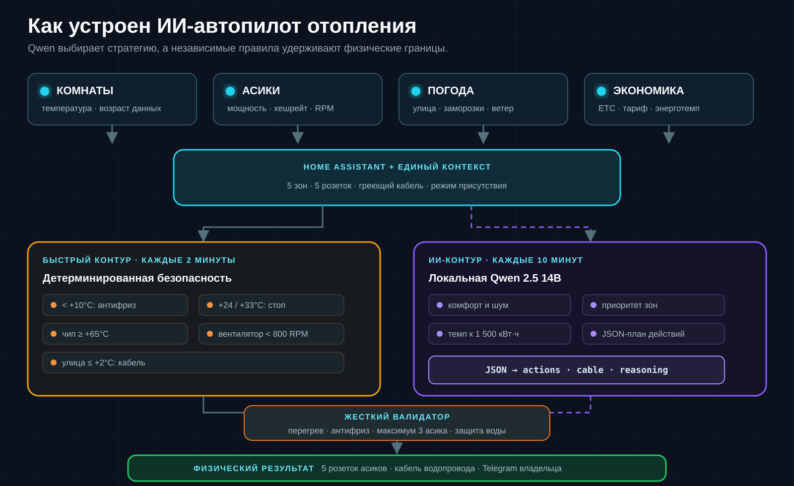
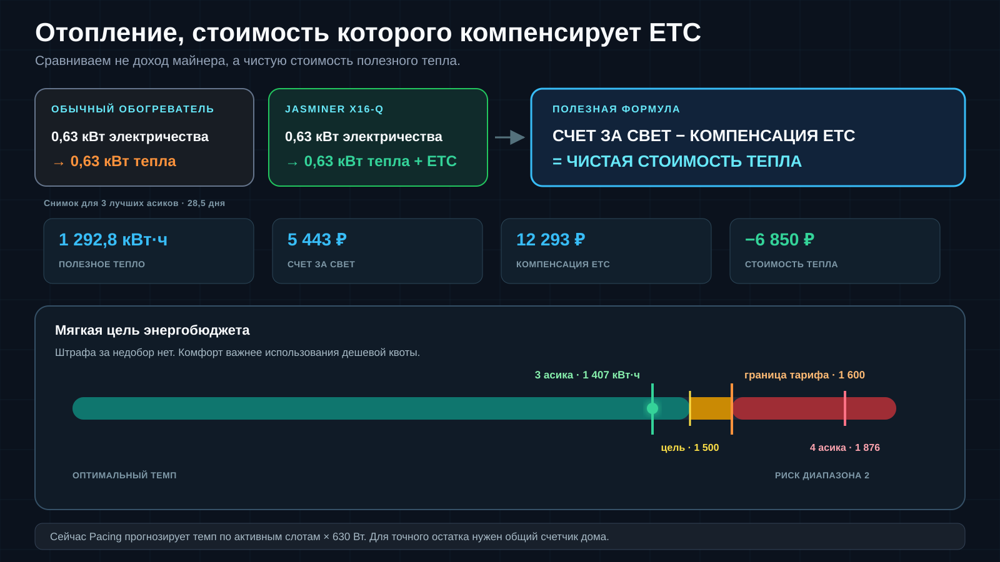

В загородном комплексе есть пять независимых тепловых зон. В каждой стоит тихий Jasminer X16-Q, который превращает потребляемую электроэнергию в тепло и одновременно добывает Ethereum Classic.

Климатом управляет локальный ИИ-автопилот с погодой, защитой водопровода, контролем кулеров и физических тумблеров, живым расчетом стоимости тепла и Telegram-панелью. Он работает на локальном Linux-сервере, распределяет до трех «тепловых слотов» между зонами и не зависит от облачной нейросети.

Главный инженерный принцип проекта: **ИИ принимает высокоуровневое решение, но последнее слово всегда остается за жесткими правилами безопасности**.

---

## Что входит в систему

| Слой | Что он видит | Зачем это нужно |
|---|---|---|
| Home Assistant | пять умных розеток Gosund, датчики Xiaomi/Aqara, реальная мощность | единая телеметрия и управление питанием |
| Климат | температура, возраст показаний, режим присутствия | защита от промерзания и перегрева |
| Асики | питание, хешрейт, температура чипов, обороты кулеров | отопление, майнинг и аппаратная безопасность |
| Погода | локальная температура, влажность и ветер | упреждающая защита водопровода |
| Экономика | цена ETC, курс рубля, сложность сети, ступенчатый тариф | расчет чистой стоимости полученного тепла |
| Локальная Qwen 2.5 14B | весь собранный контекст | выбор активных зон и объяснение решения |
| Telegram | статус, ручное управление, аварийная остановка, отчеты ИИ | контроль владельца из любой точки |

Физическая схема осталась простой: **Unit N → розетка N → зона N**. Это важная мелочь: оператору, Home Assistant и модели не приходится переводить между несколькими системами нумерации.

| Зона | Асик | Тип зоны | Лимит при людях | Лимит в отъезде |
|---:|---:|---|---:|---:|
| Z1 | Unit #1 | жилая | +24°C | +33°C |
| Z2 | Unit #2 | жилая | +24°C | +33°C |
| Z3 | Unit #3 | нежилая | +33°C | +33°C |
| Z4 | Unit #4 | жилая | +24°C | +33°C |
| Z5 | Unit #5 | жилая | +24°C | +33°C |

Отдельная шестая розетка управляет кабелем защиты водопровода от замерзания.

---

## Два автопилота вместо одного

Управление специально разделено на два параллельных цикла:



### Быстрый контур: правила каждые две минуты

Детерминированный супервизор не рассуждает и не ждет модель. Он проверяет критические условия и может немедленно вмешаться:

- при температуре помещения ниже **+10°C** включает находящийся там асик;
- при достижении **+24°C** в жилой зоне с людьми или **+33°C** в автономном режиме отключает нагрев;
- при температуре чипа от **+65°C** обесточивает устройство;
- если работающий асик потребляет больше 100 Вт, но один из основных вентиляторов вращается медленнее **800 RPM**, отключает питание;
- если розетка включена, а нагрузка ниже **15 Вт**, помечает асик как физически выключенный и отправляет владельцу ограниченное по частоте уведомление;
- при наружной температуре до **+2°C** включает греющий кабель водопровода, а после прогрева улицы до **+5°C** выключает его.

Если погодный API недоступен, с 15 ноября по 15 марта включается консервативный календарный резерв: система считает риск заморозки активным.

### Медленный контур: полноценный ИИ-автопилот

Раз в десять минут локальная **Qwen 2.5 14B** получает режим присутствия, температуры пяти зон, состояние розеток, признаки выключенного физического тумблера, погоду, состояние греющего кабеля, текущую цену ETC, тарифную политику и расчетный темп использования месячного энергобюджета.

Модель возвращает структурированный JSON:

```json
{
  "reasoning": "почему выбраны эти зоны",
  "actions": {"1": "OFF", "2": "OFF", "3": "ON", "4": "OFF", "5": "OFF"},
  "water_pipe_heating_cable": "OFF",
  "active_units": [3],
  "telegram_alert": "краткое объяснение владельцу"
}
```

После этого система не исполняет ответ вслепую. Код повторно проверяет четыре жестких контракта:

1. перегретое помещение всегда получает `OFF`;
2. помещение холоднее +10°C всегда получает `ON`;
3. в обычной ситуации одновременно разрешено не больше трех асиков;
4. при риске заморозки греющий кабель принудительно получает `ON`.

Только прошедшие валидацию действия применяются через Home Assistant. Если модель не ответила или вернула поврежденный JSON, асики переходят в безопасный `OFF`, а аварийный антифриз и защита водопровода продолжают работать по правилам.

Это и есть полный автопилот, но не «LLM с прямым доступом к реле». Qwen выбирает стратегию, программные ограничения проверяют физику, а быстрый независимый контур страхует модель между ее циклами.

---

## Комфорт, тишина и гистерезис

Система знает два режима.

В режиме **«Люди в доме»** жилые зоны ограничены +24°C. При равных условиях ИИ сначала выбирает нежилую зону, затем помещения вдали от мест отдыха и только потом спальные зоны. Так тепло и майнинг сохраняются, но шум кулеров меньше мешает людям.

В режиме **«Никого нет»** потолок повышается до +33°C, а приоритет получают самые производительные устройства: Unit #5, #1 и #2.

Чтобы реле не щелкали около одной температурной точки, используется гистерезис 1,2°C. Быстрый детерминированный контур дает ручному переключению из Telegram пятиминутное окно приоритета, но критический перегрев выше +33°C отменяет ручное исключение. ИИ все равно пересчитывает общую стратегию на следующем десятиминутном цикле.

Показания датчиков тоже не считаются безусловной истиной. Если значение не обновлялось больше 30 минут, интерфейс явно помечает резервный источник и использует калиброванную оценку. Это позволяет контуру не падать из-за севшей батарейки, но не маскирует происхождение данных.

---

## Экономика отопления: тепло оплачивает себя само

С точки зрения физики обычный электрический конвектор и асик почти одинаковы: потребленный 1 кВт·ч в конечном счете становится примерно 1 кВт·ч тепла в помещении. Разница в том, что конвектор на этом останавливается, а асик параллельно создает ETC, которым можно компенсировать счет за электричество.

Поэтому полезная формула здесь не «сколько заработал майнер», а:

```text
Чистая стоимость отопления = счет за электричество − компенсация от добытых ETC
```

В используемой тарифной модели нет обязательного минимального потребления: неиспользованные киловатт-часы не «сгорают» и штрафа за недобор нет. При расходе 800 кВт·ч счет составит 3 368 ₽, а при 1 500 кВт·ч — 6 315 ₽. Поэтому цель автопилота — не любой ценой сжечь квоту, а использовать дешевую энергию только там, где дополнительное тепло допустимо и компенсация ETC действительно снижает его чистую стоимость.



Парк неоднороден: в реестре зафиксированы снимки от **1,81 до 3,37 GH/s** при принятой мощности **630 Вт** на устройство; суммарно — **13,33 GH/s**.

Расчет ниже сделан **30 августа 2026 года в 17:12 МСК** при ETC **$7,47**, курсе **85,60 ₽/$**, сложности сети около **1,97 PH** и периоде 28,5 дня.

| Отопительный режим | Тепловая мощность | Получено тепла | Счет за свет | Компенсация ETC | Чистая стоимость тепла |
|---|---:|---:|---:|---:|---:|
| 1 лучший асик | 0,63 кВт | 430,9 кВт·ч | 1 814 ₽ | 4 291 ₽ | **−2 477 ₽** |
| 3 лучших асика | 1,89 кВт | 1 292,8 кВт·ч | 5 443 ₽ | 12 293 ₽ | **−6 850 ₽** |
| 4 асика | 2,52 кВт | 1 723,7 кВт·ч | 7 487 ₽ | 14 645 ₽ | **−7 159 ₽** |
| все 5 асиков | 3,15 кВт | 2 154,6 кВт·ч | 10 102 ₽ | 16 950 ₽ | **−6 847 ₽** |

Минус в последнем столбце означает не бесплатное электричество: счет все равно нужно оплатить. Он означает, что добытые ETC полностью покрывают этот счет, а остаток можно направить на амортизацию оборудования и обслуживание. Для трех лучших устройств расчетная стоимость 1 кВт·ч полезного тепла в этом снимке составляет **−5,30 ₽** вместо **+4,21 ₽** у обычного резистивного обогревателя.

### Энергетический темп: мягкая цель 1 500 кВт·ч

**Monthly Energy Pacing** задает мягкую цель 1 500 кВт·ч в месяц — на 100 кВт·ч ниже границы первого диапазона в 1 600 кВт·ч. Для августа это 48,4 кВт·ч в сутки, или средняя мощность около 2,02 кВт.

При принятой мощности 630 Вт на устройство индикатор выглядит так:

| Активные асики | Темп в сутки | Прогноз на 31 день | Оценка автопилота |
|---:|---:|---:|---|
| 1 | 15,1 кВт·ч | 468 кВт·ч | есть большой запас |
| 2 | 30,2 кВт·ч | 936 кВт·ч | есть запас для полезной зоны |
| 3 | 45,4 кВт·ч | 1 407 кВт·ч | оптимальный темп первого диапазона |
| 4 | 60,5 кВт·ч | 1 876 кВт·ч | риск перехода во второй диапазон |
| 5 | 75,6 кВт·ч | 2 344 кВт·ч | высокий темп |

Этот статус передается Qwen и отображается в Telegram. Если темп низкий, температура позволяет, а нежилая или другая подходящая зона может безопасно принять тепло, модель получает аргумент в пользу дополнительной нагрузки. Когда люди дома, ограничения по +24°C и шуму важнее энергобюджета. В режиме `AWAY` приоритет получают три самых производительных устройства, но жесткий потолок все равно не разрешает модели включить четвертый асик.

Есть существенная граница точности: сейчас `Pacing` — **индикатор текущего темпа**, а не накопительный счетчик. Он экстраполирует число работающих асиков по 630 Вт на полный месяц, но еще не получает фактические киловатт-часы с начала месяца, потребление остальных приборов дома и расход греющего кабеля. Поэтому он хорошо показывает, что три слота укладываются в целевой режим, но точное добирание остатка до 1 500 кВт·ч потребует интеграции с общим счетчиком.

### Сколько стоит войти в такую систему

По предоставленному срезу объявлений Avito актуальные цены Jasminer X16-Q выглядят так:

| Категория | Цена за один аппарат | Что это означает для отопительного проекта |
|---|---:|---|
| Новый, с гарантией | 76 000–85 000 ₽ | пять зон стоят 380 000–425 000 ₽ без учета автоматики |
| Рабочий б/у у частника | 20 000–31 000 ₽ | три аппарата стоят 60 000–93 000 ₽, пять — 100 000–155 000 ₽ |
| Б/у с отбором банков 3920+ под ETHW | 30 000–40 000 ₽ | дополнительная проверка повышает цену, хотя для этого проекта используется ETC |
| Быстрый выкуп | 11 000–18 000 ₽ | это ориентир ликвидационной цены для продавца, а не обычная цена покупки |

Экономическое преимущество особенно заметно на вторичном рынке. Если взять три рабочих б/у аппарата по текущему диапазону и мысленно держать их под полной нагрузкой при неизменных условиях снимка, компенсация сверх счета за тепло покрыла бы их цену примерно за **9–14 полнонагруженных месяцев**. Для всего пятизонного парка стоимостью 100 000–155 000 ₽ ориентир составил бы **15–23 полнонагруженных месяца**.

Это не календарный срок окупаемости. В теплую погоду автопилот отключает лишние зоны, сложность и курс ETC меняются, оборудование простаивает и требует обслуживания, а цена объявления не равна цене сделки. Зато формула показывает главное: покупка недорогих б/у асиков может превратить неизбежный расход на электрическое отопление в полностью компенсируемое тепло, а не просто добавить к дому еще одну майнинг-ферму.

Почему автопилот все равно держит потолок в три устройства? В 31-дневном месяце три асика по 630 Вт дают прогноз около 1 407 кВт·ч и остаются ниже мягкой цели 1 500 кВт·ч и жесткой границы 1 600 кВт·ч. Четвертый аппарат в этом конкретном экономическом снимке снижает стоимость тепла еще примерно на 308 ₽, но его постоянная работа дала бы прогноз около 1 876 кВт·ч, больше лишнего тепла и шума и риск второго тарифного диапазона.

Есть важное ограничение: таблица считает **только розетки асиков и кабеля**, а не весь ввод дома. Чтобы гарантировать первый тарифный диапазон по счетчику, к модели нужно прибавлять фоновое потребление дома. В расчет также не включены комиссии пула, простой и разница между мгновенным и устойчивым средним хешрейтом. Поэтому это оперативная модель стоимости отопления, а не обещание прибыли.

---

## Что подтвердилось на живой системе

Проверка 30 августа охватила исходный код, автоматические тесты и развернутую систему. Серверные файлы побайтно совпали с проверенной версией исходников.

- 15 автоматических тестов прошли успешно, включая сценарии месячного энергобюджета;
- службы Home Assistant и Telegram-бота включены в автозапуск и контролируются менеджером процессов;
- в локальном контуре доступна `qwen2.5:14b`;
- Home Assistant возвращает состояния всех пяти розеток, датчиков помещений и греющего кабеля;
- источник наружной погоды показал температуру выше защитного порога, поэтому кабель остался выключен;
- Telegram и промпт Qwen уже получают прогноз энергобюджета относительно цели 1 500 кВт·ч;
- первый проверочный цикл ИИ выбрал подходящую нежилую зону и действительно перевел назначенную розетку из `OFF` в `ON`.

Последний пункт дал полезную проверку всей цепочки. Физический тумблер выбранного асика оказался выключен, поэтому розетка потребляла лишь 9–10 Вт. Аппаратный watchdog не объявил команду успешным отоплением или майнингом: он классифицировал состояние как `PHYSICALLY_OFF`, исключил устройство из списка реально работающих и подготовил уведомление владельцу.

Именно такое поведение отличает автономную систему от красивой демонстрации: она проверяет не только отправленную команду, но и физический результат.

---

## Управление из Telegram

Бот принимает команды только от идентификатора владельца. В меню доступны:

- живой статус комнат, мощности, погоды и тарифного прогноза;
- обороты кулеров, температура чипов и оценка акустики;
- переключение режимов «Люди в доме» и «Никого нет»;
- ручное управление пятью розетками и греющим кабелем;
- аудит физических тумблеров;
- отдельный отчет с рассуждением Qwen;
- аварийная команда «Выключить всё».

Серверные службы автоматически перезапускаются при сбое.

---

## Итог

Пять асиков здесь не просто заменяют электрические конвекторы. Это небольшая автономная энергетическая система, которая одновременно управляет климатом пяти зон, защищает ввод воды от замерзания, учитывает шум, следит за физическим состоянием оборудования и пересчитывает чистую стоимость отопления.

Самая ценная часть решения — не размер модели. **Локальный ИИ получил право принимать и применять решения, но оказался внутри проверяемых границ: температура, вентиляторы, физическая мощность, тарифная квота и аварийное отключение остаются детерминированными.**

Система только что введена в непрерывную эксплуатацию, поэтому сезонная надежность еще должна быть подтверждена временем. Но полный путь — от телеметрии и решения Qwen до команды реле и независимой проверки фактической мощности — уже работает на живом оборудовании.
