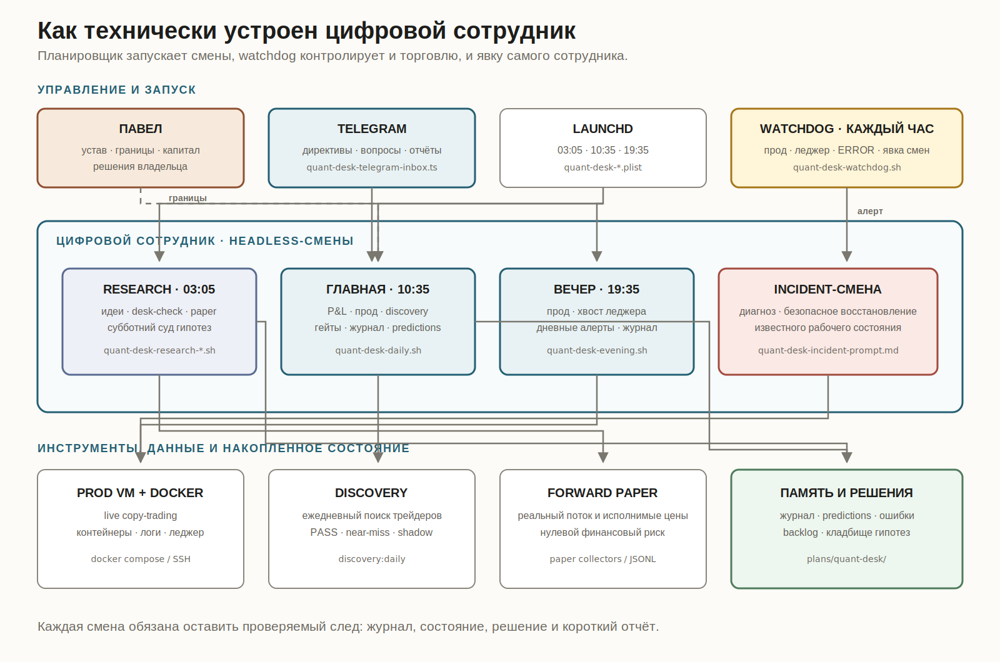

Многие системы, которые сегодня называют «цифровыми сотрудниками», работают только после сообщения человека: им всё ещё нужно ставить каждую следующую задачу.

Мне хотелось сотрудника, которого утром не нужно будить сообщением. Он сам выходит на смену, находит работу, действует в пределах полномочий и обращается ко мне только за решением владельца.

Всё началось с моей основной работы. Я много думал об автономном SRE-инженере: он должен следить за инфраструктурой, замечать сбои, разбираться в причинах, безопасно восстанавливать известное рабочее состояние и приносить человеку уже диагноз или готовое решение.

К тому моменту я уже научился автоматически разворачивать целые технические команды. Следующим шагом стал сотрудник, которому не нужно вручную раздавать задачи.

Но на основной инфраструктуре проверять такую идею было неудобно: нагрузка у нас небольшая, серьёзные инциденты происходят редко.

В начале года я заинтересовался Polymarket.

Polymarket — это рынок прогнозов. Для меня он оказался удобным полигоном: реальные внешние системы, объективный результат, настоящая цена ошибки и возможность ограничить риск небольшими суммами. Там уже работал мой набор торговых ботов.

Сначала мне было интересно копирование сделок успешных трейдеров. Я построил торговую инфраструктуру и ежедневные сканеры, научился проверять, можно ли повторить чужие результаты с моим размером ставок, и запустил несколько гипотез на небольших деньгах.

Несколько месяцев я следил за экспериментами, разбирал отчёты, добавлял и отключал трейдеров, проверял исполнение сделок и закрывал неудачные идеи.

А потом мне стало скучно.

Система всё ещё требовала управляющего: замечать тихие сбои, проверять кандидатов, разбирать результаты, помнить ошибки и решать, когда эксперимент уже проиграл, а когда ему не хватает данных.

Я понял, что не хочу быть этим управляющим.

18 июля я назначил цифрового сотрудника главным квант-трейдером проекта.

Я считаю его одним сотрудником, хотя внутри он устроен как маленькая сменная команда. Торговые боты — его руки. Сам сотрудник совмещает управляющего, исследователя и дежурного инженера.

В основе его работы — устав.

В уставе записаны должность, цель, показатели, полномочия и абсолютные границы. Сотрудник может самостоятельно менять конфигурацию, добавлять найденного трейдера в теневое наблюдение, перезапускать сервис, откатывать неудачное изменение и разворачивать бумажный эксперимент.

Но он не имеет права торговать руками, пополнять банкролл и выпускать новую стратегию на реальные деньги без достаточной проверки на бумаге. Сначала идея, затем дешёвая проверка, наблюдение на новых данных без реальных денег, заранее записанный критерий успеха или смерти — и только потом минимальный выход в реальную торговлю.

Деньги остаются моей зоной ответственности. Если система докажет новый источник дохода, она может запросить дополнительный капитал, но решение принимаю я. Я также остаюсь владельцем «конституции»: только я могу изменить сам устав или снять принципиальный запрет.

В повседневной работе моё разрешение ему не требуется.

И его не нужно будить.

Утром он сам проверяет работающую систему, прибыль и убытки, активность трейдеров, результаты ежедневного поиска и сроки экспериментов. Вечером отдельная короткая смена убеждается, что проблема не осталась на ночь. Исследовательская смена двигает гипотезы. Каждый час простой сторожевой процесс проверяет сервер, свежесть данных и ошибки.

Сторож следит ещё и за самим сотрудником: он настроен заметить пропущенную цифровую смену, один раз запустить её снова и поднять тревогу.

По регламенту каждая смена обязана оставить журнал и короткий отчёт в Telegram: что происходит с деньгами, жива ли рабочая торговая система, что сделано, что показалось странным и требуется ли от меня решение. Я могу передать ему директиву, но она будет исполнена только внутри границ устава.

Например, в одном из последних запусков он сам нашёл 85 новых трейдеров, проверил всех и сообщил, что подходящих нет. Его задача — не дать слабому кандидату добраться до денег. Полезная находка каждый день не обязательна.

У него есть память.

Рабочая память состоит из ежедневного журнала, карточек решений и ошибок, прогнозов на завтра и кладбища гипотез. Кладбище помогает не открывать заново уже опровергнутые идеи.

На этой основе я собрал ему инженерный аналог профессиональной интуиции.

Инженерная интуиция складывается из математики, памяти и обязательного расследования. Сначала система находит отклонения от истории. Затем сотрудник выбирает три главные странности, поднимает похожие эпизоды и выносит вердикт: всё объяснено, изменилась норма или требуется расследование.

У этой конструкции уже появились реальные рабочие эпизоды.

Однажды сторож не смог подключиться к торговому серверу и поднял внепланового SRE-инженера. Тот проверил сервер, состояние сервисов и свежесть данных. Оказалось, что торговая система не падала: между домашним Mac и удалённой машиной случился короткий сетевой сбой.

Сотрудник не стал перезапускать здоровую торговую систему ради красивого отчёта «починил». Он зафиксировал причину, убедился, что связь восстановилась, и оставил условие для более глубокого расследования, если проблема начнёт повторяться. Иногда лучшая работа инженера — ничего не сломать своим вмешательством.

В другом случае сотрудник обнаружил ошибку в собственном механизме «интуиции». Два дня система сравнивала прогнозы не с той датой и выдавала правдоподобные результаты. Он нашёл причину, исправил проверку и записал в долговременную память новое правило: зелёный сигнал от непроверенного контрольного механизма ещё ничего не доказывает.

Новое правило изменило подход следующих смен к похожим ситуациям.

А первая исследовательская смена получила очень красивую гипотезу: если несколько успешных трейдеров независимо покупают один исход, их общий сигнал должен быть сильнее одиночного.

На поверхности результат выглядел почти идеально: 37 групп сделок и 100% побед.

Сотрудник разобрал выборку и выяснил, что 27 из 37 случаев создали два трейдера с одной и той же механикой. Одна стратегия в двух кошельках создавала видимость независимого консенсуса. Красивую ветвь он убил. В оставшейся части было десять побед из десяти. Объявлять открытие рано: десяти наблюдений недостаточно. Вернуться к идее можно только после накопления заранее установленного объёма данных.

Для меня это важнее генерации очередной «гениальной стратегии». Цифровой сотрудник должен уметь придумывать, действовать и останавливать собственные идеи.

Пока это молодой эксперимент. Торговая инфраструктура работает уже несколько месяцев, а сам сотрудник вышел на первую смену 18 июля. Он уже действительно запускается без моего сообщения, исправляет собственные проверки, меняет разрешённую конфигурацию, расследует инциденты, проверяет кандидатов и ведёт исследовательский конвейер. Автономность уже проверяется на практике. Устойчивая прибыльность ещё не доказана.

Мне интереснее другой результат.

Цифрового сотрудника создаёт целая рабочая система: должность, расписание, полномочия, границы, память, обратная связь, инструменты для действия и обязанность отчитываться.

Ему не нужно вручную ставить каждую следующую задачу. Он сам приходит на работу.

А я постепенно выхожу из операционного управления и остаюсь в той роли, ради которой всё это затевалось: владельца системы, источника капитала и человека, который принимает только конституционные решения.
