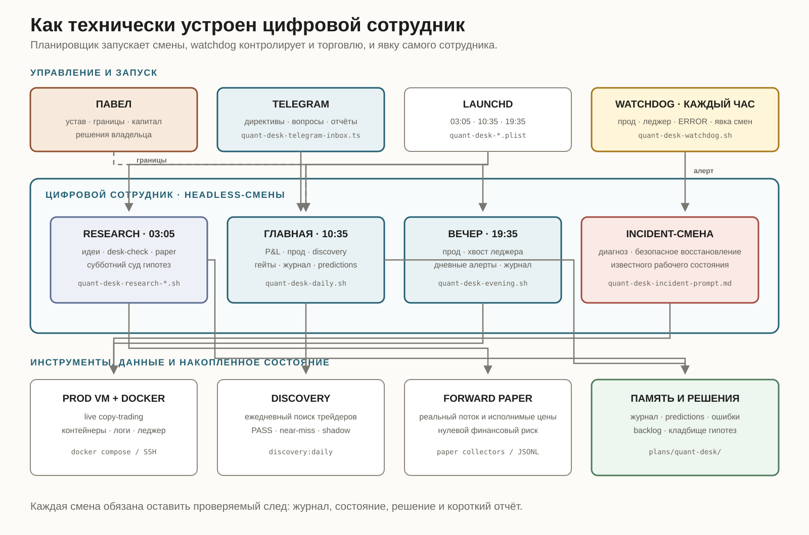

Почти всё, что сегодня называют цифровым сотрудником, работает только после сообщения человека. Каждую следующую задачу ему всё равно ставишь ты.

Мне нужен был другой. Тот, которого утром не надо будить: сам выходит на смену, сам находит работу, действует в пределах полномочий и приходит ко мне только за решением владельца.

Началось это с основной работы. Я долго думал об автономном SRE-инженере — который следит за инфраструктурой, замечает сбои, разбирается в причинах, безопасно возвращает известное рабочее состояние и приносит человеку готовый диагноз.

Разворачивать целые технические команды я к тому моменту уже умел. Дальше нужен был сотрудник, которому не раздают задачи.

Но проверять это на рабочей инфраструктуре неудобно. Нагрузка небольшая, серьёзные инциденты редки. Ждать полигона можно месяцами.

В начале года я заинтересовался Polymarket.

Polymarket — рынок прогнозов. Как полигон он мне подошёл: реальные внешние системы, объективный результат, настоящая цена ошибки и возможность держать риск в пределах небольших сумм. Мои торговые боты там уже работали.

Сначала меня занимало копирование сделок успешных трейдеров. Я построил торговую инфраструктуру и ежедневные сканеры, научился проверять, повторяются ли чужие результаты на моём размере ставок, и запустил несколько гипотез на небольших деньгах.

Несколько месяцев я следил за экспериментами. Разбирал отчёты, добавлял и отключал трейдеров, проверял исполнение, закрывал неудачные идеи.

А потом мне стало скучно.

Системе всё ещё был нужен управляющий: замечать тихие сбои, проверять кандидатов, разбирать результаты, помнить ошибки и решать, когда эксперимент уже проиграл, а когда ему просто не хватает данных.

Быть этим управляющим я не хотел.

18 июля я назначил цифрового сотрудника главным квант-трейдером проекта.

Считаю его одним сотрудником, хотя внутри он устроен как маленькая сменная команда. Торговые боты — его руки. Сам он совмещает управляющего, исследователя и дежурного инженера.

В основе — устав.

В уставе записаны должность, цель, показатели, полномочия и абсолютные границы. Сотрудник может сам менять конфигурацию, брать найденного трейдера в теневое наблюдение, перезапускать сервис, откатывать неудачное изменение и разворачивать бумажный эксперимент.

Права торговать руками у него нет. Пополнять банкролл — нет. Выпускать стратегию на реальные деньги без проверки на бумаге — нет. Сначала идея, потом дешёвая проверка, потом наблюдение на новых данных без денег, критерий успеха и смерти записан заранее. И только после этого минимальный выход в реальную торговлю.

Деньги остаются на мне. Докажет новый источник дохода — может запросить капитал, но решение моё. Устав тоже мой: снять принципиальный запрет или переписать саму конституцию могу только я.

В повседневной работе моё разрешение ему не нужно.

И будить его не нужно.

Утром он сам проверяет работающую систему, прибыль и убытки, активность трейдеров, результаты ежедневного поиска и сроки экспериментов. Вечером короткая смена убеждается, что проблема не осталась на ночь. Исследовательская смена двигает гипотезы. Каждый час простой сторож проверяет сервер, свежесть данных и ошибки.

Сторож следит и за самим сотрудником. Он замечает пропущенную смену, один раз запускает её снова и поднимает тревогу.

Каждая смена обязана оставить журнал и короткий отчёт в Telegram: что с деньгами, жива ли торговая система, что сделано, что показалось странным и нужно ли от меня решение. Директиву я передать могу, но исполнена она будет только внутри границ устава.

В одном из последних запусков он сам нашёл 85 новых трейдеров, проверил всех и сообщил, что подходящих нет. Его работа — не пустить слабого кандидата к деньгам. Находка каждый день не обязательна.

У него есть память.

Рабочая память — это ежедневный журнал, карточки решений и ошибок, прогнозы на завтра и кладбище гипотез. Кладбище держит закрытые идеи закрытыми: заново их не открывают.

На этой основе я собрал ему инженерный аналог профессиональной интуиции.

Складывается она из трёх частей: математика, память и обязательное расследование. Сначала система находит отклонения от истории. Потом сотрудник выбирает три главные странности дня, поднимает похожие эпизоды и выносит вердикт: объяснено, изменилась норма или надо расследовать.

Рабочие эпизоды у этой конструкции уже есть.

Однажды сторож не смог подключиться к торговому серверу и поднял внепланового SRE-инженера. Тот проверил сервер, состояние сервисов и свежесть данных. Торговая система не падала: между домашним Mac и удалённой машиной случился короткий сетевой сбой.

Здоровую торговую систему ради красивого отчёта «починил» он перезапускать не стал. Зафиксировал причину, убедился, что связь восстановилась, и оставил условие для расследования, если это начнёт повторяться. Иногда лучшая работа инженера — ничего не сломать своим вмешательством.

В другой раз он нашёл ошибку в собственном механизме интуиции. Два дня система сравнивала прогнозы не с той датой и выдавала правдоподобные результаты. Он нашёл причину, исправил проверку и записал в долговременную память правило: зелёный сигнал от непроверенного контрольного механизма не доказывает ничего.

Правило изменило поведение следующих смен в похожих ситуациях.

А первая исследовательская смена получила очень красивую гипотезу: если несколько успешных трейдеров независимо покупают один исход, их общий сигнал сильнее одиночного.

Сверху результат выглядел почти идеально — 37 групп сделок и 100% побед.

Сотрудник разобрал выборку. 27 случаев из 37 сделали два трейдера с одной механикой: одна стратегия в двух кошельках изображала независимый консенсус. Красивую ветвь он убил. В остатке было десять побед из десяти — этого мало, чтобы объявлять находку. Вернуться к идее можно только после заранее назначенного объёма данных.

Мне это дороже очередной «гениальной стратегии». Цифровой сотрудник должен уметь придумывать, действовать и останавливать сам себя.

Эксперимент молодой. Торговая инфраструктура работает несколько месяцев, сам сотрудник вышел на первую смену 18 июля. Он уже запускается без моего сообщения, чинит собственные проверки, меняет разрешённую конфигурацию, расследует инциденты, проверяет кандидатов и ведёт исследовательский конвейер. Автономность проверяется на практике. Устойчивая прибыльность не доказана.

Мне интереснее другой результат.

Цифрового сотрудника создаёт не модель, а рабочая система вокруг неё: должность, расписание, полномочия, границы, память, обратная связь, инструменты для действия и обязанность отчитываться.

Задачи ему ставить не надо. Он сам приходит на работу.

А я выхожу из операционного управления и остаюсь там, ради чего всё затевалось: владелец системы, источник капитала и человек, который принимает только конституционные решения.
