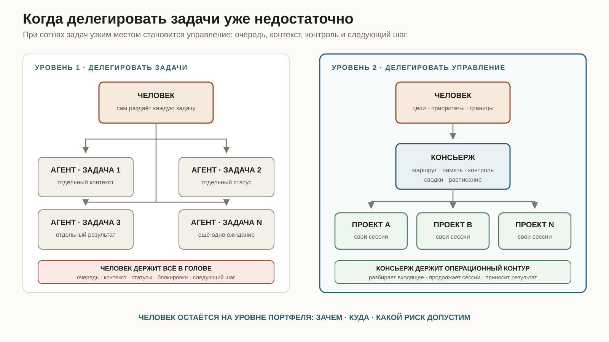
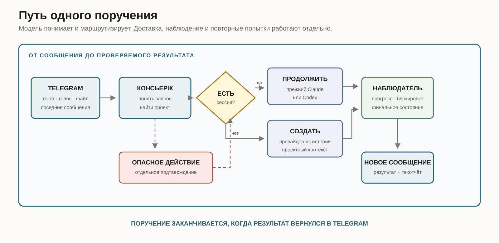

Чем больше я пользуюсь ИИ, тем быстрее двигается каждая отдельная задача. А потом ускорение упирается в самое примитивное звено системы: в меня.

Claude Code пишет код, Codex проверяет изменения, ещё одна сессия ищет причину сбоя, четвёртая ждёт ревью. Они способны работать параллельно. Мой биологический мозг — не особенно. В фокусе рабочей памяти помещается всего несколько независимых элементов; в исследованиях часто получается около четырёх [смысловых блоков](https://pubmed.ncbi.nlm.nih.gov/11515286/). Точное число зависит от задачи и умения собирать информацию в крупные куски, но это точно не несколько десятков живых сессий.

Я начал путать, кому уже ответил, какой агент чего ждёт и где лежит готовый результат. Сессии не забывали свои задачи. Забывал я.

Однажды я спросил у Telegram-бота, что происходит в одном из проектов. Он посмотрел на время последней записи и уверенно сообщил: сессия зависла полтора часа назад. На экране моего Mac в этот момент горело `2 running tasks`. В другой раз я поручил агенту работу через того же бота. Агент всё закончил, результат уже лежал в дашборде, а Telegram молчал. Через двадцать минут я написал: «ну?»

Мне понадобился помощник, который помнит агентов вместо меня: знает, кто чем занят, продолжает правильную сессию, передаёт ей новые вводные и сам возвращается с результатом.

Сначала я сделал Agent Dashboard, отдельное Electron-приложение с проектами, сессиями и последними событиями. За компьютером этого достаточно. С телефона удобнее задать один вопрос: «Что там с Logicore?» Или переслать сообщение коллеги со словами «передай это в проект».

Так появился Консьерж.

## Когда делегировать задачи уже недостаточно

Первый этап работы с ИИ почти всегда выглядит одинаково. Человек берёт задачу, формулирует её для агента и получает результат. Чем лучше инструкции и инструменты, тем более крупные куски работы можно отдавать целиком.

На одном проекте это даёт почти чистое ускорение. Я ещё способен помнить, зачем открыта каждая сессия, что ей уже объяснили и какой ответ нужно проверить. Управление остаётся незаметным, потому что занимает меньше времени, чем сама работа.

Потом проектов становится десять, а задач — сотни. Стоимость выполнения продолжает падать, но появляется новый расход: выбрать следующую задачу, найти правильный контекст, не запустить дубликат, заметить блокировку, дождаться результата и вспомнить, какое решение было принято неделю назад.

Я делегировал исполнение, но оставил себе всю диспетчерскую работу. В результате ИИ ускорил производство задач настолько, что я сам превратился в ограничитель его пропускной способности.

Следующий шаг — подняться на уровень выше. Агентам можно отдать не только работу внутри проекта, но и значительную часть операционного управления: разбор входящих запросов, маршрутизацию, продолжение прежних сессий, контроль незавершённых ходов, регулярные проверки и сбор сводок.

У человека при этом остаётся портфельный уровень. Я решаю, зачем существует проект, куда он движется, сколько риска допустимо и какие необратимые действия можно совершить. Консьерж поддерживает движение между этими решениями.

Это похоже на рост обычной компании. Сначала основатель нанимает людей, чтобы они выполняли больше работы. Затем обнаруживает, что целый день раздаёт задания и спрашивает статусы. В этот момент ему нужен уже не ещё один исполнитель, а управляющий контур.



## Зачем понадобился отдельный агент

Консьерж живёт в Telegram и принимает сообщения только от меня. Ему можно отправить текст, голосовое, скриншот, документ или кусок пересланной переписки.

Его работа начинается до вызова проектного агента. Нужно понять, о каком проекте идёт речь, найти прежнюю сессию, не потерять её контекст и решить, требуется ли вообще что-то делать. Иногда я хочу только сводку. Иногда прошу продолжить работу. А иногда пересылаю сообщение без глагола, и разумнее сначала предложить варианты.

Сам Консьерж не должен чинить проект. Я несколько раз ловил его на попытке «быстро помочь»: сходить по SSH, открыть базу или прочитать репозиторий напрямую. Получалось быстрее только на первом шаге. После этого смешивались роли, права и история работы.

Теперь правило простое: Консьерж разбирает запрос и координирует; работа внутри проекта остаётся в сессии этого проекта.

Это повлияло и на выбор модели. Мы сначала пробовали маршрутизировать задачи по стереотипу: код отдавать Codex, операторскую работу — Claude. В реальности важнее преемственность. Если проект уже ведётся в Claude Code, там накопились инструкции, навыки, открытая ветка и память о прошлых решениях. Нет смысла открывать Codex только потому, что в новой задаче встретилось слово «код».

Поэтому Консьерж ищет существующую сессию и продолжает разговор там. Новую создаёт, только если продолжать действительно нечего. Провайдер новой сессии тоже наследуется от истории проекта.

## Как выглядит один запрос

Допустим, я пересылаю в Telegram вопрос куратора. За секунду до него успеваю написать отдельной строкой: «это наш куратор».

Ранняя версия Консьержа немедленно обрабатывала первую фразу и отвечала, что не понимает, о каком человеке идёт речь. Сейчас соседние сообщения попадают в короткое окно сборки. Подпись, пересылка и вложение приходят в модель одним упорядоченным пакетом.

Дальше Консьерж сверяет упоминания с проектами из дашборда и своей рабочей памятью. Если связь надёжная, он сразу предлагает подходящее действие. Если контекста мало, в Telegram появляются две-три кнопки: передать в найденную сессию, создать отдельное поручение или просто сохранить информацию. До нажатия ничего не меняется.

После выбора Консьерж отправляет задачу проектному агенту и оставляет в чате один статус. Текст статуса меняется по ходу работы: агент читает данные, выполняет команду, редактирует файлы, проверяет результат. Это служебное сообщение; оно не должно вытеснять содержательный ответ.

Когда проектная сессия заканчивает ход, отдельный наблюдатель замечает финальное состояние и будит Консьержа. Тот присылает результат новым сообщением. Длинные логи и инженерные подробности остаются за кнопкой «Технический отчёт».

Новое сообщение здесь не мелочь. Если отредактировать старый статус, Telegram часто не покажет уведомление. Формально ответ доставлен, а человек его не увидел.



## Что работает без модели

За понимание запроса отвечает закреплённая сессия Claude Code на Sonnet. Она не закрывается после каждого ответа. Процесс ждёт следующего сообщения на стандартном вводе, поэтому в простое токены не расходуются, а новый запрос не тратит время на запуск ещё одной сессии.

Всё, что связано с надёжностью, я постепенно вынес из языковой модели.

Локальная очередь хранит готовый ответ, пока Telegram не подтвердит доставку. При сетевой ошибке повторяется отправка, а не рассуждение Sonnet. Планировщик сам вычисляет время следующего запуска. Наблюдатель следит за поручениями без постоянного опроса через ИИ. Сторожевой процесс поднимает сервис после сбоя с тем же ID сессии.

Внутри получилось несколько простых частей:

| Часть | Задача |
|---|---|
| Telegram-бот | Мобильный вход и доставка ответов |
| Закреплённая Sonnet-сессия | Понимание намерения и диалоговый контекст |
| Agent Dashboard | Список проектов, Claude/Codex-сессий и событий |
| Наблюдатель задач | Прогресс, зависшие старты и финальный результат |
| Project Brain | Факты, решения и незакрытые вопросы по проекту |
| Планировщик | Повторяющиеся поручения и история запусков |
| Корпус решений | Поиск похожих выборов в старых сессиях |

У Sonnet есть Full Access: Chrome, навыки, плагины и подключённые MCP-серверы. При этом специальный перехватчик блокирует shell и прямой доступ к проектным файлам из сессии Консьержа. Текстового обещания «не лезть в проекты» для этого оказалось мало.

## Ошибки, из которых получилась архитектура

Первая версия поднимала новую Claude-сессию на каждый запрос. Бот отвечал, завершался и забывал разговор. Фраза «перепроверь» закономерно вызывала уточнение: перепроверить что? После перехода на одну закреплённую сессию контекст перестал пропадать, а время ответа сократилось.

Затем выяснилось, что передать задачу недостаточно. У Claude Code нет события, которое само по себе заставит уже ответившую языковую модель снова заговорить, когда другая сессия закончила работу. Так появился независимый наблюдатель. Теперь мне не нужно писать «ну?» для проверки готового результата.

Следующая поломка выглядела мистически: некоторые ответы «не отрисовывались». В журнале Telegram всё было успешно. Оказалось, что начальный ответ и трекер прогресса редактировали один `message_id`. Кто писал последним, тот и оставался на экране. Мы закрепили старое сообщение только за прогрессом, а смысловой ответ начали отправлять отдельно. Заодно добавили технический журнал доставки: метод API, ID результата, номер попытки, запасной способ и хеш текста. Сам текст в журнал не попадает.

Ещё один сбой выдавал пользователю внутреннее исключение:

```text
Claude returned an invalid intake proposal
```

Причина оказалась будничной. Модель правильно разобрала запрос, но придумала подпись для кнопки длиннее 48 символов. Сейчас такие поля сначала нормализуются локально. Если структура всё ещё неверна, сервис один раз просит модель исправиться. Последний запасной вариант даёт безопасные действия только для чтения вместо трассировки ошибки.

Отдельно пришлось разбираться с правами записи. У Консьержа были два разных ограничения: обычное разрешение на изменение и дополнительное подтверждение опасной операции. Оба возвращали похожий отказ, поэтому даже агент не мог объяснить, почему соседние задачи ведут себя по-разному.

Теперь разрешение создаётся для конкретного сообщения из Telegram, действует недолго и содержит область риска: чтение, обратимое изменение или опасное действие. В отказе есть код причины и найденный рискованный фрагмент. Повтор одного и того же запрещённого вызова не может случайно «продавить» защиту.

## Что он помнит обо мне

Длинная история чата плохо работает как память. В ней легко найти слово и трудно найти момент, когда человек действительно сделал выбор.

Консьерж отдельно индексирует мои решения из локальных сессий Claude и Codex. Для каждой записи он сохраняет предшествующий разговор, мою формулировку, последующий ответ агента и названия использованных инструментов. Аргументы команд и результаты инструментов в этот индекс не попадают.

Например, я однажды жёстко сказал: «ai-panel — другой проект, не трогай его». Позже похожая задача про новый интерфейс получила полезный прецедент: создавать отдельный репозиторий, а не пристраивать функцию к проекту с похожим названием.

Такой поиск не делает из модели мою копию. Он позволяет сформулировать прогноз и показать основания: какие прошлые решения похожи, насколько они близки и какой информации сейчас не хватает. После моего фактического выбора прогноз можно откалибровать.

Рядом с общим индексом работает Project Brain. Это короткая память по каждому проекту: подтверждённые факты, последние решения, привычный провайдер и открытые вопросы. Благодаря ей ежедневная сводка не зависит только от последних десяти строк в самой свежей сессии.

## Поручения, которые возвращаются сами

Я не использую команды со слешем в обычной переписке. Регулярное поручение тоже создаётся фразой:

> По будням в десять присылай сводку по Logicore до первого сентября.

Или:

> Каждые три часа проверяй статус миграции, всего восемь раз.

Перед сохранением Консьерж показывает, как понял период, ограничение повторов и ближайшие запуски. Тем же разговорным способом расписание можно изменить, поставить на паузу, выполнить сейчас или удалить.

База расписаний находится на Mac и переживает перезапуск сервиса. Пропущенный день не создаёт очередь из десятков устаревших запусков. Одна задача не запускается параллельно сама с собой. После трёх устойчивых ошибок она останавливается и сообщает причину.

Для публикации, платежа, удаления или продакшен-деплоя постоянное расписание не считается постоянным согласием. Каждый такой запуск снова требует подтверждения.

## Где система находится сейчас

На 31 июля 2026 года локальная проверка установки показывает одну живую закреплённую Sonnet-сессию. Дашборд видит 12 проектов и 38 сессий Claude и Codex. В индексе лежат 4 246 записей решений из трёх типов источников. Текущий набор из 171 теста проходит полностью.

Эти цифры быстро устареют, а ограничения останутся.

Mac и Agent Dashboard должны быть включены, иначе Консьерж не доберётся до проектных сессий. Чужая сессия может остановиться из-за сети, авторизации или отсутствующего инструмента. Пересланный скриншот без пояснения иногда действительно неоднозначен. Модель решений ищет аналоги, но не читает мысли.

Локальные модели я тоже проверил. На обычной беседе некоторые выглядели убедительно, но на маршрутизации, строгой схеме вызовов и опасных сценариях качество проседало. Центральным диспетчером пока остался Sonnet. Локально работают распознавание голоса, хранение, поиск, расписание и наблюдение.

Сейчас я могу выйти из дома без ноутбука, переслать Консьержу задачу и получить ответ от той же проектной сессии, с которой работал утром. Если агент застрял, я вижу это в Telegram. Если закончил, результат приходит сам.

Ради этого всё и затевалось.
