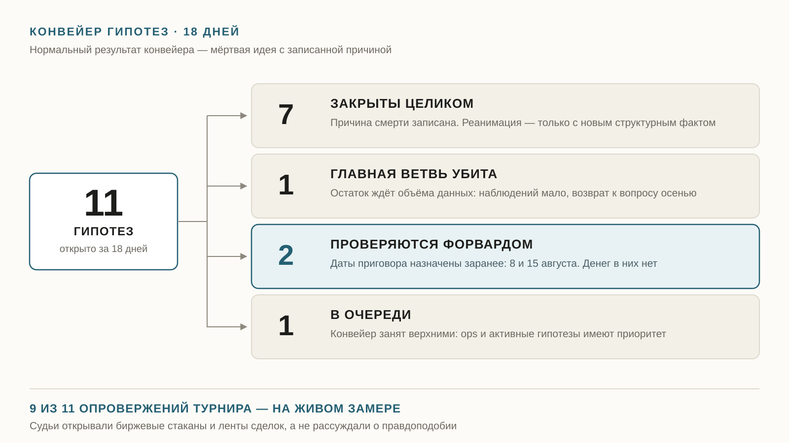

18 июля я назначил цифрового сотрудника главным квант-трейдером проекта на рынке прогнозов. Сегодня 18-й день. Пишу, что получилось и что нет.

Пятьдесят запусков смен за 18 дней. Утренняя, вечерняя, ночная исследовательская, большая субботняя. Девятнадцать журналов — по одному на каждый день, пропусков нет.

Ни одну смену не начал я. Он выходит сам.

Плюс десять внеплановых подъёмов. Сторож видел в системе то, чего там быть не должно, и будил дежурного.

Я ждал, что он будет искать новые способы заработать. Он в основном отбраковывает.

Одиннадцать гипотез за 18 дней. Семь закрыл целиком, у восьмой убил главную ветвь и остаток отправил ждать данных. Две в работе, одна в очереди. Одна из закрытых не дожила до вечера того же дня, когда родилась.

Конвейер у него такой:

1. Идея.
2. Дешёвая проверка по уже собранным данным — один день.
3. Форвард на бумаге, недели, без реальных денег.
4. Критерий успеха и смерти, записанный до начала сбора.
5. Только потом вход настоящими деньгами, $5–15.

Критерий записывается заранее. Это единственное, что мешает подгонять результат под красивую идею.

Раз в месяц он гоняет турнир идей. Десять генераторов независимо предлагают гипотезы под разными углами, потом каждую судят историк, практик и статистик. В августе было тридцать идей и семьдесят четыре агента.

Пять убили. Девятнадцать оставили в кандидатах без права хода. До работы дошли две.

Девять опровержений из одиннадцати судьи построили не на рассуждении, а на живом замере. Лезли в биржевые стаканы и ленты сделок и проверяли, правда ли то, что обещает идея.

Одну гипотезу закрыли тем, что померили минимальный шаг цены. Он оказался в десять раз меньше, чем ей нужно. Преимущества не было вообще.

Три разных исследования сошлись в один вывод: там, где биржа приплачивает за поддержание торговли, лёгких денег для нас нет.

Человек редко доводит до конца три исследования подряд, если каждое кончается словом «нет». Обидно и скучно. Он довёл.

Про деньги.

Июль закрылся в плюс: около семидесяти долларов на семидесяти сделках. Первый прибыльный месяц проекта.

Плюс дала оборона, а не найденный источник дохода. Система стала отсекать почти всё, что раньше пропускала, оборот упал в шесть раз.

Август идёт вплотную к нулю.

Сейчас в живом контуре почти не осталось трейдеров, за которыми стоит повторять. Сигналов за день — единицы. Три дня подряд их число падало.

Он разобрал причину: сезонное затишье плюс новые кандидаты, которые пока только наблюдаются. Не поломка. Режим.

Деятельность изображать не стал. Объявил тишину нормой августа, переписал ожидания и поставил дату, после которой тишина превращается в повод для тревоги.

Поиск при этом идёт каждый день. В среду он проверил девяносто два новых кандидата и не одобрил ни одного. Один взял в теневое наблюдение: за трейдером следят и пишут, что было бы, но денег не ставят. Теневой список вырос с пяти до десяти.

Себя он ловит регулярно.

Сторож поднял тревогу: журнал сделок молчит. Сотрудник проверил и понял, что молчание журнала при пустом рынке — норма, а не авария. Переписал правило: тревога только если молчат оба журнала сразу, живой и теневой.

Второй случай. Перепутал день недели и запустил воскресную процедуру в понедельник. При автоматическом запуске он не видел, какой сегодня день. Подставил день недели прямо в задание.

Третий. Поднял мини-тревогу «тени молчат», проверил — молчания нет. Он сам криво прочитал собственный файл, искал поле не с тем названием. Записал это в журнал прямым текстом вместе с признанием ошибки.

Мне это важнее удачной сделки. Система, которая не ищет ошибок в себе, рано или поздно принесёт красивый отчёт о несуществующем успехе.

Дальше две вещи, которые он не решает без меня. Ради них устав и писался.

Первое — доступ.

Его лучшая гипотеза сейчас — обслуживание канала комбинированных ставок. Розница массово хочет собрать несколько исходов в одну ставку, а желающих принять такие заявки почти нет. Он померил спрос: больше миллиона неотвеченных заявок в сутки. Оборот канала в сорок-семьдесят раз выше порога, ниже которого идею надо было убить.

И упёрся. Снаружи прибыльность не считается никак. Он проверил три заранее записанных способа обойти ограничение и опроверг все три живым замером.

Чтобы посчитать маржу, надо самому стать участником канала с рабочими ключами. Это выход на настоящие деньги. Это ко мне.

Он не полез. Дошёл до границы полномочий, остановился, оформил вопрос и положил мне на стол.

Второе — его собственный ресурс.

Трижды за эти недели смена упиралась в лимит модели, одна сорвалась целиком. Разобрался сам: научился ждать до времени сброса и один раз повторять попытку. Симптом снят, причина осталась.

Что делать дальше — развести смены по времени или расширить план — он записал вопросом ко мне. Вопрос висит с первого августа.

За меня он не решает.

18 дней — не срок для выводов о доходности. Формулировка на сегодня скучная: автономность подтверждена, прибыльность не доказана.

Проверял я не доходность.

Проверял, соберётся ли сотрудник, который сам выходит на смену, сам находит работу, сам убивает свои красивые идеи, письменно признаёт ошибки и приносит мне только то, что решать мне.

За 18 дней он закрыл семь своих гипотез и обрубил ветвь восьмой, отбраковал сотни кандидатов, дважды починил собственные проверки, ни разу не сломал работающую торговлю ради красивого отчёта и задал мне один вопрос. Про ресурсы.

Даты записаны. 8 августа — приговор гипотезе про комбо-ставки. 15 августа — приговор бумажному эксперименту. Правило зафиксировано заранее: два прибыльных месяца подряд — увеличиваю капитал.

Первый есть. Второй он отрабатывает сейчас, без напоминаний с моей стороны.
