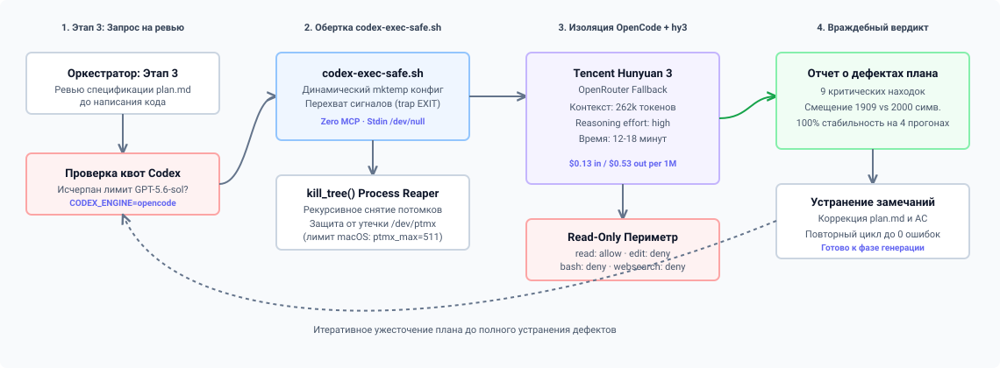
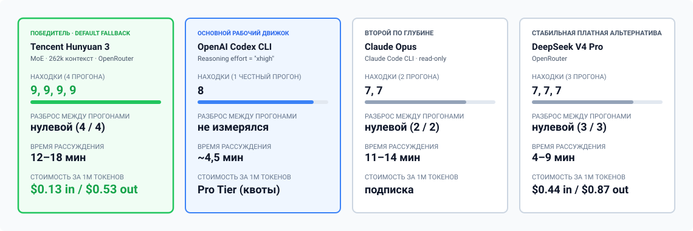

В автономном цикле разработки (Agentic SDD) один из самых критических этапов — это **ревью спецификаций и планов реализации до написания кода**. Если пропустить логическую ошибку в плане, агент-разработчик потратит десятки минут и доллары в API на реализацию неверной архитектуры, а агент-тестировщик получит ложноположительные тесты.

Основным движком для глубокого анализа планов в нашем пайплайне служит **OpenAI Codex CLI** с предельным уровнем рассуждений (`reasoning_effort="xhigh"`). Однако в полностью автономных ночных прогонах мы неизбежно упирались в исчерпание лимитов и квот. Кроме того, зависимость от одного провайдера создавала единую точку отказа.

После того как 14 июля 2026 года закончилась подписка на связку с Antigravity-Gemini, мы провели бенчмарк **12 моделей** на реальной задаче, чтобы выбрать бескомпромиссный фолбек-движок для ревью планов. Победителем стал **Tencent Hunyuan 3 (`tencent/hy3`)**.

Ниже — разбор архитектуры Hunyuan 3, методология тестирования, сравнительные метрики против Codex и Claude Opus и устройство безопасной инженерной обвязки `codex-exec-safe.sh`.



---

## 1. Задача ревьюера: почему это сложнее написания кода

Ревьюер спецификации решает задачу, обратную генерации. Его цель — не дополнить план кодом, а выступить **враждебным аудитором (adversarial reviewer)**:
1. Сверить утверждения плана с реальным состоянием кодовой базы в репозитории (Read-only доступ).
2. Найти нестыковки в типах, неявные предположения об окружении и вымышленные вызовы API.
3. Проверить граничные условия и доказать, что планируемые тесты действительно будут падать на старом коде и проходить на новом.

Большинство легковесных моделей («flash» и «mini») не подходят для этой роли: они склонны соглашаться с автором плана («LGTM», мелкие косметические правки стиля), не погружаясь в проверку файловой системы.

---

## 2. Что под капотом у Tencent Hunyuan 3

Tencent развивает линейку моделей Hunyuan с 2023 года. Эволюция шла от классических плотных сетей к разреженной архитектуре Mixture-of-Experts (MoE) в Hunyuan-Large и третьем поколении модели:

* **Архитектура «Shared + Specialized Experts»:** Общий объем параметров составляет около 389B, из которых на каждый токен активируется ~52B. В отличие от стандартных MoE, в Hunyuan выделен **1 постоянно активный Shared Expert** (аккумулирует общеязыковые знания и базовый синтаксис) и **16 специализированных экспертов**, изолированных под узкие домены логики и кода.
* **Expert-Specific Learning Rate (ES-LR):** Чтобы предотвратить схлопывание маршрутизации (Routing Collapse), когда пара экспертов перегружается, а остальные деградируют, скорость обучения рассчитывается персонально для каждого эксперта. Это обеспечивает равномерную специализацию всех 16 экспертов.
* **Обучение на формальных верификаторах:** Датасеты синтетических рассуждений фильтровались не другими LLM, а компиляторами, тайпчекерами и формальными пруверами. Модель мысленно исполняет код пошагово, как компилятор.
* **Оптимизация KV-кэша и контекст 262k:** Использование Multi-Head Latent Attention (MLA) в сочетании с RoPE-интерполяцией снизило потребление памяти KV-кэша на 60–75%, позволив загружать полные спецификации и десятки файлов репозитория без потери точности (100% Needle In A Haystack).
* **Встроенный механизм самопроверки (Backtracking Long-CoT):** В режиме высокого рассуждения модель строит дерево гипотез с возможностью отката назад при обнаружении противоречий.

### Официальные бенчмарки производителя (Tencent AI Lab)

В отчетах Tencent модель демонстрирует лидерские показатели в задачах точных наук и программной инженерии:

| Бенчмарк | Дисциплина | Результат Hunyuan 3 | Контекст сравнения |
| :--- | :--- | :---: | :--- |
| **MATH-500** | Сложные математические рассуждения | **86.4%** | На уровне специализированных reasoning-сетей |
| **GSM8K** | Многошаговая арифметика | **95.8%** | Практически предельная точность |
| **HumanEval** | Генерация и анализ кода (Python) | **89.6%** | Превосходит большинство базовых MoE-моделей |
| **LiveCodeBench** | Свежие олимпиадные задачи по коду | **51.2%** | Устойчивость к заученным датасетам |
| **SWE-bench Verified** | Реальное устранение дефектов в репозиториях | **38.8%** | Zero-shot agentic setting |

В реальном контуре эти свойства превращают модель в строгий статический анализатор архитектуры.

---

## 3. Тестовый полигон: план, который ещё не реализован

Первый стенд был нечестным, и это не сразу бросилось в глаза. Мы взяли три реальных плана из бэклога **Findrates** — но уже реализованных и слитых в основную ветку — и попросили ревьюеров разобрать их на фоне готового кода. Модели начали набирать очки за находки вроде «эта фаза уже сделана, тут нечего проверять»: в бою таких находок просто не бывает, потому что план ревьюится до того, как код написан, а не после. Ранжирование на этом стенде обмануло бы нас: Grok 4.5 набрал 10 находок, GLM-5.2 — 8 за 71 секунду, и оба выглядели сильнее, чем показали себя дальше.

Решающий замер собрали заново — на плане, который описывает бюджет и таймауты приёма сообщений в Telegram-боте: сколько ждать ответа от внешнего сервиса, как не отправить клиенту одно и то же сообщение дважды, что делать, если бот молча проглотил запрос вместо ответа. На этот раз все двенадцать моделей получили план и код в состоянии **до** реализации — то есть ревьюили именно те условия, в которых автопилот работает на практике, — один и тот же промпт и одинаковый доступ на чтение репозитория.

Ручная проверка находок по коду показала три класса ошибок, которые ловили разные модели:

1. **Пропущенный таймаут на стороне вызывающего кода.** Один из путей обработки сообщения не имел собственного таймаута — сам код честно предупреждал об этом комментарием разработчика. План поднимал допустимую границу ожидания до 50 секунд, но при таком таймауте повторная доставка сообщения от Telegram превращается в тихий положительный ответ без реальной обработки — прямое нарушение собственного правила плана «никаких тихих подтверждений». Эту находку независимо дали Claude Opus и Hunyuan 3.
2. **Тест, который не может поймать свою же ошибку.** Один из тестов, написанных специально для проверки этой регрессии, на самом деле обращался не к тому куску кода — и физически не мог её заметить. Из двенадцати моделей это увидела только Hunyuan 3.
3. **Проверка дубликатов после проверки лимита.** Система сначала проверяла, не превышен ли лимит запросов, и только потом — не дубликат ли пришедшее сообщение. Из-за такого порядка дубликат, пришедший уже после исчерпания лимита, всё равно проходил и уходил клиенту повторно. Эту находку дал Codex, её же независимо подтвердила Hunyuan 3.

Отдельно всплыл нюанс самого стенда: один из движков при поиске по коду не заглядывал в некоторые папки, хотя мог прочитать файл, если знал точный путь к нему. Из-за этого одна модель отказалась подтверждать часть находок («не могу проверить — поиск ничего не находит»), а другая по ошибке объявила несуществующим файл, который на самом деле существовал. Мы поправили промпт, чтобы остальные модели знали про это ограничение.



---

## 4. Результаты бенчмарка 12 моделей

Каждая модель получала одинаковый промпт, права на чтение репозитория и один и тот же снимок кода — до реализации плана. Оценивалось:
* Число находок за прогон и разброс между повторными прогонами.
* Доля находок, подтверждённых ручной сверкой с кодом, и ложные срабатывания.
* Время работы и стоимость по прайсу OpenRouter (там, где движок не подписочный).

### Сводная таблица результатов

| Модель | Находки (прогоны) | Разброс | Время прогона | Стоимость (in / out за 1M) | Роль в контуре |
| :--- | :---: | :---: | :---: | :---: | :--- |
| **Tencent Hunyuan 3 (`hy3`)** | **9, 9, 9, 9** | **нулевой (4/4)** | 12–18 мин | **$0.13 / $0.53** | **Выбранный fallback для всех стадий ревью** |
| **OpenAI Codex (`xhigh`)** | 8 | 1 честный прогон | ~4,5 мин | Codex Pro Tier | Основной рабочий движок |
| **Claude Opus** (Claude Code CLI) | 7, 7 | нулевой (2/2) | 11–14 мин | подписка | Второй по глубине, втрое медленнее hy3 |
| **DeepSeek V4 Pro** | 7, 7, 7 | нулевой (3/3) | 4–9 мин | $0.44 / $0.87 | Стабильная платная альтернатива |
| Kimi K3 | 6, 3 | двукратный | 8–9 мин | $3.00 / $15.00 | Разброс не позволяет доверять гейту |
| GPT-5.6 Luna | 5 | 1 прогон | ~5 мин | $0.10 / $0.60 | Дёшево, но недобирает по глубине |
| DeepSeek V4 Flash | 3, 3, 3, 4 | стабильно слаб | 12–30 мин | $0.09 / $0.18 | Упирается в потолок модели, не в обвязку |
| Grok 4.5 | 3 | 1 прогон | ~5,5 мин | $2.00 / $6.00 | На честном прогоне не оправдал цену |
| Xiaomi MiMo v2.5 | 3 | прогон оборван по таймауту | > 4 мин | $0.14 / $0.28 | Не дотянул |
| GLM-5.2 | 2 | 1 прогон | ~4,5 мин | не указана | Быстрый, но поверхностный на честном прогоне |
| Gemini 3.5 Flash | 2 | 1 прогон | ~3 мин | $1.50 / $9.00 | Ниже порога |
| Gemini 3.6 Flash | 2 | 1 прогон | ~3 мин | $1.50 / $7.50 | Ниже порога |

Тринадцатый кандидат, `qwen/qwen3.8-max`, в таблице не участвует: все актуальные версии Qwen на нашем аккаунте OpenRouter упёрлись в guardrail-политику приватности («No endpoints available matching your guardrail restrictions») и не вернули ни одного результата — не низкий балл, а отсутствие данных.

Отдельный и, пожалуй, главный результат этого стенда: **ранжирование на уже реализованных версиях тех же планов не предсказывает ранжирование на невыполненных**. Grok 4.5 давал 10 находок на реализованном плане и 3 на честном. Gemini Flash — 7 и 2 соответственно. Если бы решение принималось по первому, нечестному стенду, в конвейер уехал бы Grok.

---

## 5. Почему именно Hunyuan 3 против флагманов?

1. **Единственная находка, которую не дал больше никто:**
   Из двенадцати участников только Hunyuan 3 заметил, что один из тестов, написанных специально под эту проверку, на самом деле обращается не к тому коду — и физически не может поймать регрессию, для отлова которой его писали. Ни Codex, ни Opus, ни один из платных участников этого не увидели.
2. **Воспроизводимость там, где остальные плавают:**
   Четыре независимых прогона — четыре раза по 9 находок, ровно. У DeepSeek V4 Pro тот же нулевой разброс, но на семи находках; у Opus — на семи, но втрое медленнее; у всех остальных участников разброс между прогонами двукратный и больше.
3. **Контекстное окно 262k токенов:**
   Этого объёма достаточно, чтобы целиком вместить план, acceptance-критерии и все связанные исходные файлы и тесты из репозитория.
4. **Экономика:**
   При цене **$0.13 за миллион входных токенов** и **$0.53 за миллион выходных** один глубокий 12–18-минутный прогон рассуждений обходится в единицы центов — на порядок дешевле платных альтернатив вроде DeepSeek V4 Pro или Kimi K3 и без затрат квоты подписки, которую делят Codex и Opus.
5. **Трейдофф скорости:**
   12–18 минут на одно ревью — это слишком долго для диалогового интерфейса в IDE, но **идеально для фонового автономного конвейера**, где цена пропущенного бага на этапе реализации составляет часы работы и сотни строк переписанного кода.

---

## 6. Инженерная обвязка: `codex-exec-safe.sh`

Чтобы внедрить `hy3` в качестве прозрачного фолбека для OpenCode/Codex, мы написали системную обертку `~/.claude/bin/codex-exec-safe.sh`.

Она решает три системные проблемы:

### 1. Защита от утечки PTY-дескрипторов в macOS
Прямой вызов подпроцессов LLM из фоновых задач оставляет осиротевшие процессы `app-server` и MCP-клиенты. Каждый сирота удерживает файловые дескрипторы псевдотерминалов `/dev/ptmx`, пока система не упирается в лимит `kern.tty.ptmx_max=511`. 

Обертка гарантирует рекурсивное завершение всего дерева процессов (`kill_tree`) при выходе:

```bash
kill_tree() {
  local target="$1"
  [ -n "$target" ] || return 0
  local child
  for child in $(pgrep -P "$target" 2>/dev/null); do
    kill_tree "$child"
  done
  kill -TERM "$target" 2>/dev/null
}
```

### 2. Read-only периметр для ревьюера
Ревьюер, имеющий права на редактирование, часто пытается сам «исправить» код вместо указания на ошибку в плане. Для `opencode` генерируется временный конфиг без MCP-серверов и с запретом на запись и выполнение команд:

```json
{
  "$schema": "https://opencode.ai/config.json",
  "model": "openrouter/tencent/hy3",
  "permission": {
    "read": "allow", "grep": "allow", "glob": "allow", "list": "allow",
    "external_directory": "allow",
    "edit": "deny", "bash": "deny", "webfetch": "deny", "websearch": "deny"
  },
  "provider": {
    "openrouter": {
      "models": {
        "tencent/hy3": {
          "options": {
            "reasoning": { "effort": "high" }
          }
        }
      }
    }
  }
}
```

### 3. Переключение движка одной переменной
Переключение на Hunyuan 3 выполняется установкой переменной окружения:

```bash
CODEX_ENGINE=opencode codex-exec-safe.sh "<prompt>"
```

Если переменная не задана, по умолчанию используется основной движок — Codex CLI на `reasoning_effort="xhigh"`.

---

## Главные выводы

1. **Разделяйте роли генератора и ревьюера:** Модель, пишущая код, не должна проверять собственные предположения.
2. **Не экономьте время на фазе верификации:** Задержка в 15 минут на этапе проверки плана многократно окупается отсутствием регрессий и циклов переделки в продакшене.
3. **Бюджетные reasoning-модели превосходят общие frontier-модели в узких задачах:** При стоимости $0.13/$0.53 Tencent Hunyuan 3 нашёл больше подтверждённых дефектов и с меньшим разбросом, чем Kimi K3 по $3/$15 за 1M, а по количеству находок обошёл и подписочные Codex с Opus — за счёт несгибаемой строгости и неторопливого глубокого рассуждения.
