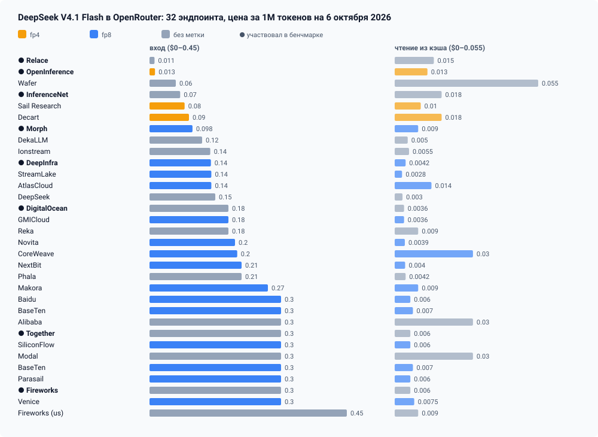
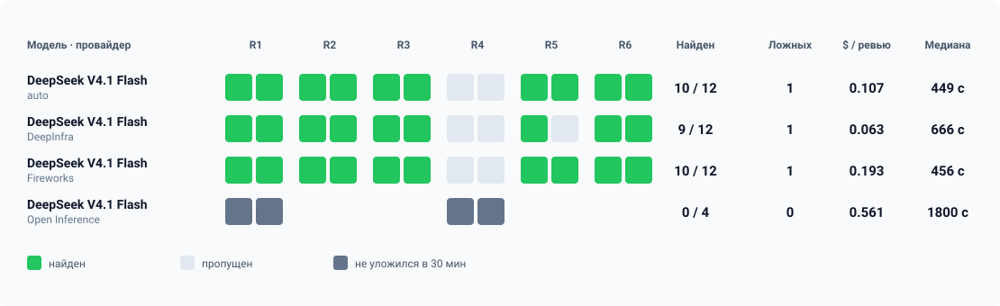

В конвейере разработки FindRates резервная модель для ревью кода — DeepSeek V4.1 Flash через OpenRouter: она проверяет код, когда основной ревьюер недоступен. В каталоге это одна строка: `deepseek/deepseek-v4.1-flash`. За этой строкой на 6 октября 2026 года стоят 32 эндпоинта у 30 провайдеров. Цена входа у них — от $0,011 до $0,45 за миллион токенов, у 15 эндпоинтов метка fp8, у трёх fp4, у четырнадцати метки нет.

По умолчанию OpenRouter сам выбирает, к кому отправить запрос. Я измерил, во что это обходится, на эталоне из реальных коммитов. Одно и то же ревью кода при близком качестве стоило $0,107 на автоматической маршрутизации, $0,063 при закреплении за DeepInfra и $0,193 за Fireworks. Провайдер с меткой fp4 не закончил ни одного ревью за 30 минут и за каждую попытку взял $0,56.

Вывод простой: провайдер — такой же параметр, как модель. Его надо проверить, закрепить и потом следить, кто на самом деле обслуживает запросы.



---

## 1. Что OpenRouter знает о провайдерах

Список эндпоинтов модели отдаёт открытый метод API, ключ не нужен:

```bash
curl -s https://openrouter.ai/api/v1/models/deepseek/deepseek-v4.1-flash/endpoints \
  | jq '.data.endpoints[] | {provider_name, quantization,
        input: .pricing.prompt, output: .pricing.completion, cache_read: .pricing.input_cache_read}'
```

Разброс в этом списке большой по каждой цене. Вход — от $0,011 до $0,45 за миллион токенов, в сорок раз. Выход — от $0,18 до $2,40. Чтение из кэша — от $0,0028 до $0,055.

Для агента важнее всего последняя цифра. Агент на каждом шаге заново отправляет весь накопленный контекст, и большая его часть приходит из кэша провайдера. В нашем ревью DeepSeek делал в среднем 31–36 вызовов и прочитывал 3,2–3,7 млн входных токенов, из них 92–95% — из кэша. Поэтому самый дешёвый по входу провайдер не обязательно самый дешёвый в работе. У Relace вход стоит $0,011, а чтение из кэша — $0,015. У DeepInfra вход $0,14, а кэш — $0,0042, в три с половиной раза дешевле.

Чего в списке нет — так это качества и скорости. Метка квантизации есть не у всех, а там, где есть, она мало что говорит (об этом ниже).

## 2. Как я мерил

Эталон собран из шести коммитов, которые влили в основную ветку с дефектом. Каждый дефект позже нашли и исправили отдельным коммитом, поэтому известно, что ревьюер должен был заметить. Эталонный дефект я записывал по исправлению до запуска моделей.

| Случай | Что сломано |
| :--- | :--- |
| R1 | Отправка, упавшая по таймауту после того, как канал уже принял сообщение, возвращает отметку «подтверждено», и подтверждение уходит второй раз |
| R2 | Повтор после отказа модели заново запускает каскад OpenRouter, который уже повторял запрос сам: 2 + 4 запроса вместо 1 + 2 |
| R3 | Повтор после 429 уходит после последней проверки «сообщение ещё нужно», и отмена в паузе его не останавливает |
| R4 | После сводки статуса клиенту повторно уходит уже доставленная карточка со ставками |
| R5 | Проверка телефонов и ссылок делит дедлайн с вызывающим кодом, получает около нуля миллисекунд и отбрасывает корректные значения |
| R6 | Отказ общего лимитера при повторе затирает настоящий ответ 429, а счётчик учитывает вызов, который не уходил |

Каждый коммит дважды проверялся одной и той же моделью с одним промптом в OpenCode, менялся только маршрут в OpenRouter:

| Вариант | Маршрут |
| :--- | :--- |
| auto | выбор OpenRouter |
| DeepInfra | `{"only": ["deepinfra"], "allow_fallbacks": false}`, метка fp8 |
| Fireworks | `{"only": ["fireworks"], "allow_fallbacks": false}`, без метки, дорогой |
| Open Inference | `{"only": ["open-inference"], "allow_fallbacks": false}`, метка fp4, только R1 и R4 |

Собственный эндпоинт DeepSeek в сравнение не попал: настройки приватности аккаунта его исключают, потому что DeepSeek может обучаться на запросах и не гарантирует, что не хранит данные.

Ревью оценивались вслепую: под случайными идентификаторами, без имени провайдера в тексте. Оценщик сравнивал ревью с эталоном и проверял каждую дополнительную находку по коду на момент коммита.

### Прокси, который записывает счёт

OpenRouter возвращает в каждом ответе имя провайдера, который его обслужил, и фактическую стоимость в `usage.cost`, если запрос об этом попросил. OpenCode эти поля не сохраняет. Поэтому между ним и OpenRouter стоял локальный прокси: он подставлял маршрут варианта, включал учёт стоимости и писал по строке на каждый вызов модели.

```js
const arm = tag.split("~")[0];
if (cfg.arms?.[arm]) json.provider = cfg.arms[arm];   // маршрут варианта
if (isCompletion) json.usage = { include: true };     // попросить фактическую стоимость
...
record({ tag, model, requested_provider: requested, status, ms, provider, cost,
         prompt_tokens, completion_tokens, reasoning_tokens, cached_tokens });
```

Первая версия на `fetch` под параллельной нагрузкой через несколько минут переставала отдавать поток. Рабочая передаёт поток через `node:https` и закрывает соединение после каждого ответа.

---

## 3. Результаты



| Маршрут | Ревью | Дефект найден | Исправление совпало | Других верных находок | Ложных | Медиана времени | Выход, токенов/с | Средняя цена ревью |
| :--- | :---: | :---: | :---: | :---: | :---: | :---: | :---: | :---: |
| auto | 12 | 10 | 9 | 21 | 1 | 449 с | 100 | $0,107 |
| DeepInfra | 12 | 9 | 7 | 16 | 1 | 666 с | 83 | $0,063 |
| Fireworks | 12 | 10 | 10 | 18 | 1 | 456 с | 161 | $0,193 |
| Open Inference | 4 | все четыре по тайм-ауту | — | — | — | 1800 с | 20 | $0,561 |

Скорость здесь — выходные токены, делённые на полное время вызова, по записям прокси.

**Качество у трёх рабочих маршрутов близкое.** Если убрать R4, который не решил никто, auto и Fireworks нашли дефект в 10 ревью из 10, DeepInfra — в 9. Единственная ложная находка у каждого — одна и та же ошибочная претензия к сравнению времени в R1. Разница видна в исправлениях: у Fireworks все 10 совпали с тем, что потом ушло в код, у DeepInfra — 7.

**Цена различается втрое.** DeepInfra — $0,063 за ревью, на 41% дешевле автоматического маршрута. Fireworks — $0,193, в три раза дороже DeepInfra.

**Скорость различается в восемь раз.** Fireworks выдаёт около 161 токена в секунду, Open Inference — около 20. У DeepInfra самая длинная медиана среди рабочих маршрутов, 666 секунд, худший прогон — 1550.

**Лимиты тоже разные.** При восьми параллельных сессиях Fireworks так часто отвечал 429, что четыре прогона упали целиком, и их пришлось повторить по два одновременно.

**Open Inference** не закончил ни одного ревью за 30 минут. На R4 одна попытка сделала 134 вызова модели и стоила $0,95. После четырёх попыток маршрут исключён из остальных случаев.

### Куда уходит автоматический маршрут

Без закрепления OpenRouter распределил вызовы двенадцати ревью по пяти провайдерам: inference.net — 202 вызова, Together — 95, Morph — 47, DigitalOcean — 42, Relace — 9. У этих провайдеров разные цены, разные метки и, судя по нашим замерам на закреплённых маршрутах, может быть разная скорость. В девяти ревью из двенадцати вызовы одного ревью обслуживали два или три разных провайдера.

Средняя цена автоматического маршрута, $0,107, — это цена смеси, которую выбрал OpenRouter в этот день. В другой день смесь будет другой.

## 4. Метка квантизации почти ничего не говорит

Естественная мысль — отсеять провайдеров по метке: брать fp8, избегать fp4. Для DeepSeek V4.1 Flash это не работает. Модель выпущена со смешанными весами: эксперты MoE в FP4, остальное в FP8. В карточке на Hugging Face это типы тензоров F8_E4M3 и I8. Метки «fp8» и «fp4» обе могут описывать исходный чекпойнт.

Четырнадцать эндпоинтов из тридцати двух метку не ставят вовсе. Ни Relace, ни inference.net, ни DigitalOcean, ни Together, ни Fireworks, ни сама DeepSeek не публикуют, как обслуживают модель. Провайдер с меткой fp4 в нашем бенчмарке провалился, но из-за скорости, а не из-за точности: до ответа он просто не дошёл.

Проверять провайдера приходится своим эталоном на своей задаче.

## 5. Настройка маршрута — это просьба, а не гарантия

OpenRouter принимает в запросе объект `provider`. Два его поля легко перепутать:

- `order` — порядок предпочтения. Если первый провайдер в списке недоступен, перегружен или отклонил запрос, OpenRouter идёт дальше, в том числе к провайдерам, которых в списке нет, пока не выключен `allow_fallbacks`.
- `only` — белый список. Запрос не уйдёт к провайдеру вне списка.

В бенчмарке маршруты были заданы через `only` с `allow_fallbacks: false`. Это соблюдалось на каждом вызове: DeepInfra обслужил 478 вызовов из 478, Fireworks — 732 из 732, Open Inference — 361 из 361.

С `order` картина зависит от момента. В одной из проверок запрос с `order: ["deepinfra"]` обслужил сначала Relace, а затем Open Inference, то есть именно тот провайдер, который в бенчмарке не закончил ни одного ревью. В моей короткой проверке позже в тот же день все пять запросов с тем же `order` ушли в DeepInfra. Обе картины согласуются с тем, что `order` — предпочтение: когда первый провайдер в порядке, запрос идёт к нему, когда нет — куда получится.

Поэтому настройку маршрута недостаточно записать в конфигурацию. Надо смотреть, кто ответил: поле `provider` есть в каждом ответе.

## 6. Счёт клиента — не счёт провайдера

OpenCode показывает стоимость каждой сессии в `opencode stats`. Эта цифра считается по одной каталожной цене модели, какой бы провайдер ни обслужил вызов. По сравнению с фактическими списаниями OpenRouter она завысила стоимость DeepInfra в 2,2 раза, занизила Fireworks (0,72 от фактической) и на автоматическом маршруте ошиблась примерно на 15%.

Первую версию сравнения я сделал по цифрам OpenCode и получил неверную разницу в цене. Фактическую стоимость даёт только `usage.cost` в ответе OpenRouter.

---

## 7. Что мы делаем

**Проверить.** Перед выбором провайдера прогнать свой эталон на нескольких закреплённых маршрутах и записать качество, время и фактическую стоимость по каждому. Цены из каталога и метки квантизации — только повод для проверки.

**Закрепить.** Решили закрепить ревьюер за проверенными провайдерами через белый список, а не через порядок предпочтения:

```json
"deepseek/deepseek-v4.1-flash": {
  "options": {
    "reasoning": { "effort": "high" },
    "provider": {
      "order": ["deepinfra", "fireworks"],
      "only": ["deepinfra", "fireworks"]
    }
  }
}
```

DeepInfra дешевле, Fireworks — запасной вариант с лучшими исправлениями и втрое большей ценой. Поведение `only` проверено в бенчмарке; сочетание `only` с `order` из двух провайдеров мы ещё не мерили. OpenCode передаёт объект `provider` из опций модели в запрос как есть, это видно по записям прокси.

**Следить.** Записывать `provider` и `usage.cost` каждого вызова. Ответ от провайдера вне списка или скачок средней цены ревью — повод разбираться, а не новая норма. OpenRouter принимает в `provider` и ограничение цены `max_price`; в этом бенчмарке мы его не проверяли.

## Ограничения

Шесть коммитов, по два прогона на маршрут, один промпт, одна модель. Промпт написан для дефектов обмена сообщениями и без изменений использован для закупочных случаев R5 и R6. Каждый случай оценивал один оценщик, оценщиками были модели Claude. Около 5% вызовов оборвались на середине потока и были повторены клиентом. Прокси не видит стоимость оборванного вызова, поэтому цены слегка занижены. Цены эндпоинтов — снимок на 6 октября 2026 года, они меняются.

## Главные выводы

1. **Одна модель в OpenRouter — это десятки разных сервисов.** Цена входа различается в сорок раз, цена ревью в нашем бенчмарке — втрое, скорость — в восемь раз.
2. **Для агента решает цена чтения из кэша, а не цена входа.** Самый дешёвый по входу провайдер может оказаться не самым дешёвым в работе.
3. **Метка квантизации не заменяет проверки.** У модели со смешанными весами fp4 и fp8 обе могут быть правдой, а у 14 эндпоинтов из 32 метки нет.
4. **`order` — просьба, `only` — правило.** И то и другое проверяется по полю `provider` в ответе.
5. **Стоимость берётся из счёта OpenRouter, а не из клиента.**
